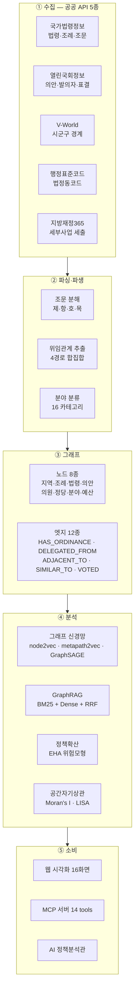

<div align="center">

# 자치법규 정책지도

**전국 자치법규 199,858건을 지도와 그래프로 잇고,
"비슷한 지자체엔 있는데 우리엔 없는 조례"를 근거와 함께 찾아 주는 시스템**

[**▶ 사이트 열기**](https://policymaps.vercel.app/) · [화면 안내](#화면-16종) · [작동 원리](#작동-원리) · [데이터 출처](#데이터-출처)


</div>

---

## 무엇을 푸는가

지자체 담당자가 새 조례를 만들 때 실제로 하는 일은 이렇다.

> 옆 동네는 이걸 어떻게 만들었지? → 구글 검색 → 자치법규정보시스템에서 하나씩 열람
> → 담당자에게 전화 → 상위법 근거가 맞는지 다시 확인

**전국 243개 지자체가 같은 일을 따로따로 반복한다.** 그러면서도
"우리와 비슷한 지자체 10곳 중 7곳에는 있는데 우리엔 없는 조례"는 아무도 알려 주지 않는다.
상위법이 조례로 정하라고 위임했는데 아직 만들지 않은 것도 마찬가지다.

이 시스템은 **전국의 조례·상위법·예산·의안·행정경계를 하나의 그래프로 엮어**
그 질문에 답한다. 답에는 항상 **근거 경로와 원문 링크**가 붙고,
**어디까지가 확인이고 어디부터가 추정인지**를 수치로 함께 공시한다.

```
"경기도 광명시에 없는 조례를 찾아 줘"
   └→ 유사 지자체 10곳 선정 (인구·재정·산업 구조)
       └→ 그 10곳이 가진 조례 집합 − 광명시 보유 조례
           └→ 상위법 위임 근거가 있는 것부터 정렬
               └→ 각 항목마다: 어느 지자체가 언제 제정했는지 · 상위법 몇 조인지
                              · 예산이 얼마나 붙었는지 · 원문 링크
```

---

## 규모

전부 실측값이다 (`system/data/manifest.json` 기준일 2026-08-21).

| 자산 | 건수 | 자산 | 건수 |
|---|---:|---|---:|
| 자치법규(조례·규칙) | **199,858** | 조문 본문 | **2,365,068** |
| 법령·행정규칙 | 29,811 | 법령 조문 | 86,745 |
| 조례→상위법 위임 | **421,627** | 법령 상호참조 | 812,339 |
| 예산 세부사업 | 933,527 | 조례↔예산 연결 | 183,145 |
| 국회 의안 | 19,847 | 의원별 표결 | 57,178 |
| 지자체·교육청 | 556 | 인접 관계 | 1,098 |
| 그래프 노드 | **250,416** | 그래프 엣지 | **1,125,036** |

**정적 배포본**은 4,972개 파일 75.8MB다. gzip 사전압축으로 원본 405.6MB를 5.2배 줄였고,
덕분에 서버 없이 정적 호스팅만으로 전국 데이터가 돈다.

---

## 작동 원리



### 핵심 설계 판단 3가지

**1. 조례를 "텍스트"가 아니라 "그래프 노드"로 본다**
제목이 달라도 같은 상위법에 위임받고, 같은 분야에 속하고, 비슷한 이웃을 가진 조례는
구조적으로 같은 정책수단이다. 그래프 임베딩은 제목 유사도가 못 잡는 이 관계를 회수한다.

**2. 위임관계를 4경로 합집합으로 뽑는다**
조례 본문의 「법률명」 낫표 인용, 국가법령정보의 위임법령 API, 조문 단위 참조,
법령명 이름해소 — 네 경로를 합쳐 421,627건을 만들었다.
이름해소로 붙인 605,424건은 추론이므로 그래프에서 `resolved_by="name-match"` 로 구분 표기한다.

**3. 검증 상태를 데이터 스키마에 넣는다**
"사람이 대조함 / 기계 전수확인 / 확률적 추정"을 행마다 기록하고 화면에 배지로 띄운다.
숨기지 않는 대신, 무엇을 믿고 무엇을 의심할지 사용자가 판단할 수 있다.

---

## 화면 16종

| 화면 | 무엇을 보여주는가 |
|---|---|
| **전국 요약** | 전 자산 규모, 그래프 구성, 수집 상태 |
| **시군구 코로플레스** | 지표별 지도 — 조례 수, 예산 집행률, 분야 비중 |
| **지역 상세** | 지자체 1곳의 조례·예산·인접·승계·변경이력 |
| **격차 분석** | 유사 지자체 대비 없는 조례 + 상위법 위임 미이행 |
| **법령 위계 그래프** | 헌법→법률→시행령→조례 위계와 서브그래프 탐색 |
| **정책 생애주기** | 제정→개정→폐지 이력, 지자체 승계 추적 |
| **정책 확산** | 템플릿 조례가 전국에 퍼진 시공간 경로 |
| **조례 실효성** | 조례에 붙은 예산의 집행률 |
| **신경망 유사도** | 3개 GNN 모델의 유사 조례·유사 지자체와 모델 간 일치도 |
| **공간자기상관** | Moran's I · LISA 국지 군집 (BH-FDR 보정) |
| **확산·커뮤니티 분석** | EHA 위험모형, 커뮤니티 탐지, 유사도 방법 비교 |
| **국회 표결** | 의안별 정당 찬반 분해 |
| **조문 전문검색** | GraphRAG 하이브리드 검색 |
| **검증 공시** | 무엇을 어떤 근거로 확인했는지 전면 공개 |
| **조례 상세** | 조문 본문 전량 + 상위법 + 예산 + 유사 조례 |
| **법령 상세** | 법령 조문 + 이 법에 위임받은 전국 조례 |

---

## 분석 방법론

전부 **numpy 단독 구현**이다. PyTorch·DGL 같은 무거운 프레임워크 없이 돌아간다.

| 방법 | 구현 | 쓰임 |
|---|---|---|
| **node2vec** | `neural/embeddings.py` | 그래프 구조 임베딩 (128차원) |
| **metapath2vec** | `neural/embeddings.py` | 이종 그래프 메타패스 임베딩 (64차원) |
| **GraphSAGE** | `neural/gnn.py` | 귀납적 임베딩 + JK-Net concat 으로 과평활 해소 (132차원) |
| **GraphRAG** | `rag/index.py`, `rag/retrieve.py` | BM25 + Dense 를 RRF(k=60)로 융합하고 그래프로 확장 |
| **EHA 사건사분석** | `analytics/eha.py` | 이산시간 위험모형 — 조례 채택 확률의 결정요인 |
| **Moran's I / LISA** | `analytics/spatial.py` | 조건부 순열검정 999회 + BH-FDR 다중비교 보정 |
| **로지스틱 성장곡선** | `analytics/diffusion.py` | 확산 S-곡선 적합, 경로 분해 |
| **커뮤니티 탐지** | `rag/community.py` | 정책 클러스터 식별 |
| **유사 지자체** | `analytics/peers.py` | 행안부 유사자치단체 기준 + 4가지 방법 비교 |

법령 그래프는 **ELI · Akoma Ntoso · FRBR** 국제 표준에 대조해 설계했다
(`system/policymap/standards.py`, [docs/14](docs/14_법령그래프_표준_및_온톨로지.md)).

---

## 데이터 출처

전부 **무료 공공 API** 다. 별도 비용이 들지 않는다.

| 출처 | 가져오는 것 | 키 |
|---|---|---|
| [국가법령정보 Open API](https://open.law.go.kr) | 법령·시행령·시행규칙·행정규칙 메타와 조문, 전국 자치법규 | `LAW_OC` |
| [열린국회정보](https://open.assembly.go.kr) | 의안, 발의자, 의안별 표결, 의원 명부 | `ASSEMBLY_KEY` |
| [V-World](https://www.vworld.kr) | 시도·시군구 경계 GeoJSON | `VWORLD_KEY` |
| [행정표준코드](https://www.data.go.kr) | 법정동코드 10자리, 행정구역 승계 | `STANREGIN_KEY` |
| [지방재정365](https://lofin365.go.kr) | 지자체 세부사업별 세출현황 | `LOFIN_KEY` |

발급 절차는 [docs/11_API키_발급가이드.md](docs/11_API키_발급가이드.md) 에 화면 단위로 적어 두었다.

> **원문의 권리는 각 기관에 있다.** 이 저장소는 공표된 법령정보를 수집·가공한 결과물이며,
> 법적 효력을 갖는 것은 언제나 국가법령정보센터의 원문이다. 화면의 모든 조례에
> 원문 링크를 함께 표시한다. 상세는 [THIRD_PARTY_NOTICES.md](THIRD_PARTY_NOTICES.md).

---

## 실행 방법

### 1) 그냥 보기 — 설치 불필요

**[https://policymaps.vercel.app/](https://policymaps.vercel.app/)**

정적 배포본이라 서버가 필요 없다. 조문 본문(490MB)만 빠져 있고 나머지는 전량이다.

### 2) 로컬에서 정적 사이트 띄우기

```bash
git clone https://github.com/zxsa0716/policymaps.git
```

```bash
cd policymaps && python -m http.server 8000
```

브라우저에서 `http://127.0.0.1:8000/viz/public/index.html`

> 웹 루트는 **저장소 루트**여야 한다. `viz/public/` 에서 서버를 띄우면
> 데이터 경로(`../../system/data`)에 접근할 수 없어 화면이 비어 보인다.

### 3) 완전판 — 조문 본문 236만 건까지

`system/data/policymap.db`(4.31GB)가 필요하다. 용량 때문에 깃허브에 올리지 않는다.

```bash
run_full.bat
```

`http://127.0.0.1:8743/viz/public/index.html?full=1`

DB가 있으면 조문 본문 전량 열람, 임의 질의 전문검색, 임의 조례 서브그래프·신경망
유사도가 모두 열린다. **API 키는 필요 없다** — 수집이 끝나 외부 호출을 하지 않는다.

### 4) 데이터 새로 수집하기

```bash
cp system/.env.example system/.env
```

키 5종을 채운 뒤:

```bash
python -m policymap init && python -m policymap collect --source law,ordin,na_bill,budget
```

```bash
python -m policymap parse && python -m policymap build && python -m policymap export
```

### 5) MCP 서버 — Claude 등 AI 도구에 연결

```bash
python -m policymap mcp
```

14개 tool 을 노출한다 — `recommend_ordinances`, `gap_analysis`, `explain_path`,
`semantic_search_ordinance`, `spatial_autocorrelation`, `diffusion_timeline`,
`ordinance_effectiveness`, `bill_vote_breakdown` 등.

---

## 저장소 구조

```
policymaps/
├── viz/public/          웹 프런트엔드 (바닐라 JS, 빌드 도구 없음)
│   ├── js/views/          화면 16종
│   ├── vendor/            leaflet · chart.js · vis-network 내장(오프라인 대응)
│   └── geo/               시군구·행정동 경계
├── viz/serve_full.py    완전판 서버 (DB 직결)
├── viz/serve_ai.py      AI 정책분석관 프록시
├── system/policymap/    파이썬 코어 (40파일 22,529줄)
│   ├── collectors/        API 수집기 5종
│   ├── parsers/           조문·분야·위임 파싱
│   ├── graph/             그래프 빌드·분석·export
│   ├── neural/            node2vec · metapath2vec · GraphSAGE
│   ├── rag/               색인·검색·재랭킹·커뮤니티
│   ├── analytics/         EHA · 공간자기상관 · 확산 · 유사지자체
│   └── mcp_server/        MCP tool 14종
├── system/data/api/     정적 배포 번들 (4,972파일 75.8MB)
├── api/chat.py          Vercel 서버리스 함수 (AI 프록시)
└── docs/                기술 문서 20종
```

---

## 검증

이 시스템은 **틀릴 수 있는 부분을 숨기지 않는다.**

| 검증 | 결과 |
|---|---|
| 원문 확보 | 조례 **199,695 / 199,858 (99.92%)** 가 공식 원문에 연결 |
| 위임 인용 대조 | 위임 **421,627건 전건**을 기계 대조 → 인용 조문 존재 확인 **182,784건(43.3%)** · 불일치 28,309건(6.7%) · 확인불가 210,534건(49.9%) |
| 사람이 직접 대조 | 1,205건 |
| 조례↔예산 링크 표본검증 | 층화표본 584건 수작업 판정 — 전체 정밀도 64.9%, 신뢰도 0.8 이상 구간 **93.2%** |
| 시간 무결성 자동감사 | 7,060건 규칙 위반 탐지·보정 |
| 공간자기상관 | 조건부 순열검정 999회 + BH-FDR (조례 수 Moran's I = 0.4333, p = .001) |

화면의 **[검증 공시]** 탭에서 위 수치의 분해와 방법을 전부 공개한다.
표본검증 설계와 판정 기준은 [docs/17](docs/17_링크_표본검증_보고서.md) 에 있다.

---

## 문서

| 주제 | 문서 |
|---|---|
| 한국 법령·조례 체계와 데이터 소스 | [docs/03](docs/03_법령조례_체계와_데이터소스.md) |
| 선행연구 리뷰 (정책확산·법령네트워크·GraphRAG) | [docs/04](docs/04_선행연구_리뷰.md) |
| 시스템 설계 | [docs/05](docs/05_시스템_설계.md) · [docs/09](docs/09_설계_고도화_v2.md) |
| API 키 발급 가이드 | [docs/11](docs/11_API키_발급가이드.md) |
| 신경망·RAG 계층 | [docs/13](docs/13_신경망_RAG_계층.md) · [docs/15](docs/15_법률RAG_연구와_개선안.md) |
| 법령그래프 국제표준 대조 | [docs/14](docs/14_법령그래프_표준_및_온톨로지.md) |
| 정책확산 그래프ML 방법론 | [docs/16](docs/16_정책확산_그래프ML_방법론.md) |
| 표본검증 보고서 | [docs/17](docs/17_링크_표본검증_보고서.md) |
| 데이터 명세서 (프런트엔드용) | [docs/19](docs/19_데이터_명세서.md) |
| 완성도 점검 | [docs/18](docs/18_시스템_완성도_종합.md) · [docs/22](docs/22_완성도_최종점검.md) |
| 선행사례·유사서비스 분석 | [docs/02](docs/02_선행사례_및_유사서비스_분석.md) |
| 레퍼런스 저장소 심층분석 | [docs/07](docs/07_레퍼런스_저장소_심층분석.md) |
| 구축 결과와 수집 실적 | [docs/10](docs/10_시스템_구축_결과.md) · [docs/12](docs/12_실데이터_수집결과.md) |
| 공개 전 법적·보안 검토 | [docs/20](docs/20_깃허브_공개계획.md) |
| 시각화 요구사항 | [docs/21](docs/21_시각화_요구사항.md) |
| 로컬 완전판 운영 가이드 | [docs/23](docs/23_발표_완전판_운영가이드.md) |
| 시각화 상세 | [viz/README.md](viz/README.md) |

문서 전체 목록은 [docs/README.md](docs/README.md) 에 있다.

---

## 라이선스

코드는 [MIT](LICENSE). 수집·가공 데이터의 원 권리는 각 제공기관에 있으며,
재이용 조건은 각 기관의 고지를 따른다. 제3자 소프트웨어 고지는
[THIRD_PARTY_NOTICES.md](THIRD_PARTY_NOTICES.md), 보안 정책은 [SECURITY.md](SECURITY.md).

---

<div align="center">
<sub>제8회 공간정보 활용·아이디어 경진대회 출품작 · 국토교통부 / 공간정보산업진흥원</sub>
</div>
