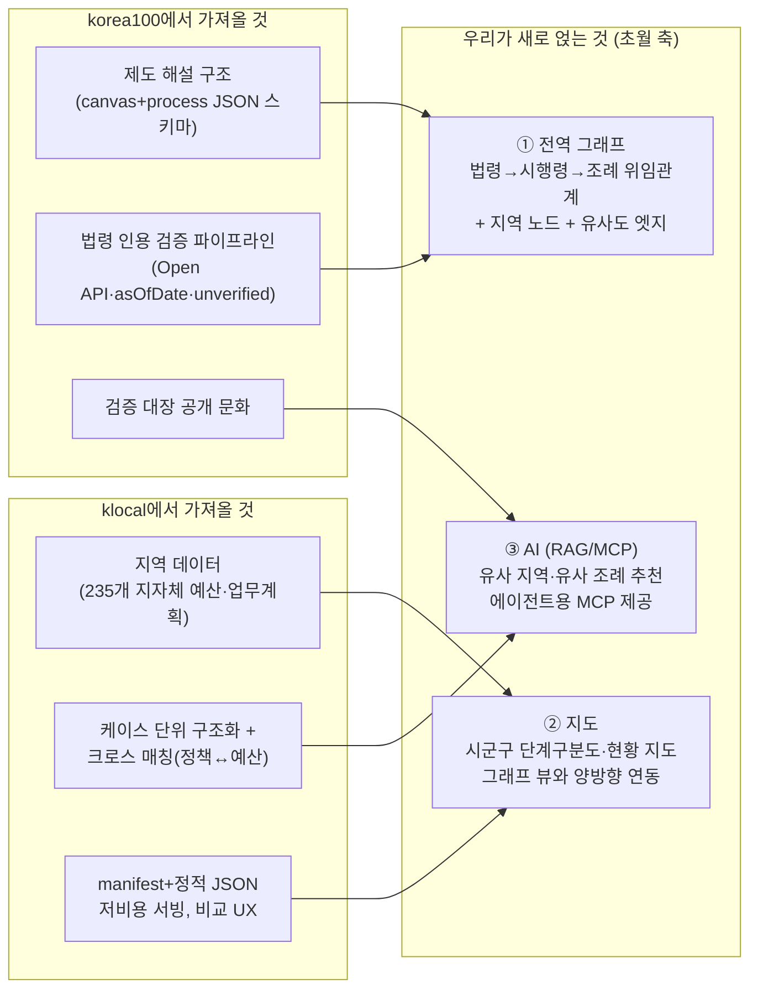
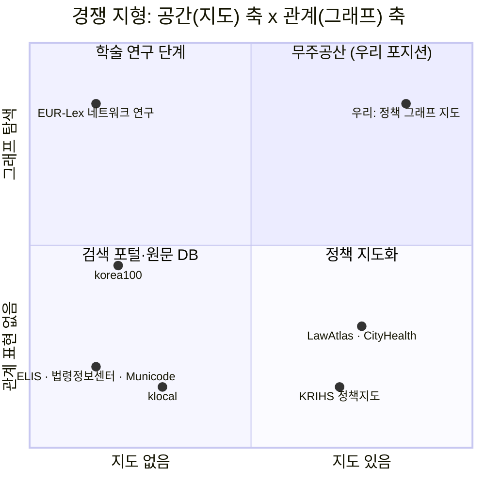

# 02. 선행사례 및 유사 서비스 분석

> 프로젝트: 전국 시군구 단위 "공간 정책 그래프 지도" (제8회 공간정보 활용·아이디어 경진대회 출품 기획)
> 문서 목적: 팀장이 지목한 레퍼런스 2개(korea100, klocal)를 해부하고, 국내외 유사 서비스 지형에서 우리의 포지션(공백 지점)을 정의한다.
> 작성 기준일: 2026-08-18. 모든 사실은 실접속·실호출·저장소 분석으로 확인된 조사자료에 근거하며, 미확인 사항은 (추정) 또는 (확인 필요)로 표기한다.

---

## 0. 요약 (3줄)

1. **korea100은 "제도 해설의 구조화(스키마·검증)"의 교과서, klocal은 "지자체 실무 데이터(예산·업무계획)의 저비용 서빙"의 교과서**다. 단, 둘 다 MCP를 제공하지 않으며(실측 확정), 지도도 그래프 탐색도 없다.
2. 국내 유사 시스템(국가법령정보센터·ELIS·의안정보시스템·리걸테크)은 전부 **텍스트 검색·목록 중심**이고, 해외(LawAtlas·CityHealth·Climate Policy Radar)는 지도 또는 AI까지는 있으나 **"조례 전국 커버리지 × 위임관계 그래프 × 지도"를 하나로 묶은 서비스는 국내외 어디에도 없다.**
3. 따라서 우리의 포지션은 "두 레퍼런스의 개념을 합치되, **그래프+지도+AI(RAG/MCP)**라는 세 축을 얹어 초월"하는 것 — 이 조합의 실현 가능성은 법제처 Open API 실호출로 이미 검증돼 있다.

---

## 1. 레퍼런스 ① korea100 — "대한민국 제도 지도" (hosungseo.github.io/korea100)

### 1-1. 무엇인가

| 항목 | 내용 |
|---|---|
| 정식 명칭 | "한 장으로 끝내는 대한민국 제도 지도" (제도 100에서 출발, 현재 **578개 제도**) |
| 제작자 | 서호성 — 행정안전부 행정사무관, 개인 프로젝트 (GitHub 프로필 기준) |
| 철학 | "기업에 비즈니스 모델이 있듯, 국가에는 제도 모델이 있다" — 복잡한 법령 문언을 시각 구조도와 한 장 요약으로 변환 |
| 표현 방식 3종 | ① 한 장 요약(9칸 캔버스: 목적·이해관계자·법적 근거·기관 권한·자금/서류 흐름·병목) ② 업무구조도(행위주체 스윔레인 + 신청·반려·이의신청 경로) ③ 검증 대장(미확정 정보를 사유와 함께 공개) |
| 라이선스/스택 | MIT, Next.js + TypeScript 정적 export → GitHub Pages. DB 없이 저장소 내 JSON |

### 1-2. 페이지 구성

- `/` 홈: 검색 가능한 제도 카탈로그 (JS 동적 로딩)
- `/model/[slug]/` 제도 페이지 578개: 한 줄 정의 → 업무구조도(노드 18/레인 9/게이트 8 수준의 BPMN식 그래프) → 목적·법적 근거(법률/시행령/시행규칙 3층) → 권한 관계 → 돈의 흐름 → 문서의 흐름 → 병목 → 개선점 → 관련 제도 → 현장 검증 필요사항 → 메타데이터(법령 기준일 asOfDate 등)
- `/mega-projects/…`: 광주 반도체 클러스터 1건 — 행정절차 1,281개·제도 103개·마일스톤 49개·게이트 8개를 프로젝트 관점으로 재조합하는 "오버레이" 개념
- `/verification/`: 조문 확인 14,332/14,347건, 공식 원문 링크 1,148건 등 검증 현황을 전면 공개, GitHub 이슈로 제보 유도
- `/llms.txt`: AI 에이전트 이용 안내("JSON 데이터 자유 활용 가능") 포함

### 1-3. 데이터·검증 방법론 (이 프로젝트의 진짜 자산)

- 1차 출처는 **국가법령정보센터(law.go.kr) Open API** 원문 대조. 법령별 lawId·mst·공포/시행일·공식 URL을 데이터에 보관.
- 제도당 JSON 1개 스키마: `canvas(요약) + process(nodes/edges/lanes/stages 그래프) + verification(검증 메타) + warnings(정정 이력)`. 노드마다 `legal_basis {law, article, text}`와 `confidence(0~1)`를 부여하고, 보완요구 회귀 루프까지 엣지로 모델링.
- 검증 원칙: 조문 존재 자동 전수검증, 미확인 정보는 `unverified` 명시("지어내지 않기"), 정정 이력 날짜와 함께 공개.

### 1-4. MCP 제공 여부 — **없음 (확정)**

- README에 "행정절차 MCP v0.2 (mcp/README.md)" 문구가 있으나 **해당 경로는 404이고, main 브랜치에서 mcp 경로를 건드린 커밋이 0건**(GitHub API로 확인). 사이트 `/mcp/`도 404, llms.txt에 MCP 언급 없음. 제작자의 공개 저장소 40여 개에도 korea100용 MCP 서버 없음.
- 즉 README가 광고하는 MCP는 한 번도 커밋된 적 없는 미공개물이다. AI 접근 수단으로 실제 제공되는 것은 llms.txt + raw JSON(MIT) 뿐.

### 1-5. 차용할 점 / 한계

| 차용할 점 | 한계 (= 우리의 차별화 지점) |
|---|---|
| 제도 JSON 스키마(canvas+process 그래프+verification+warnings) — 조례·정책의 그래프 모델링에 그대로 참고 | **지역 차원 부재**: 국가 법령·중앙 제도만. 조례·자치법규 미취급, 243개 지자체 비교 불가 |
| 법령 인용 검증 파이프라인(Open API + lawId/mst + 조문 자동 전수검증 + unverified 마킹) | **지도 없음**: "제도 지도"라는 이름과 달리 지리적 지도가 아님 |
| 기준일 규율(asOfDate와 사이트 기준일 분리 + 법적 고지) — 개정 잦은 조례에서 더 중요 | **제도 간 관계가 얕음**: related[]는 문자열 배열. 제도 내부는 정밀 그래프지만 **제도 사이 전역 그래프 탐색은 없음** |
| 검증 대장 공개("모르는 것은 모른다고 표시" + 이슈 제보) — 신뢰 설계의 모범 | 실운영 데이터 부재(현장 검증 대기 2,219건) — 법령 문언 기반 규범 모델 |
| 메가프로젝트 오버레이 — 우리는 "지역"·"정책 주제" 축의 조례 오버레이로 변형 가능 | 공식 API/MCP 없음 — raw JSON fetch 외 프로그래매틱 접근 수단 없음 |
| 저비용 스택(정적 export + GitHub Pages + 저장소 내 JSON) + llms.txt | 1인 프로젝트 지속성 리스크, README(509개)와 사이트(578개) 통계 불일치 등 갱신 동기화 이슈 |

---

## 2. 레퍼런스 ② klocal — "K-지방직 정책서랍" (klocal.solvonluchs.com)

### 2-1. 무엇인가

| 항목 | 내용 |
|---|---|
| 한 줄 정의(사이트 자체) | "전국 지자체의 주요업무계획과 세출예산서를 사업·부서·지역별로 검색하고, 타지역 정책 사례와 원문 근거를 비교하는 지방행정 실무 서비스" |
| 대상 사용자 | 지자체 공무원. "실무에서 가장 자주 하는 일 중 하나는 **다른 지자체는 이 사업을 어떻게 했는지 찾는 일**" — **우리 타깃 시나리오와 문제 정의가 정확히 동일** |
| 운영 주체 | 제작자 미상의 개인 비영리 프로젝트. "AI 에이전트용 지식베이스를 모아보던 프로젝트를 웹으로 정리" |
| 스택 | React + Vite SPA, nginx 단일 서버, DB 없이 정적 JSON(manifest + 지자체별 조각) 클라이언트 사이드 검색 |

### 2-2. 데이터 구성

| 데이터 | 규모 | 출처 |
|---|---|---|
| 세출예산서 (2026 단일 연도) | **235개 지자체, 1,477,728행** (17개 시도 전체) | e호조(지방재정관리시스템) 원자료 — 구체적 획득 경로는 미기재 (추정: 지방재정365 계열 공개 채널) |
| 주요업무계획 | 235개 지자체, 문서 235건, **사례(섹션) 50,918건** | HWP/PDF 원문을 텍스트 추출·구조화. documentShape(부서별 상세형/요약보고형/정책축형 등)로 문서 유형 분류 |
| 참고자료집 | NotebookLM 공유노트 12개 (법령해석례 8,517건, 자치입법 의견제시 3,662건, 행정심판 재결례 약 2만 건 등) | 자체 RAG가 아니라 **Google NotebookLM 링크 위임** |
| 원문 | 구글드라이브 공유폴더 | "웹에는 구조화 데이터, 필요시 원문 연결" 전략 |

### 2-3. 주목할 기능

- **사례 검색**: 검색식(`"문구"`, `&`, `or`) + 행정용어 동의어 사전(버스정류장↔승강장↔정류소) + 235개 파일 백그라운드 프리로드 진행률 UI
- **정책비교**: 사례를 "비교 담기" → 비교 → 브라우저(localStorage) 세션 저장 — 타 지자체 벤치마킹 실무 흐름에 정확히 맞춘 UX
- **업무계획-예산서 크로스 매칭**: 사례 상세에 같은 지자체 예산서 부기 행을 자동으로 붙여 "정책 서술 ↔ 예산 근거"를 연결 — 이 서비스의 핵심 차별점
- **/api/smart**: LLM 계획-검색-판정 파이프라인(plan의 search_terms/reasoning을 응답에 노출, 소요 1~3분 사전 안내) — 공공데이터 내비게이터 전용 내부 API

### 2-4. MCP 제공 여부 — **없음 (확정)**

- `/mcp` 경로는 200이지만 SPA catch-all(임의 경로와 동일한 index.html). MCP JSON-RPC initialize POST → nginx **405**. JS 번들 294KB 전체에 "mcp" 문자열 0건. llms.txt 없음.
- 내부 API 3종(/api/search, /api/smart, /api/verify)은 존재하나 문서화 없음, 공공데이터 내비게이터 전용.

### 2-5. 차용할 점 / 한계

| 차용할 점 | 한계 (= 우리가 피하거나 차별화할 지점) |
|---|---|
| manifest + 지자체별 정적 JSON 조각 아키텍처 — DB 없이 전국 148만 행 서빙, 저비용 무운영 | **지도/공간 시각화 전무** — 지역 데이터인데 목록·카드·표뿐. 지도 기반인 우리와 자연스럽게 차별화 |
| 문서가 아닌 "사업(케이스)" 단위 구조화 + documentShape 유형 분류 | MCP·공개 API 없음 — AI 에이전트/외부 연동 불가 |
| 업무계획-예산서 크로스 매칭(근거 자동 연결) | 클라이언트 전량 로드 — 검색 인덱스 없이 브라우저 순차 검색, 데이터 커지면 확장 불가 |
| 비교 담기→비교→세션 저장 UX | URL 라우팅 부재 — 딥링크/공유/북마크 불가 |
| NotebookLM 위임(자연어 질의를 인프라 비용 0으로) — 실용적 절충의 사례 | HWP 파싱 품질 낮음(레이아웃 아티팩트가 summary에 그대로 잔존) |
| 검색식 + 도메인 동의어 사전, 대량 로드 진행률 UX, 비공식 고지·원본 파일명 보존 등 신뢰 장치 | 단일 연도(2026)·수동 갱신, 제작자 미상·라이선스 불투명·지속성 리스크 |

---

## 3. "두 개를 합치되 초월한다" — 팀장 지시의 구체화

### 3-0. 전제 정정: "두개 MCP"는 존재하지 않는다

팀 카카오톡 원문("이 두개 mcp를 활용해서 합치되 우리가 더 초월할 수 있도록")의 지시 대상은 직전에 공유된 두 링크, 즉 korea100과 klocal 그 자체로 확정됐다. 그러나 **두 사이트 모두 설치·연결 가능한 MCP를 제공하지 않음이 실측으로 확정**됐다(korea100: mcp 경로 404·커밋 0건 / klocal: JSON-RPC 405·번들 내 문자열 0건). 따라서 지시는 다음과 같이 재해석해 팀 합의를 갱신해야 한다.

> **"두 사이트를 MCP 공급자가 아니라 'UX·콘텐츠 구조 레퍼런스'로 삼고, 데이터 접근은 별도 경로(법제처 Open API + 기존 법령 MCP 차용 + 필요 시 얇은 자체 MCP)로 확보한다."**

- 법령·조례 축은 기존 MCP **차용 가능**: `chrisryugj/korean-law-mcp` (★2,472, npm v4.12.0, 원격 엔드포인트 initialize/tools-list 실동작 확인. `search_law`가 조례 검색, `ordinance_radar`가 조례-상위법 개정 감시 제공).
- 지자체 예산·업무계획 축(klocal의 영역)은 기존 MCP 부재 → 지방재정365 OpenAPI를 래핑하는 **얇은 자체 MCP 또는 배치 수집**이 필요.
- 최희도에게 "두개 mcp"가 용어 오용이었는지 1문장 재확인 권장 (확인 필요).

### 3-1. 무엇을 어디서 가져와 어떻게 결합하는가

결합 논리를 한 문장으로: **korea100의 "제도 하나를 깊게 해부하는 구조"를 조례 단위로 축소 적용하고, klocal의 "전국 235개 지자체 가로 커버리지"를 그 위에 깔되, 두 서비스가 모두 갖지 못한 (1) 제도·지역 '사이'를 잇는 전역 그래프, (2) 지리적 지도, (3) 외부 에이전트가 접속할 수 있는 AI 인터페이스를 얹는다.**

### 3-2. "초월"의 5가지 구체 항목

| # | 초월 항목 | 두 레퍼런스의 상태 | 우리의 추가 | 실현 근거 (검증 완료 사항) |
|---|---|---|---|---|
| 1 | **전역 관계 그래프** | korea100: 제도 내부 그래프만, 제도 간은 문자열 related[]. klocal: 관계 개념 자체 없음 | 법령→시행령→조례 위임관계 + 지역 인접성 + 정책 유사도를 엣지로 하는 탐색 가능한 전역 그래프 | 법제처 Open API 4개 엔드포인트(lsDelegated/lsStmd/lnkLsOrd/lnkOrg) **실호출 검증 완료** — 법령 조문 단위→전국 개별 조례 매핑(주차장법 기준 조례 1,000여 건)이 XML/JSON으로 즉시 수급됨 |
| 2 | **지도 인터페이스** | 둘 다 지도 전무 | 시군구 단계구분도("이 조례가 있는/없는 지자체"), 지도↔그래프 뷰 양방향 연동, 정책 확산의 시계열 지도 | 공모전이 국가 공간정보 활용 대회(브이월드·행정경계 데이터 등) — 지도가 곧 대회 적합성 |
| 3 | **AI 추천·질의** | korea100: llms.txt 수준. klocal: NotebookLM 링크 위임 + 내부 /api/smart | 조례 원문 RAG 기반 "우리와 비슷한 지역이 이미 만든 조례" 추천, 카테고리별 그래프 유사도 군집 | klocal의 /api/smart(plan 노출·소요시간 안내) 패턴과 NotebookLM 절충안을 설계 참고로 차용 |
| 4 | **MCP 제공** | 둘 다 없음 (실측 확정) | 우리 데이터(조례 그래프·지역 유사도)를 MCP 서버로 개방 — 두 레퍼런스가 '표방만 하고 못 한' 지점 | 법령 검색은 korean-law-mcp 차용, 예산·업무계획은 자체 얇은 MCP (확인 필요: 아이디어 부문 제출물에 구현을 어디까지 포함할지) |
| 5 | **검증·신뢰 규율** | korea100이 모범, klocal은 고지 수준 | korea100의 asOfDate·unverified·정정 이력 규율을 조례 데이터에 적용 + 연계 DB 누락은 조례 본문의 법령 인용(「」) 파싱으로 교차 보완 | ordin 본문 API에서 낫표 인용 원문 확인 — 하이브리드(공식 연계 API 합집합 + 낫표 파싱 검증) 설계 실측 근거 확보 |

### 3-3. 유의점

- lsStmd(조례 1,056건) vs lnkLsOrd(511건) 등 **연계 API 간 건수 불일치**가 실측됐다(추정: 연계 범위 정의 차이). 파이프라인은 복수 경로 합집합 + 출처 필드 보존으로 설계하고, 기획서에는 이 한계와 보완책(낫표 파싱 교차 검증)을 명시하는 것이 심사 서술상 안전하다.
- 두 레퍼런스 모두 1인 프로젝트로 지속성 리스크가 이미 노출됐다(korea100 통계 불일치, klocal 수동 갱신). 우리 기획서에는 **자동 갱신 파이프라인**(조례 개정 감시 — korean-law-mcp의 ordinance_radar 개념 참고)을 지속성 항목의 답으로 배치한다. (2차 발표심사에 '지속성 15점' 항목 존재)

---

## 4. 국내 유사 시스템 총정리

| 서비스 | 운영 | 대상 데이터 | 규모 | 지도 | 그래프/네트워크 | AI | 비교 기능 | 우리 기획과의 차이 |
|---|---|---|---|---|---|---|---|---|
| 국가법령정보센터 (law.go.kr) | 법제처 | 법령+행정규칙+자치법규+판례 | 국가 법령정보 전체 | ✕ | △ 법령체계도(트리) | △ Lawbot — 대상은 법령·행정규칙만, **조례는 AI 검색 대상 아님** | ✕ | 검색 포털. 위임관계 '데이터'는 있으나(위임법령 OpenAPI 존재) 그래프·지도 시각화 없음 |
| 자치법규정보시스템 ELIS (elis.go.kr) | 행정안전부 | 자치법규 | **총 175,904건**(조례 128,352) | ✕ | ✕ | ✕ | △ 두 지자체 조문 텍스트 나란히 비교 | 원문 DB 그 자체. "어느 지자체에 이 조례가 있고 없는가"의 현황 지도 부재 — **우리의 원천 데이터 공급처이자 최대 공백의 증거** |
| 국회 의안정보시스템 | 국회 | 국회 의안·표결 | 22대 접수법안 20,610건 | ✕ | ✕ | △ 지능형검색 | ✕ | **조례 미취급**(국회 전용). 발의·표결 속성 데이터의 참고처 |
| 지방의정포털 (clik.nanet.go.kr) | 국회도서관 | 지방의회 의안·회의록 | (확인 필요) | ✕ | ✕ | ✕ | ✕ | 통합검색 포털이지 시각화 아님 (검색 결과로만 확인) |
| 열려라국회 | 참여연대 | 의원 활동·법안·표결 | 의원 299명 | ✕ | ✕ | ✕ | ✕ | 중앙 의정감시 전용 — **'지방판 열려라국회'가 없다는 것 자체가 수요 공백** |
| 엘박스/케이스노트/로앤비 | 민간 리걸테크 | 판례 중심(+법령·자치법규 부가) | 판례 194만~500만 건 | ✕ | ✕ | ○ 법률 AI | ✕ | 변호사용 검색 도구. 로앤비에 자치법규 섹션 존재, 엘박스 조례 커버리지는 (확인 필요) |
| KRIHS 정책지도 | 국토연구원 | 공간·통계 데이터 | 연구·시범 수준 | ○ | ✕ | ✕ | △ | 통계의 지도화이지 조례 텍스트 아님. 상시 대국민 서비스 URL 미확인 (추정: 연구 단계) |
| 공간빅데이터 분석플랫폼 | 국토교통부 | 공간 빅데이터 | 공통데이터 21종+ | ○ | ✕ | ✕ | ✕ | GIS 분석 도구, 조례·정책 무관 (도메인 접속 불가 — 이전 여부 확인 필요) |
| korea100 | 개인(현직 사무관) | 국가 제도 해설 | 578개 제도 | ✕ | △ 제도 '내부'만 | △ llms.txt | ✕ | §1 참조 |
| klocal | 개인(미상) | 지자체 예산·업무계획 | 235개 지자체 | ✕ | ✕ | △ NotebookLM 위임 | ○ 비교 담기 | §2 참조 |

**독해**: 국내 지형에서 "지도 ○"는 조례와 무관한 GIS 계열뿐이고, "조례 ○"는 지도·그래프·AI가 전무한 검색 포털뿐이다. 두 집합의 교집합이 비어 있다.

---

## 5. 해외 사례

### 5-1. Temple LawAtlas / Policy Surveillance Program (미국) — ★최중요 벤치마크

- **운영**: Temple University Beasley School of Law, Center for Public Health Law Research(CPHLR). 공중보건법 **152개 데이터셋**, 50개 주+DC, 학술 인용 200회+.
- **policy surveillance 방법론** (우리 기획서의 방법론적 근거로 인용할 것):
  1. 정의 — "법률·정책의 체계적 수집, 분석, 확산". CDC와 협력해 공식화, 델파이 연구로 정제. 총 10단계 legal mapping 절차가 문헌으로 정리됨.
  2. 핵심 기법 — 법률 원문 수집 → 연구 질문 설계 → **질문-답변(코딩 질문) 형식으로 법 조항을 관할권별 정량 변수로 코딩** → 각 답변을 원문 인용(citation)으로 역연결.
  3. 품질관리 — **중복 조사·중복 코딩(redundant research/coding)**. 전용 플랫폼 MonQcle(비영리·학술 연구자 공개) 사용.
  4. 산출물 — 거의 모든 데이터셋이 **대화형 지도+표**, 시간에 따른 법 변화 추적, **CSV + 코드북 + 연구 프로토콜 공개**.
- **한계**: 공중보건 한정, 주(state) 단위 중심, **전문가 수작업 코딩이라 확장이 느림**(그래서 152개 주제에 머묾), AI·그래프 없음.
- **우리에게 주는 것**: "조례를 변수로 코딩해 지도화한다"는 방법론의 국제 표준 + 원문 인용 역연결·코드북 공개라는 신뢰 규율. **LLM 자동 코딩 + 사람 검수**로 수작업 병목을 돌파하면 "LawAtlas의 한국판을 AI 속도로"라는 서사가 성립한다.

### 5-2. Climate Change Laws of the World (LSE Grantham + Climate Policy Radar)

- 196개 국가·영토·EU, 약 9,000건+의 기후 법률·정책. **AI·데이터과학 기반** 문맥 검색, 관련 구절 하이라이트, 다언어 번역 구절, 데이터 다운로드.
- 시사점: "법률 전수 DB + AI 검색"의 세계적 선례. 다만 **국가 단위**이며 지방(municipal) 수준이 아니고, 지도 시각화는 명시 확인 안 됨 (추정: 국가별 브라우징 수준). 팀의 '기후 카테고리' 분류 아이디어의 해외 근거로 인용 가능.

### 5-3. CityHealth (미국)

- 미국 **75개 도시 × 12개 정책**(유급병가, 실내금연 등)의 채택 여부를 평가해 금·은·동 메달 등급 + "Explore the Map" 대화형 지도.
- 시사점: **"조례·정책 유무 → 등급화 → 지도"라는, 우리 기획과 구조적으로 가장 가까운 소비자향 UX.** 다만 12개 정책 한정, 원문·그래프 없음 — 우리는 임의 주제·전국 커버리지·그래프로 확장.

### 5-4. Municode / American Legal Publishing (미국)

- 미국 시·군 조례집의 온라인 호스팅(Municode 약 2,000개+ 지자체). 원문 열람·키워드 검색뿐 — 비교·코딩·지도·그래프·AI 전무. **"미국판 ELIS"**. 원문 DB가 있어도 활용 계층이 자동으로 생기지 않는다는 방증.

### 5-5. 기타

- **OECD STIP Compass**: 57개국+EU, 약 7,700개 정책 이니셔티브를 설문으로 구조화 + 대시보드. "구조화된 정책 DB + 대시보드"의 국제기구 표준. 국가 단위·STI 분야 한정.
- **EUR-Lex 네트워크 연구**: EU 법령·판례 인용 네트워크 분석(arXiv), EuCaseNet 등 — **법령을 그래프로 보는 수요·방법론은 학계에서 검증됐으나 대중 서비스화 사례 없음.** "그래프 축의 학술적 타당성" 근거로 인용.
- **PolicyMap (미국)**: 이름과 달리 통계 지표 지도화 상용 플랫폼 — 조례 텍스트 아님 (직접 확인 안 함, 추정).

### 5-6. 해외 사례 요약 매트릭스

| 사례 | 지방(조례) 단위 | 구조화 코딩 | 지도 | 그래프 | AI |
|---|---|---|---|---|---|
| LawAtlas | △(주 중심) | **○** | **○** | ✕ | ✕ |
| Climate Laws of the World | ✕(국가) | △ | (확인 필요) | ✕ | **○** |
| CityHealth | ○(도시 75개) | △(12개 정책 평가) | **○** | ✕ | ✕ |
| Municode | ○(원문만) | ✕ | ✕ | ✕ | ✕ |
| OECD STIP Compass | ✕(국가) | ○(설문) | △ | ✕ | ✕ |
| EUR-Lex 네트워크 연구 | ✕ | ✕ | ✕ | **○** | △ |

해외에서도 한 사례가 두 축 이상을 갖는 경우는 있어도, **조례 단위 전국 커버리지 + 그래프 + 지도 + AI 네 축을 모두 갖춘 서비스는 없다.**

---

## 6. 결론 — 우리가 파고들 공백(니치)

**니치 명제 (기획서 '독창성' 항목에 그대로 쓸 한 문단):**

> 전국 조례 12.8만 건이 ELIS에 이미 디지털화되어 있고, 법령→조례 위임관계 데이터가 법제처 Open API로 조문 단위까지 공개되어 있음에도, "어느 지자체에 어떤 조례가 있고 없는가"를 지도 한 장으로 보여주거나 법령-조례-지역의 관계를 그래프로 탐색하게 해 주는 서비스는 국내에 존재하지 않는다. 해외에서도 구조화 코딩+지도(LawAtlas·CityHealth), 대규모 DB+AI(Climate Policy Radar), 법령 네트워크(EUR-Lex 학술 연구)가 각각 따로 존재할 뿐, 이 축들을 지방자치 수준에서 하나로 묶은 사례는 발견되지 않았다. 우리는 `ELIS의 전국 조례 원문(공공데이터) + LawAtlas의 구조화 코딩 방법론 + CityHealth의 지도 UX + EUR-Lex 연구의 네트워크 그래프 + Climate Policy Radar의 AI 검색`의 조합 — 즉 korea100의 '제도 해설 구조'와 klocal의 '지역 데이터 커버리지'를 그래프·지도·AI로 잇는 **공간 정책 그래프 지도** — 로 이 무주공산을 차지한다. 수요는 이미 실증돼 있다: klocal이 "다른 지자체는 이 사업을 어떻게 했는지 찾는 일"을 문제로 정의해 개인 프로젝트로도 235개 지자체 데이터를 모았고, 열려라국회의 '지방판'은 부재하며, 지자체·지방의회 실무자는 여전히 구글링과 전화에 의존한다.

**부속 리스크 메모** (역대 수상작 유사성 우려 관련): 본 조사 범위에서 국내에 동일 컨셉 서비스는 발견되지 않았으나, 본 대회 **역대(1~7회) 수상작 목록에 대한 조사는 별도로 수행되지 않았다 (확인 필요)** — 기획 확정 전 브이월드 공지의 역대 수상작 공개 자료를 확인할 것. 또한 GeoAI 부문 예시로 "K-GeoP+국가법령정보시스템 연계 AI 분석 서비스"가 대회 안내문에 이미 제시되어 있다는 점은 (i) 주최 측이 이 방향의 출품을 기대한다는 긍정 신호인 동시에 (ii) 유사 출품이 몰릴 수 있는 지점이므로, 우리 차별화(전역 그래프 + 지도 연동 + 검증 규율)를 기획서에서 명시적으로 대비시켜야 한다.

---

### 부록 A. 핵심 출처 (전체 목록은 조사 원자료 참조)

| 구분 | URL |
|---|---|
| korea100 메인 / 검증 대장 | https://hosungseo.github.io/korea100/ , /verification/ |
| korea100 저장소(스키마·JSON) | https://github.com/hosungseo/korea100 |
| klocal 메인 / 예산 manifest | https://klocal.solvonluchs.com/ , /data/jeonnam-budget/manifest.json |
| ELIS 자치법규 현황 | https://elis.go.kr/sysinfo/alrStatList |
| 법제처 Lawbot | https://www.law.go.kr/LSW/aai/main.do |
| LawAtlas / 방법론 FAQ | https://lawatlas.org/ , /faq |
| CityHealth | https://www.cityhealth.org/ |
| Climate Change Laws of the World | https://climate-laws.org/ |
| 법제처 위임법령 OpenAPI (공공데이터포털) | https://www.data.go.kr/data/15038873/openapi.do |
| 자치법규 법령 연계 API 가이드 | https://open.law.go.kr/LSO/openApi/guideResult.do?htmlName=ordinLsConListGuide |
| korean-law-mcp (차용 후보) | https://github.com/chrisryugj/korean-law-mcp |

### 부록 B. 이 문서가 남긴 (확인 필요) 목록

1. 본 대회 역대(1~7회) 수상작 중 유사 컨셉 존재 여부 — 별도 조사 필요.
2. 최희도의 "두개 mcp" 발언 의도(용어 오용 여부) — 팀 내 1문장 재확인.
3. 엘박스·케이스노트의 자치법규 커버리지 범위 — 로그인 필요로 미검증.
4. 지방의정포털(clik.nanet.go.kr)의 정확한 데이터 규모·기능 — 검색 결과 수준으로만 확인.
5. Climate Change Laws of the World의 지도 시각화 기능 유무.
6. MCP 제공(§3-2 #4)을 아이디어 부문 제출물에 어느 수위로 포함할지 — 아이디어 부문은 코드 없이 서식 제출이므로 '제안' 수준 서술이 적정한지 팀 결정 필요.
