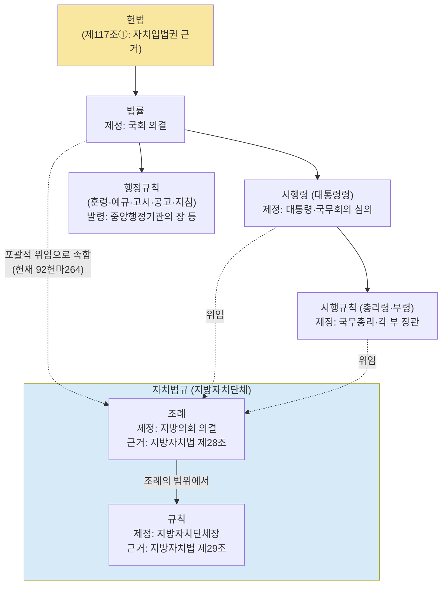
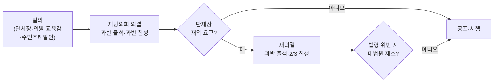
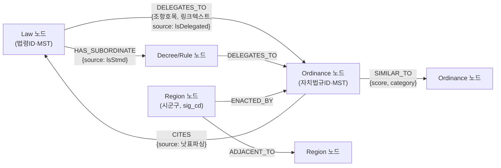
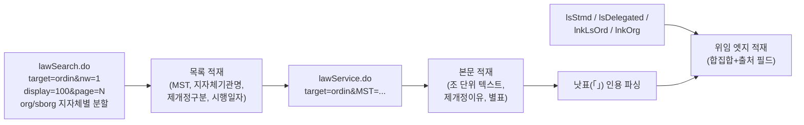
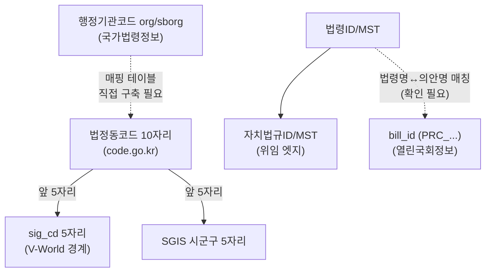

# 03. 법령·조례 체계와 데이터 소스

> 공간 정책 그래프 지도 프로젝트 — 데이터 엔지니어링 레퍼런스.
> 목적: 한국 법체계의 구조를 "그래프로 어떻게 표현할 것인가" 관점에서 정리하고, 사용할 모든 데이터 소스의 접근 방법·제약을 한 문서에 모은다.
> 표기 원칙: 본 문서의 사실은 2026-08-18 기준 조사(공식 가이드 열람·API 실호출 포함)에 근거한다. 조사에서 확정하지 못한 항목은 "(확인 필요)" 또는 "(추정)"으로 표시했다. 실호출로 검증된 항목은 **[실측]** 으로 표시.

---

## 1. 한국 법체계 위계

### 1.1 위계 다이어그램



### 1.2 단계별 제정 주체·절차 요약

| 단계 | 제정 주체 | 절차 요점 | 그래프 노드 타입(안) |
|---|---|---|---|
| 헌법 | — | 제117조①이 자치입법권 근거("법령의 범위 안에서 자치에 관한 규정 제정") | (모델 밖, 배경) |
| 법률 | 국회 | 국회 의결로 제정 | `Law` |
| 시행령(대통령령) | 대통령 | 국무회의 심의를 거침 | `Decree` |
| 시행규칙(총리령·부령) | 국무총리·각 부 장관 | — | `Rule(중앙)` |
| 조례 | **지방의회 의결** | §1.4 입법 절차 참조 | `Ordinance` |
| 규칙 | **지방자치단체장** (교육감은 교육규칙) | 법령 또는 조례의 범위에서 그 권한에 속하는 사무 | `LocalRule` |
| 행정규칙 | 중앙행정기관의 장 등 | 훈령(1)·예규(2)·고시(3)·공고(4)·지침(5)·기타(6) — 괄호는 국가법령정보 API `knd` 코드 | `AdmRule` |

### 1.3 조례제정권의 범위 — 지방자치법 제28조 (조문 전문 확인됨)

> ① 지방자치단체는 법령의 범위에서 그 사무에 관하여 조례를 제정할 수 있다. 다만, 주민의 권리 제한 또는 의무 부과에 관한 사항이나 벌칙을 정할 때에는 법률의 위임이 있어야 한다.
> ② 법령에서 조례로 정하도록 위임한 사항은 그 법령의 하위 법령에서 그 위임의 내용과 범위를 제한하거나 직접 규정할 수 없다.

- "법령의 범위" = 법령에 위반되지 않는 범위 (대법원 2022. 7. 28. 선고 2021추5050 판결).
- 조례에 대한 법률 위임은 **포괄적 위임으로 족함** (헌재 1995.4.20. 92헌마264 병합) — 위임 관계가 넓고 느슨하게 형성됨. 그래프 관점에서는 "법령→조례 위임 엣지가 1:N으로 대량 발생한다"는 의미.
- 조례 제정 5대 준수요건(ELIS 안내):
  1. 법령의 범위 안에서 규정
  2. 소관사무(자치사무·단체위임사무)에 한정 — 국가사무·기관위임사무는 조례 불가
  3. 주민 권리제한·의무부과·벌칙은 법률 위임 필요
  4. 기초 자치법규는 광역 자치법규 위반 금지 → **광역 조례→기초 조례 사이에도 위계 엣지가 성립**
  5. 집행기관·의결기관 간 권한배분 원칙 준수

### 1.4 조례 입법 절차 (ELIS 안내 확인)



- 감독기관(기초→시·도지사, 광역→주무부장관)의 재의요구 지시·제소 지시·직접 제소 제도 존재(지방자치법 제192조).
- 주민조례발안: 「주민조례발안에 관한 법률」 — 18세 이상 주민, 인구 규모별 1/20~1/200 서명 요건.
- **데이터 시사점**: "누가 발의했는가"는 조례의 경우 단체장/의원/주민 발의로 나뉘는데, **이 발의자 정보는 국가법령정보·ELIS API 응답 필드에 없다**(§3.4 참조). 발의자·표결은 '법률' 레벨에서 열린국회정보로 확보하는 것이 현실적(§4.2). 조례 레벨 발의자·지방의회 표결은 각 지방의회 회의록 시스템 대상이라 전국 표준 API 존재 여부 (확인 필요).

---

## 2. 조례·규칙의 법적 성격과 "위임 관계"의 데이터 표현

### 2.1 조례 vs 규칙 (ELIS 안내 확인)

| 구분 | 조례 | 규칙 |
|---|---|---|
| 근거 | 지방자치법 제28조 | 지방자치법 제29조 |
| 제정 주체 | 지방의회 의결 | 지방자치단체장 (교육감은 교육규칙 — 지방교육자치법 제25조) |
| 범위 | 법령의 범위에서 그 사무에 관하여 | 법령 또는 조례의 범위에서 그 권한에 속하는 사무 |
| 우리 그래프 비중 | **핵심 노드** (전국 약 12.8만 건) | 보조 노드 (약 2.8만 건) |

### 2.2 위임 관계를 데이터로 얻는 4가지 공식 경로 — 전부 실호출 검증 완료 **[실측]**

당초 "조례→상위법 연계는 API로 못 얻는다"가 걱정이었으나, 실측 결과 **국가법령정보 Open API에 공식 경로가 최소 4개 존재**한다 (2026-08-18, `OC=test` 샘플 값으로 curl 실호출 성공, 테스트 법령: 주차장법 MST=280143).

| 경로 | target | 방향 | 단위 | 실측 결과 (주차장법 기준) |
|---|---|---|---|---|
| A. 위임법령 조회 | `lsDelegated` | 법령 조문 → 개별 조례 조문 | **조문 단위, 가장 정밀** | `위임구분=위임자치법규` 21건 + 시행령 30·시행규칙 26·위임행정규칙 1·인용법령 81. 시행령(MST=273373)→조례 위임 9건도 확인 |
| B. 법령 체계도 | `lsStmd` | 법령 1건 → 하위 조례 전체 | 법령 단위(벌크에 최적) | `상하위법` 트리에 `<자치법규><조례>` **1,056건** 나열 (자치법규ID·일련번호·공포일자·시행일자·본문링크 포함) |
| C. 법령-자치법규 연계 검색 | `lnkLsOrd`(법령ID→조례 목록), `lnkOrg`(지자체→연계 조례+**법령ID 역방향 쌍**), `lnkOrd`(명칭 검색) | 양방향 | 목록 단위 | lnkLsOrd(knd=001814)→511건, lnkOrg(org=3270000 부산 동구)→336건(각 조례에 법령명·법령ID 동봉), 페이징(display=100) 정상 동작 |
| D. 조례 본문 낫표 파싱 | `ordin` 본문 | 조례 → 법령 (텍스트 추출) | 보완·검증용 | 조례 제1조에 `「주차장법」...에 따라` 인용 원문 그대로 수신 확인 |

주의사항:
- **경로별 건수가 불일치**한다(1,056 vs 511). lsStmd는 시행령·시행규칙 경유 위임까지 합산한 체계도 전체, lnkLsOrd는 법령ID 직접 연계만 집계하는 등 범위 정의가 다른 것으로 보임 (추정). → 파이프라인에서 **복수 경로 합집합 수집 + 엣지에 출처(provenance) 필드** 필수.
- 연계 DB의 전수성은 미보장(신규 조례·연계 누락 가능) → 경로 D(낫표 파싱)를 "누락 보완 + 교차 검증" 레이어로 병행하는 하이브리드 설계가 심사 서술상으로도 안전.
- 자치법규 본문 API(target=ordin) 응답 자체에는 '근거법령/상위법령' 필드가 **없다** (공식 가이드 응답 필드 전수 확인). 연계는 반드시 위 A~C의 별도 엔드포인트로 얻는다.

### 2.3 위임 관계의 그래프 스키마 표현(안)



- `DELEGATES_TO` 엣지 속성: 법령 쪽 위치(`조항호목`, 예: 제2조제10호), 조례 쪽 위임 문구(`링크텍스트`·`라인텍스트`), 수집 경로(`source`).
- 위계 방향(법률→시행령→시행규칙)은 `lsStmd`, 조 단위 상세 매핑은 `thdCmp`(3단비교, knd=1 인용조문/2 위임조문 + 위임행정규칙목록 필드)로 얻는다.

---

## 3. 국가법령정보센터 Open API (open.law.go.kr) — 주 데이터 소스

### 3.1 이용 신청

- 절차: 회원가입(이메일) → OPEN API 활용 신청(활용 목적 기재) → 담당자 승인(1~2일 이내) 후 사용.
- **OC 파라미터 = 이메일의 ID 부분** (공식 가이드 원문: "g4c@korea.kr일 경우 OC값=g4c"). API인증키 관리 페이지(usrOcInfoMod.do)에서 변경 가능.
- 팀 액션: 팀 이메일(예: zxsa0716)로 가입·신청하면 당일~2일 내 확보 가능 (추정). 데모·검증에는 공식 가이드 샘플 값 `OC=test`가 현재 동작함을 실측 확인 **[실측]** — 단 대량 수집에는 자체 OC 사용이 안전 (추정).
- 총 191개 API 제공. 무료.

### 3.2 공통 요청 구조

```
목록 조회: http://www.law.go.kr/DRF/lawSearch.do?OC={OC}&target={target}&type={HTML|XML|JSON}
본문 조회: http://www.law.go.kr/DRF/lawService.do?OC={OC}&target={target}&type={...}
```

공통 파라미터:

| 파라미터 | 의미 | 비고 |
|---|---|---|
| `query` | 검색어 | |
| `search` | 1=명칭, 2=본문검색 | |
| `display` | 페이지당 건수 | 기본 20, **최대 100** |
| `page` | 페이지 번호 | |
| `sort` | lasc/ldes/dasc/ddes/nasc/ndes/efasc/efdes | |
| `efYd`, `ancYd`, `ancNo`, `date` | 시행일자 범위·공포일자·공포번호 | |
| `rrClsCd` | 제개정 종류 | 300201 제정 / 300202 일부개정 / 300203 전부개정 / 300204 폐지 / 300209 타법개정 등 |
| `org`, `sborg` | 소관 부처·지자체 코드 | org=광역(예: 서울 6110000), sborg=기초 |
| `knd`, `gana`, `nw` | 종류·가나다·현행(1)/연혁(2) | |

### 3.3 target 값 정리

| target | 내용 | 확인 수준 |
|---|---|---|
| `law` | 현행법령(공포일) 목록/본문 | 공식 가이드 확인 |
| `eflaw` | 현행법령(시행일) 본문 — `efYd` 필수. 시점별 본문 조회 가능 | 공식 가이드 확인 |
| `ordin` | **자치법규 목록/본문** — `nw`(1현행/2연혁), `knd`(30001 조례/30002 규칙/30003 훈령/30004 예규/30006 기타/30010 고시/30011 의회규칙) | 공식 가이드 + **[실측]** |
| `ordinfd` | 자치법규 분야(분류) 조회 — `org` 필수 → 카테고리 분류에 활용 후보 | 공식 가이드 확인 |
| `admrul` | 행정규칙 목록/본문 — `knd`(1훈령~6기타) | 공식 가이드 확인 |
| `lsStmd` | 법령 체계도(법률–시행령–시행규칙–**조례** 상하위 관계) | 공식 가이드 + **[실측]** |
| `thdCmp` | 3단비교(법률↔시행령↔시행규칙 조문 매핑 + 위임행정규칙목록) — `knd` 1=인용/2=위임 | 공식 가이드 확인 |
| `lsDelegated` | 위임법령 조회 — **위임자치법규까지 조문 단위 반환** | **[실측]** (target 값 명칭은 서드파티 문서 기준이었으나 실호출 성공으로 확정) |
| `lnkLsOrd` / `lnkOrg` / `lnkOrd` | 자치법규-법령 연계 목록 조회 (공식 가이드 ordinLsConListGuide) | 공식 가이드 + **[실측]** |
| `prec`, `lstrm` | 판례·법령용어 | 서드파티 정리 기준 (확인 필요) |

### 3.4 자치법규 본문 응답 구조 (target=ordin, 공식 가이드 필드 전수 확인)

- 요청: `ID`(자치법규ID) 또는 `MST`(자치법규 일련번호) 중 하나.
- 응답 구조:
  - **기본정보**: 자치법규ID, 공포일자/번호, 시행일자, **지자체기관명**, 자치법규종류, 담당부서명, 전화번호
  - **조문**: 조문번호, 조문여부, 조제목, 조내용 — **조(條) 단위까지 구조화** (법령 본문과 달리 항·호 세분 필드는 가이드에 없음 — 실응답 검증 필요, 확인 필요)
  - **부칙**: 부칙공포일자·부칙공포번호·부칙내용
  - **별표**: 별표번호·가지번호·제목·첨부파일명·내용
  - **제개정정보·개정문내용·제개정이유내용** → 연혁·제정 이유 텍스트 확보 가능
- **없는 것**: 근거법령/상위법령 필드(§2.2), 발의자·표결 정보.
- 샘플 URL(공식 가이드 게재): `http://www.law.go.kr/DRF/lawSearch.do?OC=test&target=ordin&query=청소년&type=JSON`

법령 본문(target=law)은 더 세밀함: `JO`(조번호 6자리=조 4자리+가지 2자리, 예 000200=제2조)로 조 지정, 응답은 항번호·항내용·호번호·호내용까지 계층 구조화.

### 3.5 제약

- **정량적 호출 한도(일/월)는 공식 문서에 없음** (확인 필요). "상업적 이용 불가 API의 상업적 활용, 트래픽 초과로 시스템 부하 발생 시 이용 제한 가능" 문구만 존재 → 전국 조례 약 12.8만 건 전수 수집 시 요청 간 지연 삽입(예의적 스로틀링) 권장.
- 보조 경로: 공공데이터포털 '법제처 국가법령정보 공유서비스'(data 15000115)는 자동승인·개발계정 10,000건/일 명시. 단 위임·연계 오퍼레이션은 목록에서 미확인 → **연계 데이터는 law.go.kr DRF 직접 호출이 확실한 경로**.

### 3.6 전국 조례 전수 수집 파이프라인(안)



---

## 4. 기타 데이터 소스

### 4.1 ELIS 자치법규정보시스템 (www.elis.go.kr)

- 운영: 행정안전부 (유지관리: 한국지역정보개발원 KLID). 1997년부터 전 지자체 자치법규 DB 공동 서비스.
- 용도: ① **전국 규모 파악·통계의 공식 출처** ② 입법예고·자치법규 비교검색 ③ 연혁 조회(본문 URL histNo 파라미터 관측) ④ 조례/규칙 제도 해설(본 문서 §1~2의 근거).
- **오픈 API·벌크 다운로드 메뉴는 발견하지 못함** — 기계가독 수집 창구는 사실상 국가법령정보 API target=ordin (추정). 즉 ELIS는 "검증·통계 참조용", 수집은 §3으로.
- 전국 현행 건수 (2026-07-20 기준, ELIS 현황 페이지 확인):

| 구분 | 시도 | 시군구 | 총계 |
|---|---|---|---|
| 조례 | 13,854 | 114,129 | **127,983** |
| 규칙 | 2,341 | 25,362 | **27,703** |
| 훈령 | 1,489 | 14,059 | 15,548 |
| 예규 | 448 | 3,763 | 4,211 |
| 합계 | | | **약 175,000건** |

- 행정안전부가 매년 "자치법규 운영현황"(hwpx/xlsx)을 mois.go.kr에 게시 — 교차 검증용.

### 4.2 열린국회정보 (open.assembly.go.kr) — 의안·발의자·표결

- 용도: 법률(Law) 노드에 **발의자·정당·표결** 속성 부여. "언제 제정되고 누가 발의했고 정당별 표결이 어땠는지"의 유일한 소스.
- 인증: 회원가입 후 포털에서 인증키(KEY) 발급. 공통 파라미터 `KEY`, `Type`(json/xml), `pIndex`, `pSize`. 개발계정 월 10,000 요청 제한 (서드파티 카탈로그 기준, 확인 필요).
- 엔드포인트: `https://open.assembly.go.kr/portal/openapi/{서비스코드}?KEY=...&Type=json&pIndex=1&pSize=100&AGE=22` — URL 패턴 동작은 실호출로 확인(무효 키 시 ERROR-290). `KEY=sample` 은 동작하지 않음 → **실제 키 발급 후 응답 필드 실측 검증 필요**.
- 주요 API:

| API | 서비스코드 | 핵심 필드 | 확인 수준 |
|---|---|---|---|
| 국회의원 발의법률안 | `nzmimeepazxkubdpn` | `RST_PROPOSER`(대표발의), `PUBL_PROPOSER`(공동발의 명단), `PROPOSER` → **대표/공동 구분 가능** | 개발 블로그 실측 기록 확인 |
| 본회의 표결정보(의원별) | `nojepdqqaweusdfbi` (추정) | 의원별 찬성/반대/기권 + 정당 필드 → 정당별 집계는 클라이언트에서 (추정). bill_id+대수로 조회 | 공식 데이터셋 페이지 존재 확인(20대 국회부터, 수시 갱신), 서비스코드·필드는 (확인 필요) |
| 의안별 표결현황 | `ncocpgfiaoituanbr` | 의안 단위 찬/반/기권/총투표수 | 서드파티 교차 확인 |
| 의안정보 통합 | `ALLBILL`(의안번호 필수), `TVBPMBILL11`, `BILLINFODETAIL`, `BILLINFOPPSR` | 의안 검색·상세·제안자 | 서드파티 교차 확인 |

- 공공데이터포털(data.go.kr)에도 동일 계열 등재: 표결정보(15125948), 의원 통합(15126133), 의안 통합(15126134).
- 표결 API의 bill_id(`PRC_...`)는 의안정보시스템(likms) 식별자 체계와 동일 (추정) → 법령↔의안 조인 키.
- **한계**: 표결·발의 데이터는 20대 국회 이후 중심(표결 API는 20대부터 명시). 오래된 법령의 제정 당시 표결은 커버리지 (확인 필요). 조례(지방의회) 표결은 이 소스에 없음.
- MCP 차용 후보: `hollobit/assembly-api-mcp` (★87, 열린국회정보 276개 API 래핑) — 설치·동작 검증 필요.

### 4.3 V-World (api.vworld.kr) — 지도 타일·행정구역 경계 폴리곤

- 운영: 국토교통부 디지털트윈국토 / 공간정보산업진흥원(**공모전 주관기관과 동일**) → 공모전 데이터 수급성 서술에 유리. 무료.
- 인증: vworld.kr 가입 후 인증키 발급. **키는 등록 도메인에 종속** — 서버/비브라우저 호출 시 `domain` 파라미터에 등록 도메인 동봉 필수. 일일 한도 초과 시 `OVER_REQUEST_LIMIT` (한도 수치는 확인 필요).
- 시군구 경계 GeoJSON 확보 실전 경로 (공식 레퍼런스 + 복수 실측 코드 확인):

```
https://api.vworld.kr/req/data?service=data&version=2.0&request=GetFeature
  &data=LT_C_ADSIGG_INFO          ← 시군구 (시도: LT_C_ADSIDO_INFO / 읍면동: LT_C_ADEMD_INFO)
  &key={인증키}&domain={등록도메인}
  &format=json&geometry=true&attribute=true
  &attrFilter=sig_cd:=:11350       ← 또는 full_nm:like:서울
  &geomFilter=BOX(124,33,132,43)   ← 전국 일괄은 BBOX+페이징 패턴
  &size=1000&page=1&crs=EPSG:4326
```

- 응답: `response.result.featureCollection` — GeoJSON FeatureCollection, MultiPolygon, properties에 **`sig_cd`(시군구코드 5자리)**, `full_nm`, `sig_kor_nm`, `sig_eng_nm`.
- 그 외 WMS(1.3.0)/WFS(1.1.0) — 행정구역 레이어 `lt_c_adsido`/`lt_c_adsigg`/`lt_c_ademd`, 배경지도·WMTS/TMS(지도 뷰 타일), 지오코더(일별 제한 있음, 수치 확인 필요).

### 4.4 법정동코드 / 행정표준코드 (code.go.kr)

- 행정표준코드관리시스템(행정안전부 운영, 법정동코드 소관은 국토교통부 공간정보제도과).
- **법정동코드 10자리 = 시도(2)+시군구(3)+읍면동(3)+리(2)** — 예: 1100000000 서울특별시, 1111000000 종로구. 출력 항목에 상위지역코드·생성일·**폐지일** 포함 → 행정구역 개편 이력 추적 가능.
- **핵심 조인 키**: 법정동코드 앞 5자리 = V-World `sig_cd` = SGIS 시군구 5자리.
- **주의**: 국가법령정보 API의 `org`/`sborg`(예: 서울 6110000)는 법정동코드가 아니라 **행정기관코드 계열** — 둘 사이 공식 매핑 자료 제공처 미확인 (확인 필요). **매핑 테이블 직접 구축 필요** (지자체 수 ~243개 수준이라 수작업+검증으로 가능, 추정).

### 4.5 통계청 SGIS (통계지리정보서비스)

- 용도: ① 경계 데이터 보조·대체 소스(**SHP 파일 다운로드** 제공, 로그인 필요 — V-World 장애 시 폴백) ② 인구 등 통계 결합 시 확장 소스.
- API 주소: `https://sgisapi.mods.go.kr/OpenAPI3/...` (sgis.kostat.go.kr / sgis.mods.go.kr 도메인 병존 관측 — 기관 개편 반영으로 보임, 추정).
- 인증: `consumer_key`+`consumer_secret` → `/OpenAPI3/auth/authentication.json` 호출로 `accessToken` 발급 후 사용.
- 경계 API: 행정구역 단위 경계, 단일 경계, 경계 기준년도, 집계구 경계 등. 행정구역코드 체계: 시도 2 / 시군구 5 / 읍면동 7자리.

### 4.6 공공데이터포털 (data.go.kr) — 보조

- 법제처 국가법령정보 공유서비스(15000115, 자동승인·10,000건/일), 법제처 위임법령 정보(15038873), 국회사무처 계열(표결 15125948 등) 등재.
- 역할: 트래픽 한도 명시가 필요할 때의 보조 경로 + 공모전 신청서 '활용 데이터' 표의 출처 표기용(공개 데이터 증빙). 시군구 경계 폴리곤 자체의 대표 데이터셋은 미확인 (확인 필요).

---

## 5. 그래프 데이터 항목 체크리스트 — 소스 매핑 표

### 5.1 노드

| 노드 | 항목 | 소스 | 상태 |
|---|---|---|---|
| Region(시군구) | 명칭·시군구코드(sig_cd 5자리) | V-World LT_C_ADSIGG_INFO / 법정동코드 | 확보 경로 확정 |
| Region | 경계 MultiPolygon (지도 뷰) | V-World 데이터 API (폴백: SGIS SHP) | 확보 경로 확정 |
| Region | 폐지·개편 이력 | 법정동코드(생성일·폐지일) | 확보 경로 확정 |
| Ordinance(조례) | ID·명칭·지자체·종류·공포/시행일자·담당부서 | 국가법령정보 ordin 목록/본문 | **[실측]** |
| Ordinance | 조 단위 본문 텍스트 (유사도 계산 원료) | ordin 본문 (조문번호·조제목·조내용) | **[실측]** |
| Ordinance | 제정/개정/폐지 이력·이유 | ordin `nw=2` 연혁 + 제개정정보·제개정이유내용 + `rrClsCd` 필터 | 가이드 확인 |
| Ordinance | 카테고리(기후·복지 등) | ordinfd(자치법규 분야) 1차 + 자체 분류 보강 (추정) | 부분 확보 |
| Law(법률) | ID·명칭·조·항·호 본문 | 국가법령정보 law/eflaw | 가이드 확인 |
| Law | 발의자(대표/공동)·정당 | 열린국회정보 발의법률안 API | 코드 확인, 실측 필요 |
| Law | 본회의 표결(의원별 찬반+정당) | 열린국회정보 표결 API (bill_id 조인) | **키 발급 후 실측 필요** |
| AdmRule(행정규칙) | 훈령·예규·고시 등 | admrul | 가이드 확인 |

### 5.2 엣지

| 엣지 | 정의 | 소스 | 상태 |
|---|---|---|---|
| Region—Region `ADJACENT_TO` | 공간 인접성 | V-World 폴리곤에서 자체 계산(경계 접촉 판정) | 계산으로 생성 |
| Law—Ordinance `DELEGATES_TO` | 위임 관계 (조문 단위) | lsDelegated / lsStmd / lnkLsOrd / lnkOrg 합집합 | **[실측] 4경로 검증** |
| Ordinance—Law `CITES` | 조례 본문의 법령 인용 | ordin 본문 낫표(「」) 파싱 | **[실측]** 원문 수신 확인 |
| Law—Decree—Rule 위계 | 법령 체계 | lsStmd + thdCmp | 가이드 확인 |
| Ordinance—Ordinance `SIMILAR_TO` | 정책·법령 유사성 | 본문 텍스트로 자체 계산(임베딩 등) | 계산으로 생성 |
| Region—Ordinance `ENACTED_BY` | 제정 주체 | ordin 지자체기관명 + org/sborg | 확보, 단 코드 매핑 필요 |
| 광역조례—기초조례 위계 | §1.3 요건④ 근거 | 직접 연계 API 미확인 → 명칭·위임 관계에서 유도 (추정) | (확인 필요) |

### 5.3 조인 키 맵



---

## 6. 데이터 리스크 정리

| # | 리스크 | 내용 | 대응 |
|---|---|---|---|
| 1 | **규모** | 현행 조례 127,983건 + 규칙 27,703건, 연혁 포함 시 그 이상. 본문 API는 건당 1콜 → 전수 수집에 13만+ 호출 | 공모전은 아이디어 부문(코드 미제출)이므로 전수는 불필요 — **특정 카테고리(기후·복지 등)×전국, 또는 특정 법령의 위임 조례(주차장법 기준 약 1,000건)로 범위 축소한 PoC 설계** (추정/제안) |
| 2 | **호출량 제한** | 국가법령정보: 정량 한도 미공표, "트래픽 초과 시 제한 가능"만 명시. V-World: 일일 한도 존재하나 수치 미확인. 열린국회정보: 월 10,000 (서드파티 기준, 확인 필요) | 요청 간 지연 삽입, 야간 배치, 결과 캐싱. 한도 명시가 필요하면 공공데이터포털 경로(10,000건/일 명시) 병기 |
| 3 | **행정구역 개편 과도기** | **2026-07-01 전남광주통합특별시 출범(광역 17→16개), 기초 행정코드 재부여**(전남 5개 시→광주 5개 구→전남 17개 군 순). 자치법규 2,454건 정비 대상 중 784건 완료·1,670건 연말까지 처리(2026-08-04 보도) → 폐지 지자체(구 전남·광주·제주도) 잔존 법규와 신설 법규 혼재 | Region 노드에 유효기간(valid_from/valid_to) 부여, 법정동코드의 생성일·폐지일 활용. 신 코드 값과 각 오픈데이터(V-World 경계·org 코드) 반영 시점은 (확인 필요) — 개발 초기에 실데이터로 점검 |
| 4 | **품질·전수성** | 위임 연계 DB 누락 가능, 경로별 건수 불일치(lsStmd 1,056 vs lnkLsOrd 511), ordin 본문은 조 단위까지만(항·호 세분 미확인) | 복수 경로 합집합+출처 필드, 낫표 파싱 교차 검증, OC 발급 후 실응답으로 항·호 구조 검증 |
| 5 | **코드 체계 불일치** | org(행정기관코드) ≠ 법정동코드, 공식 매핑 자료 미확인 | 매핑 테이블 자체 구축(~243개 규모) + 지자체기관명 문자열 매칭으로 검증 |
| 6 | **갱신 주기** | 국가법령정보: 명시 주기 미확인 (확인 필요). ELIS 통계는 수시 갱신 관측(2026-07-20 기준치 게시). 열린국회정보 표결: "수시" 명시. SGIS 경계: 연 주기(2025년 2분기 최신 확인) | 아이디어 단계에서는 스냅숏 수집으로 충분. 서비스화 시 rrClsCd+ancYd 증분 수집 설계 (추정/제안) |
| 7 | **라이선스·이용약관** | 국가법령정보: "상업적 이용 불가 API의 상업적 활용 시 제한" 문구 존재 — 어떤 API가 상업 불가인지 목록 (확인 필요). V-World: 무료, 키 도메인 종속. **공모전 규정: 유료·개인데이터 사용 시 0점** → 본 문서의 소스는 전부 공개·무상이라 안전 | 신청서 '활용 데이터' 표에 출처·무상여부 명기(서식2 요구사항). 상업화 검토 시 약관 재확인 |
| 8 | **표결 데이터 커버리지** | 의원별 표결 API는 20대 국회부터. 조례(지방의회) 표결·발의자는 전국 표준 API 부재 (확인 필요) | "정당별 표결" 속성은 법률 노드에 한정해 제공하는 것으로 기획 범위 명확화 (제안). 지방의회는 향후 확장 과제로 서술 |
| 9 | **미검증 항목 잔존** | 열린국회정보 표결 응답 필드 실측 미완(키 필요), lsDelegated의 조례 커버리지 전수성, 자치법규 항·호 구조 | 키 발급(open.law.go.kr, open.assembly.go.kr) 직후 스모크 테스트 스크립트 1회 실행으로 소거 |

---

## 7. 부록 — 키 발급 체크리스트 (팀 액션)

| 소스 | 가입처 | 키 형태 | 소요 | 담당(제안) |
|---|---|---|---|---|
| 국가법령정보 Open API | open.law.go.kr | OC(이메일 ID) | 승인 1~2일 이내 | 구현 담당 |
| 열린국회정보 | open.assembly.go.kr | KEY | (확인 필요) | 구현 담당 |
| V-World | vworld.kr | 인증키(도메인 등록 필요) | (확인 필요) | 구현 담당 |
| SGIS | sgis 개발자센터 | consumer_key/secret → accessToken | (확인 필요) | 구현 담당 |
| 공공데이터포털(보조) | data.go.kr | 서비스키 | 자동승인(15000115 기준) | 구현 담당 |

관련 문서: `02_*`(아이디어·차별화), `04_*`(그래프 모델·유사도 산식) — 본 문서는 소스·수급 근거의 단일 참조점(single source of truth)으로 유지한다.

### 주요 출처 (조사에서 확인한 것만)

- 국가법령정보 OPEN API 가이드 목록: https://open.law.go.kr/LSO/openApi/guideList.do
- 자치법규 목록/본문 가이드: guideResult.do?htmlName=ordinListGuide / ordinInfoGuide
- 자치법규-법령 연계 가이드: guideResult.do?htmlName=ordinLsConListGuide
- 법령 체계도·3단비교 가이드: guideResult.do?htmlName=lsStmdInfoGuide / thdCmpInfoGuide
- ELIS 자치법규 현황·안내: https://elis.go.kr/sysinfo/alrStatList , /sysinfo/guide
- 열린국회정보: https://open.assembly.go.kr/portal/openapi/main.do
- V-World WMS/WFS·데이터 API 레퍼런스: https://www.vworld.kr/dev/v4dv_wmsguide2_s001.do , v4dv_2ddataguide2_s001.do
- 행정표준코드(법정동코드): https://www.code.go.kr/stdcode/regCodeL.do
- SGIS 인증·경계 API: https://sgis.kostat.go.kr/developer/... , https://sgis.mods.go.kr/OpenAPI2/contents/sub03.vw
- 전남광주통합특별시 출범·자치법규 정비 보도: 연합뉴스 2026-06-30, 2026-08-04
