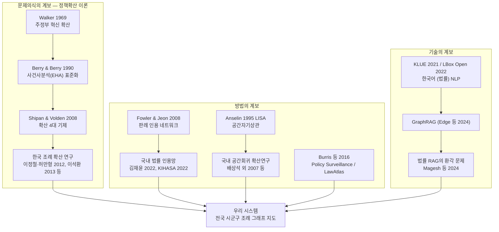

# 04. 선행연구 리뷰 — 공간 정책 그래프 지도의 학술적 계보

> **문서 목적**: 우리 아이디어("전국 시군구 조례·법령 그래프 지도")가 어떤 연구 전통 위에 서 있고, 어디가 학술적 공백(novelty)인지 정리한다. 발표심사(10/22)와 서류(서식2 ①배경·⑤참고문헌 장)에서 그대로 인용할 수 있는 형태로 작성했다.
>
> **작성 기준**: 별도 조사 워크플로(학술검색·웹검색)에서 서지 확인된 문헌만 수록. 원문에서 직접 확인하지 못한 서지 항목은 "(확인 필요)"로 표기. 조사에 없는 문헌은 넣지 않았다.
>
> **핵심 메시지 한 줄**: *정책확산 이론(1969~)이 던진 질문을, 법령 네트워크 분석·공간통계·legal mapping의 방법으로, 한국어 법률 NLP와 GraphRAG 기술로 구현한다 — 그리고 이 조합을 "전국 조례 전체"에 적용한 사례는 아직 없다.*

---

## 0. 한눈에 보기: 세 갈래 계보와 우리 시스템

| 계보 | 그들이 남긴 것 | 그들이 못 한 것 (= 우리 공백) |
|---|---|---|
| 정책확산 이론 | "누가 먼저 조례를 만들고 누가 따라가는가"라는 질문과 분석 방법(EHA·공간회귀) | 정책 1~5종의 조례 제정일을 매번 **수작업 수집** — 범용 데이터 인프라 부재 |
| 법령 네트워크 분석 | "인용 그래프의 중심성 = 법적 중요도" 검증, 국내 법률 인용망 구축 사례 | **자치법규(조례) 수준**의 전국 인용·유사도 네트워크는 국내외 미구축 |
| 공간통계 | 기초지자체 단위 핫스팟 분석의 표준 절차(Moran's I·LISA·Gi*) | 조례 데이터와 결합한 상시 서비스 없음 |
| Legal mapping | 법을 코딩해 지도로 배포하는 방법론·플랫폼(LawAtlas) | **한국 조례 전면 적용 사례 부재** |
| GraphRAG·법률 NLP | 그래프 기반 검색의 성능 실증, 공개 한국어 법률 코퍼스·모델 | 조례 지식그래프 + 지도 + 대화형 인터페이스의 결합 사례 없음 |

---

## 1. 정책확산(Policy Diffusion) 이론 — 우리 지도의 이론적 뼈대

### 1.1 고전 (미국)

| 문헌 | 핵심 기여 | 우리와의 연결 |
|---|---|---|
| **Walker (1969)**, "The Diffusion of Innovations among the American States", *APSR* 63: 880–899 | 미국 주(州)들의 신규 프로그램 채택 속도 차이를 최초로 체계적으로 계량화. "지역 선도 주를 다른 주들이 모방한다"는 지역확산 모형 제시. 현대 정책확산 연구의 출발점(인용 482회 이상, Cambridge Core 기준) | "어떤 지자체가 먼저 조례를 만들고 누가 따라가는가"라는 우리 프로젝트의 핵심 질문 자체가 이 논문에서 시작된 정통 연구 프로그램 |
| **Berry & Berry (1990)**, "State Lottery Adoptions as Policy Innovations: An Event History Analysis", *APSR* 84(2): 395–415 | 내부결정요인 모형과 지역확산 모형을 사건사분석(EHA)으로 통합한 방법론적 전환점. 이후 확산 연구의 표준 방법 | 조례 **제정 "시점"** 데이터가 곧 EHA의 원자료. 전국 조례의 제정일·개정일을 구조화하면 임의의 정책영역에 EHA를 즉시 적용할 수 있는 데이터 인프라가 됨 |
| **Shipan & Volden (2008)**, "The Mechanisms of Policy Diffusion", *AJPS* 52(4): 840–857 | 미국 675개 대도시의 금연정책(1975–2000)으로 확산의 4대 기제 — 학습·경제적 경쟁·모방·상급정부 강압 — 실증. 기초정부 단위 확산 연구의 대표작 | 지도 시각화에서 "이웃 모방 vs 상급정부(광역·중앙) 압력"을 구분해 보여줄 이론적 프레임 |

### 1.2 한국 지자체 조례 확산 연구

| 문헌 | 핵심 기여 | 우리와의 연결 |
|---|---|---|
| **이정철·허만형 (2012)**, "출산장려금 제도의 정책확산 연구: 기초자치단체의 제도 도입을 기초한 사건사 분석", 정책분석평가학회보 22(3): 95–119 | 2002년 전남 함평군발 출산장려금 조례의 전국 확산을 EHA로 분석. 인접 지자체 수(모방·압력), 중앙정부 제도 수립(강압), 내부요인(출산율·인구감소·단체장 3선 여부)이 채택에 영향. KCI 피인용 78회 | 한국에서 "이웃 지자체 효과"가 실증된 대표 사례. 우리 지도가 보여줄 확산 패턴의 전형(함평군 → 전국)이 이미 학술적으로 검증됨 |
| **이석환 (2013)**, "한국 지방자치단체 출산장려정책의 수평적·수직적 확산", 한국행정학보 47(3): 329–359 | Heckman 표본선택모형 + EHA로 조례 '제정'과 금액 '책정'을 분리 분석. 기초↔기초 수평확산과 광역→기초 수직확산을 동시 실증 | **광역조례–기초조례의 위계 관계(수직확산)를 그래프 엣지 타입으로 모델링**할 근거 |
| 이석환 (2014), vol.48(2): 161–184 (게재지명 한국행정학보로 추정, 확인 필요) | 상향확산(기초→광역→중앙) 후속 연구 | 확산 방향의 다양성(상향 포함) 근거 |
| 이석환 (2022), vol.56(2): 61–91 (게재지명 한국행정학보로 추정, 확인 필요) | 확산 기제 종합검증 | 기제별 엣지 해석의 최신 근거 |
| **김진영·이석환 (2016)**, "정책확산의 경로에 대한 정책결정자의 주관적 인식과 객관적 계량분석 결과의 비교", 한국공공관리학보 30(4): 249–270 | 확산 "경로" 실증 비교 — 단순 경계인접보다 **동일 광역행정구역 소속**(사회경제적·행재정적 유사성 포함)이 확산 경로로서 설명력 최대 | **지도의 인접성 정의를 단순 경계공유가 아니라 광역권 소속·유사성 기반으로도 제공**해야 한다는 설계 근거 (우리 엣지 설계 ①공간 인접성 ②정책 유사성의 이론적 정당화) |
| 배상석 (2010), 출산장려금제도 도입에 관한 연구 (게재지명 확인 필요, KCI ART001514912) | 수도권 50개 지자체 이산시간 EHA | EHA 적용의 국내 추가 선례 |
| 최상한 (2010), "지방정부 주민참여예산제도의 확산과 영향요인" | 83개 지자체(2004–2010) Cox 비례위험모형 | 출산장려 외 정책영역으로도 확산 연구가 일반화됨을 보여줌 |
| 고려대 박사학위논문 (dCollection 000000082591, 연도 확인 필요), 한국 지자체 기후변화 대응정책 확산 | 기후 관련 **조례 5종**(기후변화대응·저탄소녹색성장·에너지·녹색건축물·자전거)을 227개 지자체·2005–2017에 대해 공간분석+패널+EHA로 종합 분석 | 우리 카테고리 분류(기후·복지 등)의 '기후' 축에서 직접 비교 가능한 최신 종합 연구 |

### 1.3 발표용 논리: "우리 시각화는 확산 이론의 실측 도구다"

1. 50년 넘게 축적된 정책확산 연구가 공통으로 요구하는 원자료는 **"어느 지자체가, 어떤 조례를, 언제 제정·개정했는가"**다.
2. 그런데 국내 조례 확산 연구는 전부 특정 정책 1~5종의 조례 목록을 **연구자가 수작업으로 수집**해 왔다(이정철·허만형 2012의 출산장려금 1종 ~ 고려대 박사논문의 기후 조례 5종).
3. 우리 시스템은 전국 조례의 제정·개정 이력과 상위법령 연계를 **전 영역에 걸쳐 그래프로 상시 구조화**한다. 즉, 지금까지 논문 한 편마다 다시 만들던 데이터셋을 **범용 인프라로 일반화**하는 것이며, 지도 위에서 확산 경로(함평군→전국 같은)를 누구나 실측할 수 있게 한다.
4. 타깃 사용자(지자체·의회 실무자)에게는 같은 데이터가 "우리와 비슷한 지역이 이미 만든 조례 찾기" 도구가 된다 — 이론이 말하는 '학습(learning)' 기제를 도구로 구현하는 셈.

---

## 2. 법령 인용 네트워크 분석 — "그래프 중심성 = 법적 중요도"의 검증된 계보

| 문헌 | 핵심 기여 | 우리와의 연결 |
|---|---|---|
| **Fowler & Jeon (2008)**, "The Authority of Supreme Court Precedent", *Social Networks* 30(1): 16–30 | 1754–2002년 미 연방대법원 다수의견 30,288건 인용 네트워크 전수 구축. 허브/권위(authority) 점수로 산출한 '중요 판례'가 법률 전문가 평가와 거의 일치, 미래 중요 판례까지 예측 | **"법 문서 인용 그래프에서 중심성 = 법적 중요도"라는 우리 그래프 뷰의 핵심 가정이 이미 검증됨**. 발표에서 "왜 그래프인가"의 1순위 근거 |
| Fowler, Johnson, Spriggs, Jeon & Wahlbeck (2007), "Network Analysis and the Law", *Political Analysis* 15(3) (페이지 324–346 추정, 확인 필요) | 위 연구의 동반 논문 — 판례의 법적 중요도 측정 방법론 | 방법론 상세 인용처 |
| Dahl (2024), "Chain novel, or Markov chain? Estimating the authority of U.S. Supreme Court case law", *Journal of Empirical Legal Studies* (DOI: 10.1111/jels.12401) | Fowler 전통을 잇는 최신 연구 | 이 연구 흐름이 현재진행형임을 보여주는 근거 |
| Mazzega, Bourcier & Boulet (2009), 프랑스 법전 인용 네트워크 (ICAIL 2009로 추정, 확인 필요) | 프랑스 전체 법체계가 'small world'보다 집적된 'concentrated world' 구조임을 발견 | 국가 법체계 전체를 네트워크로 보는 접근의 국제 선례. 국내 후속 연구들의 방법론적 준거 |
| **김재윤 (2022)**, "특별법 중심 입법이 법체계에 미친 영향: 법률간 인용에 대한 종단 네트워크 분석", vol.14(1): 161–194 (게재 학술지명 확인 필요) | 한국 법률 간 인용 구조 73년치 종단 분석. 17–19대 국회 특별법 대량 입법으로 국토·교통 법률 군집 급성장, 최다 피인용 법률이 2009년 민법→국토계획법으로 교체 | 국가법령(법률) 수준의 인용 네트워크는 이미 구축 사례가 있음 — **자치법규(조례) 수준의 전국 네트워크는 공백**이라는 novelty 주장의 직접 근거 |
| **KIHASA (2022)**, "인용 연결망 분석을 통한 현행 보건복지 분야 법률의 구조에 대한 연구", 보건사회연구 42(3): 320– | 보건복지부 등 소관 119개 법률의 인용망을 국가법령정보센터(law.go.kr) 원문의 **낫표(「」) 인용 규칙 기반 자동 추출**로 구축. 연결정도·고유벡터·PageRank 중심성 + 루뱅(Louvain) 커뮤니티 탐지로 분야별 대표법 식별 | **우리가 그대로 확장할 실무 방법론**: law.go.kr 원문 「」 패턴 → 인용 엣지 자동 추출, PageRank+Louvain 조합. 우리 파이프라인의 '낫표 파싱 교차검증 레이어' 설계가 이 논문의 직접 계승 |
| KAIST 석사학위논문 (2021, 지도 양재석), "대한민국 법률의 네트워크 구조 분석 — 준용 법률과 판례의 참조 법률을 중심으로" (KOASAS) | 준용(입법 단계) 네트워크와 판례 참조조문(적용 단계) 네트워크를 비교, 법률 '실효성'을 중심성으로 계량화 | **조례—상위법령—판례를 잇는 다층(멀티레이어) 그래프** 설계의 국내 선례 |
| 원자력 법제 SNA 연구 (2019), 디지털융복합연구 17(8): 47–60 | 특정 분야 법령 네트워크의 정합성 진단 | 분야별(카테고리별) 서브그래프 분석의 선례 |

**핵심 논리**: 법률 수준 인용 네트워크 연구(김재윤 2022; KIHASA 2022)는 있으나, **전국 자치법규(조례) 수준의 인용·유사도 네트워크 구축 연구는 이번 조사에서 발견되지 않았다**. 이것이 우리 프로젝트의 직접적 novelty 근거다. (단, 검색 한계 가능성이 있으므로 RISS/DBpia 원문 재검색으로 공백 여부 재확인 필요 — §8 참조.)

**데이터 실현성 보강**: 별도 실측 조사에서 법제처 국가법령정보 Open API의 위임법령 조회(`lsDelegated`)·법령체계도(`lsStmd`)·자치법규 법령 연계(`lnkLsOrd`/`lnkOrg`) 4개 엔드포인트를 실호출 검증했고, 법령 조문 단위→전국 개별 조례 매핑(주차장법 기준 조례 1,000여 건)이 XML/JSON으로 즉시 수급됨을 확인했다. 즉 이 절의 선행연구가 수작업 또는 텍스트 파싱으로 만들던 엣지를 우리는 **공식 API + 낫표 파싱 하이브리드**로 만든다. (상세는 데이터 파이프라인 문서 참조.)

---

## 3. 법률 지식그래프와 한국어 법률 NLP — 유사도·분류 모듈의 기술 기반

| 문헌/자원 | 핵심 기여 | 우리와의 연결 |
|---|---|---|
| **Hwang, Lee, Cho, Lee & Seo (2022)**, "A Multi-Task Benchmark for Korean Legal Language Understanding and Judgement Prediction" (LBox Open), *NeurIPS 2022 Datasets and Benchmarks* (arXiv:2206.05224) | 최초의 대규모 한국 법률 AI 벤치마크: 판례 14.7만 건(2.59억 토큰) 코퍼스 + 분류 2종 + 판결예측 2종 + 요약 1종. 한국어 법률 특화 언어모델 **LCUBE** 공개 | **조례 텍스트 임베딩·분류·유사도 계산에 쓸 공개 한국어 법률 코퍼스/모델의 표준 출처**. "법령 유사성 엣지"와 "카테고리 자동 분류" 모듈의 기술 근거 |
| KBL (Korean Benchmark for Legal LLMs, GitHub: lbox-kr/kbl) | 한국 법률 LLM 벤치마크 후속 (논문 서지사항 확인 필요 — GitHub 존재만 확인) | 법률 LLM 평가체계 참고 |
| **Park et al. (2021)**, "KLUE: Korean Language Understanding Evaluation", *NeurIPS 2021 Datasets and Benchmarks* | 한국어 NLU 8개 태스크(주제분류·STS·NLI·NER·관계추출·의존구문·MRC·DST) 벤치마크 + KLUE-BERT/RoBERTa 공개(CC BY-SA 4.0) | 조례 텍스트에서 기관·대상·급부 등 **개체/관계 추출** 시 베이스라인 모델·평가체계 |
| 법령 온톨로지 구축에 관한 연구 (KCI ART001929542, 발행연도 확인 필요) | 한국 법령의 상·하위 구조, 고유 속성, 법률 간 참조 관계를 OWL DL의 TBox/ABox로 매핑하는 규칙 제안 | **조례 지식그래프 스키마**(법령 위계·참조 관계·조문 패턴) 설계 시 참조할 국내 초기 연구 |
| 계층적 민법 구조를 반영한 모듈형 RAG 기반 한국어 법률 질의응답 시스템 (KCI ART003265336, 2025로 추정 — 발행연도 확인 필요) | 장-절-조 계층과 조문 간 참조 관계를 반영한 LangGraph 기반 모듈형 RAG. 검색 정확도 88%, MRR 0.84, 응답 적절성 92%, 직접 조문 참조 질의 100% | **"법령의 그래프 구조를 검색에 반영하면 성능이 오른다"는 국내 실증** — 조례 그래프 + RAG(챗봇 인터페이스) 결합의 직접적 근거 |

**추가 조사 필요**: LCUBE 외 한국어 법률 특화 임베딩/사전학습 모델(예: KRLawBERT 계열)의 존재 여부와 서지사항 (확인 필요).

---

## 4. GraphRAG와 법률 QA — 챗봇/에이전트 인터페이스의 근거

| 문헌 | 핵심 기여 | 우리와의 연결 |
|---|---|---|
| **Edge, Trinh, Cheng, Bradley, Chao, Mody, Truitt & Larson (2024)**, "From Local to Global: A Graph RAG Approach to Query-Focused Summarization", arXiv:2404.16130 (Microsoft Research) | LLM으로 코퍼스에서 엔티티 지식그래프를 구축하고 커뮤니티 요약을 사전 생성 — 코퍼스 전체를 조망하는 질문(global sensemaking)에서 기존 벡터 RAG 대비 포괄성·다양성 크게 개선 | "어느 지역들이 어떤 유형의 조례를 갖는가" 같은 **전역적 질문은 정확히 GraphRAG가 겨냥한 문제 유형**. 우리 조례 그래프 지도가 곧 GraphRAG의 지식그래프 역할을 함 — 챗봇 모듈이 별도 구조물이 아니라 그래프의 자연스러운 활용이라는 논리 |
| **Magesh et al. (2024/2025)**, "Hallucination-Free? Assessing the Reliability of Leading AI Legal Research Tools", *Journal of Empirical Legal Studies* (arXiv:2405.20362, DOI: 10.1111/jels.12413, Stanford RegLab) | Lexis+ AI, Westlaw AI 등 상용 법률 RAG 도구의 환각률이 여전히 **17–33%** 임을 최초 실증. 법률 RAG 환각 유형론 제시 | **"왜 그냥 LLM에 물으면 안 되는가"의 답**. 출처(조례 원문·조항)로 근거를 고정하는 그래프 기반 검색의 필요성을 정당화 — 발표 예상 질문 대비 1순위 인용 |
| (참고) CLERC (arXiv:2406.17186) 등 법률 판례 검색·RAG 데이터셋 연구 | 2024년 이후 법률 RAG가 독립 연구 분야로 성립 | 우리 접근이 최신 연구 흐름의 한복판에 있음을 보여주는 배경 근거 |
| (국내) §3의 모듈형 RAG 민법 QA 연구 | 한국어 법률 도메인에서 구조 반영 RAG 성능 실증 | 국내 실증 사례로 재인용 |

---

## 5. 정책·제도의 공간 분석 — 지도 뷰의 통계적 근거

| 문헌 | 핵심 기여 | 우리와의 연결 |
|---|---|---|
| **Anselin (1995)**, "Local Indicators of Spatial Association—LISA", *Geographical Analysis* 27(2): 93–115 | 전역 Moran's I를 관측치별 기여로 분해하는 국지 지표(LISA) 제안 — 핫스팟/공간 이상치 탐지의 표준. (Moran's I 자체의 기원은 Moran 1950으로 통상 인용 — 확인 필요) | 조례 채택의 공간 군집(핫스팟) 지도를 그릴 때의 표준 통계량. **지도 UI에 Moran's I/LISA 레이어를 넣을 학술 근거** — "예쁜 지도"가 아니라 "통계적으로 정의된 군집"임을 주장 가능 |
| **Mitchell (2018)**, "Does Policy Diffusion Need Space? Spatializing the Dynamics of Policy Diffusion", *Policy Studies Journal* 46(2): 424–448 | 기제 중심으로 흘러온 확산 연구에 공간적 차원을 복원해야 한다고 주장 — 확산연구와 공간분석의 교량 문헌 | **"확산 이론 + 공간통계 + 지도"라는 우리 조합이 학계에서 요구되어 온 방향**임을 한 문장으로 보여주는 인용 |
| **배상석·임채홍·하현선 (2007)**, "정부회계도입의 정책확산에 대한 실증적 분석", 한국정책학회보 16(3): 231–254 | 공간회귀 기법을 한국 정책확산 연구에 도입 — 복식부기 도입 노력이 이웃 지자체 노력에 영향받음을 실증 | 한국 지자체 데이터에 공간계량모형을 적용한 초기 선례 |
| 도시재생 기반 관광 공간의 확산요인 분석 (KCI ART003019318, 최근 논문 — 서지 상세 확인 필요) | 조례 '채택'과 '개정'을 구분, 공간자기상관 확인 후 공간회귀로 기제 검증(채택기엔 경쟁·학습·강제, 개정기엔 경쟁·학습만 유의) | **조례 생애주기(제정→개정)별로 확산 기제가 다름** — 우리 데이터 모델에 개정 이력을 포함해야 할 근거 |
| 공간적 자기상관을 활용한 지역안전지수의 공간패턴 분석 (한국측량학회지, 2021) | 전국 기초지자체 대상 Global Moran's I + LISA + Getis-Ord Gi*로 핫스팟/콜드스팟 도출 | **국내 기초지자체 단위 공간통계 분석의 전형적 절차** 시연 — 우리 분석 파이프라인의 절차 템플릿 |
| 최유진 (2017), "사회적 경제 증진 조례의 협동조합 활성화 효과: 공간회귀모형의 활용" (DBpia) | 조례의 '효과'를 공간회귀로 검증(기초조례가 광역조례보다 효과 큼) | 조례 데이터 인프라가 '채택 연구'를 넘어 '효과 연구'로도 이어질 수 있음을 보여주는 확장 근거 |

---

## 6. Policy Surveillance / Legal Mapping — "법을 코딩해 지도로 만든다"의 원형

| 문헌/플랫폼 | 핵심 기여 | 우리와의 연결 |
|---|---|---|
| **Burris 등 (2016)**, "Policy Surveillance: A Vital Public Health Practice Comes of Age", *Journal of Health Politics, Policy and Law* (41(6): 1151–1173로 추정 — 권·호·페이지 확인 필요) | 정책 서베일런스 = "관할구역·시점에 걸친 법·정책의 체계적 수집·분석·배포"로 정의. 법 텍스트를 코딩해 정량 데이터로 만드는 실무를 학문으로 정립 | **우리 프로젝트가 바로 이 방법론의 한국 조례판**. 방법론적 정당성의 1순위 인용처 |
| **Burris, Ashe, Levin, Penn & Larkin (2016)**, "A Transdisciplinary Approach to Public Health Law: The Emerging Practice of Legal Epidemiology", *Annual Review of Public Health* (저자 구성 일부 추정 — 확인 필요) | '법역학(legal epidemiology)' — 법을 (건강) 결과의 요인으로 연구하는 과학 — 개념 체계화 | 조례 데이터가 정책 효과 연구의 독립변수가 될 수 있다는 학술적 프레임 |
| **LawAtlas / MonQcle** (Temple University, Robert Wood Johnson Foundation 후원) | 2009년 설립된 Public Health Law Research 프로그램이 80여 개 실증연구 지원. LawAtlas(lawatlas.org)는 법을 코딩해 관할구역 간 비교 가능한 지도·데이터셋으로 공개. 대규모 추적용 소프트웨어 MonQcle 2016년 출시 | **조례를 속성별로 코딩해 지도로 배포하는 서비스의 국제적 원형**. 우리 포지셔닝: "한국판 LawAtlas + 그래프 분석 + GraphRAG". 한국 조례에 이 방법론을 체계 적용한 국내 선행 서비스는 이번 조사에서 발견하지 못함 → **공백 = novelty** |
| **KIHASA (2023)**, "다자녀 지원에 관한 광역자치단체 조례 분석 연구", 보건사회연구 43(3) | 국가법령정보센터에서 '다자녀' 키워드로 조례 64건 수집, 분석틀(대상 포괄성·급여·재정책임성·전달체계)로 코딩 | 사실상 **소규모 policy surveillance의 국내 수행 사례** — 수요는 있으나 수작업·일회성에 머물러 있음을 보여줌. 우리 시스템은 이를 상시·전 영역으로 확장 |

**추가 확인 필요**: LawAtlas 방법론(MonQcle 코딩 체계)의 구체적 코딩 프로토콜 문서는 원문을 열어보지 못함. 방법론 차용을 명시적으로 쓰려면 원 프로토콜 문헌(Anderson et al. 2013 등으로 알려짐 — 확인 필요) 추가 확인 필요.

---

## 7. 종합 표: 연구 분야 → 대표 문헌 → 우리 시스템 모듈 매핑

우리 시스템 모듈 정의(팀 논의 기준): **M1** 조례·법령 데이터 파이프라인(제정·개정 이력, 상위법 연계, 발의·표결 속성) / **M2** 그래프 구축(지역 노드 + 법령 노드, 인접성·유사성 엣지) / **M3** 지도 뷰(공간통계 레이어) / **M4** 그래프 뷰·군집(카테고리별 유사 지역·유사 법령 추천, 인접성 군집, 유사도 군집) / **M5** 챗봇·에이전트 인터페이스(GraphRAG).

| 연구 분야 | 대표 문헌 | 계승하는 것 | 구현 모듈 |
|---|---|---|---|
| 정책확산 이론 (고전) | Walker 1969; Berry & Berry 1990; Shipan & Volden 2008 | 연구 질문("누가 먼저, 누가 따라가나")과 확산 기제 프레임 | M1 (제정·개정 시점 데이터), M3 (확산 경로 시각화) |
| 한국 조례 확산 연구 | 이정철·허만형 2012; 이석환 2013; 김진영·이석환 2016 | 이웃 효과·수직확산 실증, 광역권 소속 기반 인접성 정의 | M2 (엣지 타입 설계), M4 (인접성 군집) |
| 법령 인용 네트워크 | Fowler & Jeon 2008; 김재윤 2022; KIHASA 2022; KAIST 석사 2021 | 중심성=중요도 가정, 낫표 파싱 + PageRank + Louvain 파이프라인, 멀티레이어 그래프 | M1 (인용 엣지 추출), M2, M4 (군집·중심성 분석) |
| 법률 지식그래프·한국어 법률 NLP | LBox Open 2022; KLUE 2021; 법령 온톨로지 연구; 모듈형 RAG 민법 QA | 임베딩·분류용 코퍼스/모델, 그래프 스키마, 구조 반영 검색의 성능 실증 | M1 (카테고리 분류), M2 (유사성 엣지), M5 |
| GraphRAG·법률 QA | Edge 등 2024; Magesh 등 2024 | 전역 질문용 그래프 기반 검색, 출처 고정으로 환각 억제 논리 | M5 |
| 정책의 공간 분석 | Anselin 1995; Mitchell 2018; 배상석 외 2007; 지역안전지수 2021 | Moran's I·LISA·Gi* 표준 절차, 공간+확산 결합의 당위 | M3 (핫스팟 레이어), M4 (인접성 군집의 통계적 정의) |
| Policy surveillance / legal mapping | Burris 등 2016; LawAtlas/MonQcle; KIHASA 2023 | 법 코딩→지도 배포 방법론, 서비스 형태의 원형 | 시스템 전체 포지셔닝 ("한국판 LawAtlas") + M1 (속성 코딩) |

---

## 8. Novelty(공백) 정리와 리스크

### 8.1 세 가지 공백 — 발표 슬라이드용

1. **자치법규(조례) 전국 단위의 인용·유사도 그래프는 국내외 미구축** — 법률 수준(김재윤 2022, KIHASA 2022)까지만 존재.
2. **Policy surveillance 방법론의 한국 조례 전면 적용 사례 부재** — KIHASA 2023 같은 일회성·소규모 수작업 사례만 존재.
3. **확산연구용 조례 제정·개정 이력 데이터의 범용 인프라 부재** — 논문마다 수작업 재수집.

→ 세 공백을 **하나의 그래프 지도로 동시에 메우는 것**이 본 프로젝트의 기여. 심사기준의 **독창성(15점)** 항목 서술의 뼈대로 사용.

### 8.2 리스크와 대응

| 리스크 | 내용 | 대응 |
|---|---|---|
| 공백 주장 반박 가능성 | "조례 네트워크 연구가 없다"가 검색 한계일 수 있음 | 제출 전 RISS/DBpia 원문 검색으로 재확인. 발견 시 "전국 상시 서비스화"로 novelty를 서비스 층위로 이동 |
| 미확인 서지 | §9 목록의 서지 미확정 항목 | hwp 서식2 ⑤참고문헌 장에 넣기 전 원문 확인. 미확정 문헌은 발표 슬라이드에서 제외 |
| 유사 수상작 | 역대 수상작 중 유사작 존재 여부 미조사 (팀 우려사항) | 별도 조사 필요 — 본 문서 범위 밖 |

### 8.3 공모전 서류(서식2)와의 연결

- 서식2는 ①배경 및 개요 ②구현 방법 및 결과 ③활용분야 ④기대효과 **⑤참고문헌 출처** 5개 장으로 구성되며, 신청서에 활용한 참고문헌 출처 일체 기재가 필수다.
- 본 문서 §1~§6의 표를 그대로 압축하면 ①배경(연구 계보 + 공백)과 ⑤참고문헌 장이 나온다. 본문 15쪽 제한을 고려해 서류에는 **분야당 1~2개 대표 문헌만** 인용하고 나머지는 발표 질의응답 대비용으로 유지한다.
- 추천 최소 인용 세트(7편): Walker 1969, 이정철·허만형 2012, Fowler & Jeon 2008, KIHASA 2022, Anselin 1995, Burris 등 2016, Edge 등 2024 (+환각 질문 대비 Magesh 등 2024).

---

## 9. 미확인 항목 체크리스트 (제출 전 원문 확인 필요)

- [ ] 이석환 2014, 2022의 게재 학술지명 (한국행정학보로 추정)
- [ ] 배상석 2010의 게재 학술지명
- [ ] 김재윤 2022의 게재 학술지명 (vol.14(1)만 확인)
- [ ] 법령 온톨로지 연구(KCI ART001929542)의 발행연도
- [ ] 모듈형 RAG 민법 QA 논문(KCI ART003265336)의 발행연도 (2025 추정)
- [ ] KBL 벤치마크의 논문 서지사항 (GitHub 존재만 확인)
- [ ] Burris 등 2016 (JHPPL)의 정확한 권·호·페이지 (41(6): 1151–1173 추정)
- [ ] Fowler 등 2007 (Political Analysis)의 페이지 범위 (15(3): 324–346 추정)
- [ ] Mazzega 등 2009의 게재처 (ICAIL 2009 추정)
- [ ] 고려대 박사학위논문(기후 조례 확산)의 저자·연도
- [ ] Moran 1950 원 문헌 서지 (Moran's I 기원으로 통상 인용)
- [ ] LCUBE 외 한국어 법률 임베딩 모델(KRLawBERT 계열 등) 존재 여부
- [ ] LawAtlas 코딩 프로토콜 원 문헌 (Anderson et al. 2013 추정)
- [ ] 한국 조례 대상 인용 네트워크 연구의 부재 여부 — RISS/DBpia 재검색으로 공백 재확인

---

## 부록: 확인된 주요 출처 링크

| 문헌 | 링크 |
|---|---|
| Walker 1969 | https://www.cambridge.org/core/journals/american-political-science-review/article/abs/diffusion-of-innovations-among-the-american-states/C99D4409CA8FFC170E7EDFA8789C9748 |
| Berry & Berry 1990 | https://www.jstor.org/stable/1963526 |
| Shipan & Volden 2008 | https://onlinelibrary.wiley.com/doi/10.1111/j.1540-5907.2008.00346.x |
| 이정철·허만형 2012 | https://www.kci.go.kr/kciportal/ci/sereArticleSearch/ciSereArtiView.kci?sereArticleSearchBean.artiId=ART001702570 |
| 이석환 2013 | https://www.kci.go.kr/kciportal/ci/sereArticleSearch/ciSereArtiView.kci?sereArticleSearchBean.artiId=ART001806197 |
| 이석환 2022 | https://www.kci.go.kr/kciportal/ci/sereArticleSearch/ciSereArtiView.kci?sereArticleSearchBean.artiId=ART002857157 |
| 김진영·이석환 2016 | https://scholarworks.bwise.kr/hanyang/handle/2021.sw.hanyang/153355 |
| 배상석 2010 | https://www.kci.go.kr/kciportal/ci/sereArticleSearch/ciSereArtiView.kci?sereArticleSearchBean.artiId=ART001514912 |
| 최상한 2010 | https://www.kci.go.kr/kciportal/ci/sereArticleSearch/ciSereArtiView.kci?sereArticleSearchBean.artiId=ART001483823 |
| Fowler & Jeon 2008 | https://www.sciencedirect.com/science/article/abs/pii/S0378873307000378 |
| Fowler 등 2007 | https://www.cambridge.org/core/journals/political-analysis/article/abs/network-analysis-and-the-law-measuring-the-legal-importance-of-precedents-at-the-us-supreme-court/D9B2F13BE2594E1527780AAFDD6BF164 |
| Dahl 2024 | https://onlinelibrary.wiley.com/doi/10.1111/jels.12401 |
| 김재윤 2022 | https://www.kci.go.kr/kciportal/ci/sereArticleSearch/ciSereArtiView.kci?sereArticleSearchBean.artiId=ART002835562 |
| KIHASA 2022 (보건사회연구 42(3)) | https://www.kihasa.re.kr/hswr/assets/pdf/1356/journal-42-3-320.pdf |
| KAIST 석사논문 2021 | https://koasas.kaist.ac.kr/handle/10203/294916 |
| 원자력 법제 SNA 2019 | https://www.kci.go.kr/kciportal/ci/sereArticleSearch/ciSereArtiView.kci?sereArticleSearchBean.artiId=ART002493666 |
| 법령 온톨로지 연구 | https://www.kci.go.kr/kciportal/landing/article.kci?arti_id=ART001929542 |
| LBox Open (arXiv) | https://arxiv.org/abs/2206.05224 |
| LBox Open (GitHub) | https://github.com/lbox-kr/lbox-open |
| KBL (GitHub) | https://github.com/lbox-kr/kbl |
| KLUE (NeurIPS 2021) | https://datasets-benchmarks-proceedings.neurips.cc/paper/2021/hash/98dce83da57b0395e163467c9dae521b-Abstract-round2.html |
| 모듈형 RAG 민법 QA | https://www.kci.go.kr/kciportal/ci/sereArticleSearch/ciSereArtiView.kci?sereArticleSearchBean.artiId=ART003265336 |
| GraphRAG (Edge 등 2024) | https://www.semanticscholar.org/paper/From-Local-to-Global:-A-Graph-RAG-Approach-to-Edge-Trinh/c1799bf28d1ae93e1631be5b59196ee1e568f538 |
| Magesh 등 (arXiv) | https://arxiv.org/abs/2405.20362 |
| Magesh 등 (JELS) | https://onlinelibrary.wiley.com/doi/full/10.1111/jels.12413 |
| Anselin 1995 | https://onlinelibrary.wiley.com/doi/abs/10.1111/j.1538-4632.1995.tb00338.x |
| Mitchell 2018 | https://onlinelibrary.wiley.com/doi/abs/10.1111/psj.12226 |
| 배상석·임채홍·하현선 2007 | https://www.kci.go.kr/kciportal/ci/sereArticleSearch/ciSereArtiView.kci?sereArticleSearchBean.artiId=ART001185634 |
| 도시재생 관광 공간 확산요인 | https://www.kci.go.kr/kciportal/ci/sereArticleSearch/ciSereArtiView.kci?sereArticleSearchBean.artiId=ART003019318 |
| 지역안전지수 공간패턴 2021 | https://www.koreascience.kr/article/JAKO202108956205060.page?lang=ko |
| 최유진 2017 | https://www.dbpia.co.kr/journal/articleDetail?nodeId=NODE10800570 |
| 고려대 박사논문 (기후 조례 확산) | https://dcollection.korea.ac.kr/srch/srchDetail/000000082591 |
| Burris 등 2016 (JHPPL) | https://am.aals.org/wp-content/uploads/sites/4/2025/01/burris_et_al_policy_surveillance_jhppl.pdf |
| Burris 등, Legal Epidemiology | https://stacks.cdc.gov/view/cdc/49992 |
| LawAtlas FAQ | https://lawatlas.org/faq |
| KIHASA 2023 (보건사회연구 43(3)) | https://www.kihasa.re.kr/hswr/v.43/3/92/ (다자녀 지원 광역자치단체 조례 분석) |
