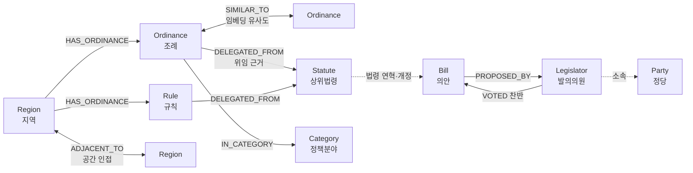
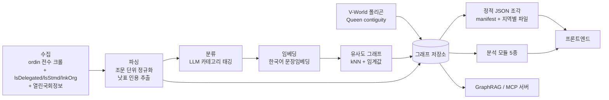
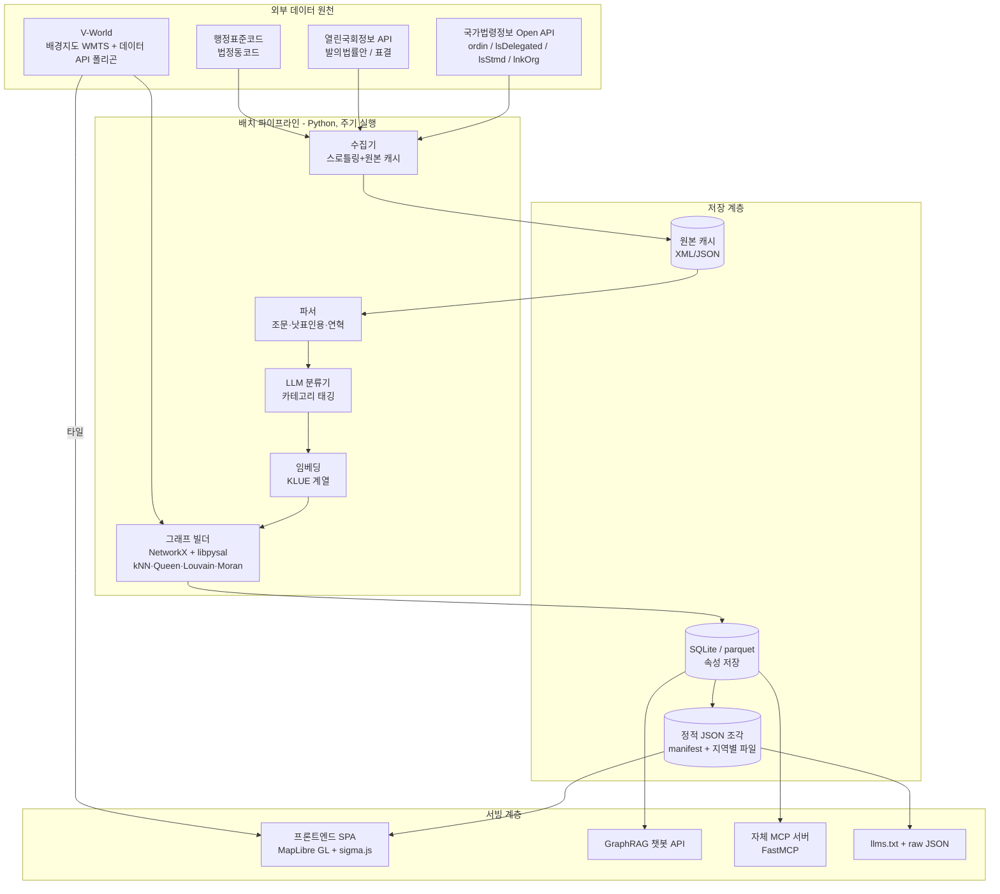

# 05. 시스템 설계서 — 전국 조례 공간 정책 그래프 지도

> 팀 내부 개발 청사진. 제8회 공간정보 활용·아이디어 경진대회 출품작의 실제 구현 설계.
> 기준일: 2026-08-18. 근거는 팀 조사자료(법령데이터·korea100·klocal·학술·공모전 요강·MCP 검증·위임조례 API 실측)에 한정하며, 조사자료로 확인 못한 항목은 (확인 필요)로 표시.

---

## 0. 설계 전제 (조사로 확정된 사실)

| 전제 | 근거 |
|---|---|
| 전국 현행 조례 약 127,983건, 규칙 27,703건 (2026-07-20, ELIS) | ELIS 자치법규 현황 |
| 조례 수집·본문은 국가법령정보 Open API `target=ordin`으로 조문 단위 확보 가능 | 공식 가이드 확인 |
| 법령→위임조례 연계는 `lsDelegated`(조문 단위) + `lsStmd`(법령당 전체) + `lnkLsOrd`/`lnkOrg`(연계 전용) 4개 경로 실호출 검증 완료 | 실측 (주차장법 기준 조례 1,000여 건 수신) |
| 시군구 경계 폴리곤은 V-World 데이터 API `LT_C_ADSIGG_INFO`(GeoJSON MultiPolygon, sig_cd 5자리) | 공식 레퍼런스 + 실측 블로그 |
| 국회 발의·표결은 열린국회정보 API(대표/공동발의 구분, 의원별 찬반+정당) | 데이터셋 페이지 확인 (일부 서비스코드는 서드파티 매핑, 확인 필요) |
| 2026-07-01 전남광주통합특별시 출범 → 광역 16개 체제(추정), 기초 행정코드 재부여, 자치법규 2,454건 정비 과도기 | 연합뉴스 확인 |
| korea100·klocal 모두 설치 가능한 MCP 없음 → 우리가 MCP 서버를 "제공"하는 쪽이 차별화 | MCP 부재 독립 재검증 완료 |
| 공모전 제약: 공개 데이터만 사용(개인·유료 데이터 0점), hwp 서식2 본문 15쪽, 발표 10-22 | 안내문·양식 hwp 전수 확인 |

---

## 1. 서비스 컨셉

### 1.1 가칭 후보

| 후보 | 한 줄 피치 |
|---|---|
| **조례맵 (JoryeMap)** | 전국 12.8만 조례를 지도 위에 올린, 대한민국 최초의 자치법규 그래프 지도 |
| **폴리시그래프 (PolicyGraph Korea)** | 지역과 법을 노드로, 인접성과 유사성을 엣지로 — 정책이 퍼지는 길을 보여주는 지도 |
| **입법나침반** | "우리 동네에 없는 조례"를 유사 지자체 그래프에서 찾아주는 실무자용 나침반 |
| **로컬로 (LocalLaw)** | 조례 벤치마킹을 구글링에서 그래프 탐색으로 바꾸는 지방행정 도구 |
| **K-조례 아틀라스** | 한국판 LawAtlas — 조례를 코딩·지도화·그래프화한 policy surveillance 플랫폼 |

- 1순위 권고: **조례맵** (직관성) 또는 **입법나침반** (심사위원 스토리텔링용). 최종 선정은 팀 투표.

### 1.2 사용자 페르소나 4종과 핵심 시나리오

| 페르소나 | 상황 | 핵심 시나리오 | 대응 기능 |
|---|---|---|---|
| **P1. 지자체 실무자** (조례 입안 담당 주무관) | 단체장 지시로 "반려동물 지원 조례" 초안을 만들어야 함. 지금은 구글링·타 지자체 전화로 사례 수집 | ① 우리 시 선택 → ② 유사 지자체 Top-10 확인 → ③ 그중 7곳에 있는데 우리에게 없는 조례(격차) 목록 → ④ 원문·근거법·제정연혁 비교 → ⑤ 초안 참고 | 유사 지자체 추천 + 조례 격차 분석 + 조례 상세 |
| **P2. 지방의원·보좌진** | 의원 발의 조례 준비. "이 조례가 다른 지역에서 언제·어느 정당 주도로 만들어졌나" 근거 필요 | ① 키워드로 조례군 검색 → ② 확산 타임라인으로 최초 제정지·확산 경로 확인 → ③ 근거 상위법령의 국회 발의·표결 정보(발의자·정당별 찬반) 열람 → ④ 발의 논리 자료 확보 | 확산 타임라인 + Bill/Legislator 연계 |
| **P3. 연구자·기자** | 정책확산 연구 또는 "출산장려금 조례, 함평에서 전국으로" 류 기획기사 | ① 카테고리 선택(예: 인구·복지) → ② 공간 군집 vs 정책 군집 비교 지도 → ③ Moran's I·LISA 핫스팟 → ④ 제정일 데이터 CSV 내려받아 사건사분석(EHA)에 활용 | 군집 비교 + 공간통계 레이어 + 데이터 익스포트 |
| **P4. 시민** | "우리 동네에는 청년 지원 조례가 있나? 옆 동네는?" | ① 내 지역 검색 → ② 카테고리별 조례 유무 카드 → ③ 이웃 지역과 비교 → ④ 챗봇에 자연어 질문 | 지역 대시보드 + GraphRAG 챗봇 |

- 1차 타깃은 P1(팀 논의와 일치, klocal의 검증된 수요층). P2~P4는 확장 타깃으로 문서·발표에서 "수혜자 범위"(기대효과 정량·정성 서술)에 활용.

---

## 2. 그래프 스키마

### 2.1 노드 8종

| 노드 | 설명 | 주요 속성 | 데이터 출처 |
|---|---|---|---|
| `Region` | 광역(16, 추정)/기초(226 유지 추정) 지자체 | region_id(법정동코드 앞 5자리), org_code(법령정보 행정기관코드), sborg_code, name, level(광역/기초), parent_region, geometry_ref(MultiPolygon), population(확인 필요), 폐지일(구 전남·광주 등 폐지 지자체용) | V-World LT_C_ADSIGG_INFO, code.go.kr, ordin API org/sborg |
| `Ordinance` | 조례 | ordin_id(자치법규ID), mst(일련번호), title, 공포일자, 공포번호, 시행일자, 제정일, 최종개정일, 폐지일(연혁 nw=2), 제개정구분(rrClsCd: 제정 300201/일부개정 300202/전부개정 300203/폐지 300204), 담당부서, 전화번호, 조문수, 전문 텍스트, embedding_ref | ordin 본문 API |
| `Rule` | 규칙 (knd=30002) | Ordinance와 동일 구조 + 제정주체=단체장 | ordin API |
| `Statute` | 상위법령(법률·시행령·시행규칙) | law_id, mst, 법종구분, 공포일/시행일, officialUrl | law/eflaw API, lsStmd |
| `Bill` | 국회 의안 | bill_id(PRC_ 형식), 의안번호, 대수(AGE), 제안일, 의결일, 처리결과, 찬성/반대/기권/총투표수 | 열린국회정보 ALLBILL·의안별 표결현황 (서비스코드 일부 확인 필요) |
| `Legislator` | 발의 의원 | 의원명, 대수, 지역구(확인 필요), 소속 정당 | 발의법률안 API(RST_PROPOSER/PUBL_PROPOSER) |
| `Party` | 정당 | 정당명 | 표결 레코드의 정당 필드에서 유도 |
| `Category` | 정책분야 | code, name, level(대/중), 정의문 | 자체 태깅 체계(3.3절) + ordinfd 분야 API 대조 |

### 2.2 엣지 7종

| 엣지 | 방향 | 속성 | 생성 방법 |
|---|---|---|---|
| `HAS_ORDINANCE` | Region → Ordinance/Rule | 현행 여부 | ordin 목록 API의 org/sborg·지자체기관명 매핑 |
| `DELEGATED_FROM` | Ordinance → Statute | 근거 조항(조항호목, 예: 제2조제10호), 위임 문구(링크텍스트), source(lsDelegated/lsStmd/lnkOrg/낫표파싱 중 어느 경로로 얻었는지), 검증상태(verified/unverified) | **lsDelegated + lsStmd + lnkOrg 합집합** + 조례 본문 낫표(「」) 인용 파싱으로 교차 보완 (실측 검증 완료 경로) |
| `ADJACENT_TO` | Region ↔ Region | contiguity_type(queen), shared_boundary(확인 필요), same_province(동일 광역 소속 여부) | 시군구 폴리곤에서 Queen contiguity 계산. **김진영·이석환(2016)에 따라 동일 광역 소속을 별도 속성으로 두어 확산 경로 분석에 사용** |
| `SIMILAR_TO` | Ordinance ↔ Ordinance | cosine_sim(가중치), rank, model_name, computed_at | 임베딩 kNN + 임계값 (3.5절) |
| `PROPOSED_BY` | Bill → Legislator | role(대표/공동) | RST_PROPOSER/PUBL_PROPOSER 구분 |
| `VOTED` | Legislator → Bill | 찬성/반대/기권, 소속 정당(표결 시점) | 본회의 표결 API (인증키 발급 후 응답 필드 실측 필요 — 확인 필요) |
| `IN_CATEGORY` | Ordinance → Category | confidence(LLM 태깅 신뢰도), method(rule/llm) | LLM 분류 파이프라인 |

### 2.3 스키마 다이어그램

- 설계 노트 1: Statute→Bill 연결은 법령명·공포일 기반 매칭이 필요(법령 API와 의안 API 간 공식 조인 키 부재 — 확인 필요). MVP에서는 대표 법령 소수에 대해서만 수동 검증 매칭.
- 설계 노트 2: 폐지 지자체(구 전라남도·광주광역시·구 제주도) 노드는 삭제하지 않고 `폐지일` 속성 + 승계 Region으로의 별도 엣지(`SUCCEEDED_BY`, 선택)로 보존 — 2026-07 통합 과도기의 잔존 법규 혼재를 데이터 모델에서 흡수.
- 설계 노트 3: 모든 노드에 korea100 방식의 `asOfDate`(데이터 기준일)와 `verification`(수집 경로·검증 상태) 메타를 부여. "지어내지 않기" 원칙 — API로 확인 못한 관계는 `unverified` 표시.

---

## 3. 데이터 파이프라인

### 3.1 수집 (Collector)

| 대상 | 엔드포인트 | 방식 |
|---|---|---|
| 조례·규칙 목록 | `lawSearch.do?target=ordin&nw=1&display=100&page=N` (+`nw=2` 연혁) | org/sborg 지자체별 분할 × 페이징. display 최대 100 |
| 조례 본문 | `lawService.do?target=ordin&MST=...&type=JSON` | 조문 단위 구조화 응답 (항·호 세분 여부는 실응답 검증 필요 — 확인 필요) |
| 법령→조례 위임 | `lsDelegated`(조문 단위) / `lsStmd`(법령당 전체) / `lnkLsOrd`·`lnkOrg`(연계 전용) | **4개 경로 합집합 수집 + source 필드 보존** (경로별 건수 불일치 실측됨: 주차장법 lsStmd 1,056 vs lnkLsOrd 511) |
| 국회 의안·표결 | 열린국회정보 발의법률안·표결 API | 인증키 발급 후. 개발계정 월 10,000건 제한(서드파티 기준, 확인 필요) |
| 행정구역 경계 | V-World `LT_C_ADSIGG_INFO` (geomFilter=BOX 전국 페이징) | GeoJSON MultiPolygon, sig_cd 5자리 |

- 인증: 법령정보 OC(이메일 ID 기반, 무료, 승인 1~2일 이내), 열린국회 KEY, V-World 키(도메인 종속 — 서버 호출 시 domain 파라미터 필수).
- 스로틀링: 법령정보 API의 정량 호출 한도는 공식 문서에 없음(확인 필요) → 요청 간 지연 삽입(예: 0.2~0.5초) + 재시도 + 로컬 캐시(원본 XML/JSON 전부 보존)로 예의적 수집.
- 규모 추정: 조례 12.8만 + 규칙 2.8만 = 약 15.6만 건 본문. 건당 1콜이면 15.6만 콜 — **전수는 MVP 이후 단계**로 미루고 MVP는 8절의 축소 범위로.
- 코드 매핑 테이블: org(행정기관코드) ↔ 법정동코드 앞 5자리 ↔ V-World sig_cd 매핑은 공식 자료 미확인(확인 필요) → 지자체명 문자열 매칭 + 수작업 검수로 자체 구축, 저장소에 CSV로 버전 관리. 전남광주 통합 코드 재부여분은 별도 검수 항목.

### 3.2 파싱 (Parser)

- 조문 단위 정규화: 조번호·조제목·조내용 + 부칙·별표 분리 저장.
- 낫표(「」) 인용 추출: 조례 본문(특히 제1조 목적)에서 「법률명」 패턴을 정규식으로 추출 → 법령명 사전과 매칭 → `DELEGATED_FROM` 후보 엣지 생성. KIHASA(2022)가 보건복지 119개 법률 인용망을 같은 방식으로 구축한 선례 있음. **역할: 주 경로(연계 API)의 누락 보완 + 교차 검증 레이어** (실측으로 실현 가능성 확인됨 — 가평군 조례 제1조에서 「주차장법」 인용 확인).
- 제개정 이력: 목록 API `제개정구분명` + 본문 `제개정정보`·`개정문내용`·`제개정이유내용`으로 제정일/개정 이력/폐지일 타임라인 구성. 확산 연구(도시재생 관광 공간 연구)에 따르면 채택기와 개정기의 확산 기제가 다르므로 개정 이력은 필수 보존.

### 3.3 LLM 분류 — 정책 카테고리 태깅 체계

표준분류 제안 (대분류 12종 — 자체 설계, ELIS `ordinfd` 분야 분류와 대조·정합 확인 필요):

| 코드 | 대분류 | 예시 조례 키워드 |
|---|---|---|
| C01 | 기후·환경·에너지 | 기후변화대응, 저탄소, 신재생에너지, 자원순환 |
| C02 | 복지·보건 | 노인, 장애인, 기초생활, 건강증진 |
| C03 | 인구·가족·보육 | 출산장려금, 다자녀, 청년, 결혼 |
| C04 | 안전·재난 | 재난안전, 소방, 교통안전, CCTV |
| C05 | 산업·경제·일자리 | 소상공인, 창업, 사회적경제, 스마트팜 |
| C06 | 도시·주택·건설 | 도시재생, 빈집, 주차장, 경관 |
| C07 | 농림·해양 | 농업지원, 귀농귀촌, 수산 |
| C08 | 문화·체육·관광 | 문화예술, 축제, 체류형관광 |
| C09 | 교육 | 평생교육, 장학, 교육경비 |
| C10 | 행정·재정·의회 | 위원회 구성, 기금, 수수료, 행정기구 |
| C11 | 동물·생활환경 | 반려동물, 유기동물, 공원녹지 |
| C12 | 디지털·데이터 | 스마트도시, 정보화, 공공데이터 |

- 태깅 방법: ① 규칙 기반 1차(조례명 키워드 사전 — 저비용·고정밀) → ② LLM 2차(조례명+제1조 목적 입력, 대분류 1개 + 신뢰도, 다중 라벨 허용 최대 2개) → ③ 표본 수동 검증(카테고리당 30건, 팀원 분담)으로 정확도 측정치를 공모전 문서에 기재.
- 프롬프트에 카테고리 정의문·경계 사례를 포함하고, 분류 근거 1문장을 함께 출력시켜 `IN_CATEGORY.confidence`에 반영.

### 3.4 임베딩 — 한국어 문장임베딩 선택지

| 선택지 | 장점 | 단점 | 판단 |
|---|---|---|---|
| KLUE-RoBERTa 계열 문장임베딩 | 공개(CC BY-SA 4.0), 한국어 표준 벤치마크 검증 | 법률 도메인 특화 아님 | **기본안** |
| LCUBE (LBox Open) | 한국 법률 코퍼스(판례 14.7만 건) 특화 | 판례 중심 — 조례 문체 적합성 미검증(확인 필요) | 비교 실험 대상 |
| KRLawBERT 등 기타 법률 특화 모델 | — | 존재·서지 미확인(확인 필요) | 후보 조사만 |
| 상용 임베딩 API | 품질·간편성 | 비용, 15.6만 건 전수 시 부담. 공모전 "유료데이터 0점"은 데이터 규정이므로 모델 사용과는 별개(추정)이나 무료 우선이 안전 | 예비 |

- 입력 단위: 조례 전문이 아닌 **조례명 + 제1조(목적) + 조제목 리스트** 요약 표현 (임베딩 비용·노이즈 절감). 조문 단위 임베딩은 GraphRAG 검색용으로 별도 보관.
- 평가: 동일 명칭 조례 쌍(예: 각 지자체 "주차장 설치 및 관리 조례")을 정답 쌍으로 삼아 모델 간 유사도 랭킹 비교 — 라벨링 비용 없는 자체 평가셋.

### 3.5 유사도 그래프 구축

- 카테고리 내 kNN: 조례별 상위 k=10 이웃 + cosine 임계값(초기 0.80, 분포 보고 조정) 이중 조건.
- 전 카테고리 간선 폭발 방지: `SIMILAR_TO`는 동일 카테고리 내에서만 생성(카테고리 간 유사성은 지역 벡터 수준에서 처리).
- **지역 벡터**: Region별로 카테고리별 조례 임베딩 평균(또는 보유 조례 원-핫+임베딩 혼합)을 만들어 지역 간 유사도 계산 — 4장 분석 모듈의 공통 기반.

### 3.6 공간 인접 그래프

- V-World 시군구 MultiPolygon → GeoPandas + libpysal로 **Queen contiguity**(꼭짓점 공유 포함) 산출 → `ADJACENT_TO` 엣지.
- 섬 지자체(예: 울릉군)는 인접 0이 되므로 최근접 centroid k=1 보정 엣지(속성 `contiguity_type=knn_fallback`)를 추가.
- 동일 광역 소속 여부를 엣지 속성으로 병기(김진영·이석환 2016 — 경계인접보다 동일 광역 소속의 확산 설명력이 큼).

### 3.7 저장소 — Neo4j vs 경량 대안

| 기준 | Neo4j | NetworkX + SQLite/parquet (경량안) |
|---|---|---|
| 그래프 질의 | Cypher 강력, GraphRAG 연계 용이 | 파이썬 코드로 직접 구현 |
| 운영 비용 | 서버 상주 필요(무료 티어 제약) | **서버리스 — 정적 파일로 완결** |
| 규모 | 수십만 노드 무난 | MVP 규모(수천~수만 노드) 충분 |
| 배포 | 별도 인프라 | klocal 방식 정적 JSON 서빙과 자연 결합 |
| 팀 역량·일정 | 학습 곡선 | 익숙한 파이썬 스택 |

- **결정: 이중 구조.** 분석 파이프라인은 NetworkX(+속성은 SQLite/parquet)로 수행하고, 산출 결과를 **manifest + 지역별 정적 JSON 조각**(klocal 검증 패턴)으로 내보내 프론트가 소비. Neo4j는 GraphRAG 데모·시연용 옵션으로 2단계에 검토(발표에서 "확장 시 Neo4j 전환" 로드맵으로 서술). 공모전 심사(현실성 20점) 관점에서 무운영 정적 구조가 유리.

---

## 4. 분석 모듈 5종

| # | 모듈 | 방법 | 산출물 | 학술 근거 |
|---|---|---|---|---|
| ① | **유사 지자체 추천** | 지역 벡터(3.5) cosine + 카테고리별 가중치 조절 슬라이더 | "우리 시와 조례 포트폴리오가 가장 비슷한 지자체 Top-10" | 정책확산의 유사성 경로(김진영·이석환 2016) |
| ② | **조례 격차(gap) 분석** ★킬러 기능 | 유사 지자체 Top-10 중 m곳 이상이 보유한 조례군(SIMILAR_TO 클러스터)에서 우리 지역 미보유분 추출, 보유율 순 정렬 | "**유사 지자체 10곳 중 7곳에 있는데 우리에게 없는 조례**" 리스트 + 각 조례 원문·근거법 링크 | LawAtlas식 관할구역 간 비교(policy surveillance)의 그래프 자동화 |
| ③ | **공간 군집 vs 정책 군집 비교** | ADJACENT_TO 그래프와 SIMILAR_TO 기반 지역 그래프 각각에 Louvain/Leiden 커뮤니티 탐지 → 두 파티션의 일치도(ARI 등) + **불일치 지역 하이라이트** | "지리적으로는 호남권인데 정책적으로는 수도권 군집에 속하는 지역" 류 인사이트 지도 | Louvain은 KIHASA(2022) 법률망 분석에서 기사용 |
| ④ | **정책확산 타임라인 애니메이션** | 조례군(예: 출산장려금)별 제정일 정렬 → 지도 위 시간 슬라이더로 채택 지자체가 물드는 애니메이션 | 함평군(2002)→전국 확산 같은 전형 패턴 시각화. 최초 제정지·확산 속도·미채택 지역 표시 | Walker(1969)~Berry&Berry(1990) EHA 전통, 이정철·허만형(2012) 국내 실증 |
| ⑤ | **공간자기상관 분석** | 카테고리별 조례 보유율/제정 시점에 대해 Global Moran's I + LISA(핫스팟·콜드스팟) 레이어 | "기후 조례는 공간 군집이 강하고 문화 조례는 무작위" 같은 카테고리별 비교 | Anselin(1995) LISA, 국내 기초지자체 적용 선례(지역안전지수 2021) |

- 구현 스택: ①②는 numpy cosine + pandas, ③은 python-louvain/leidenalg, ④는 프론트 시간 슬라이더(데이터는 제정일 필드), ⑤는 esda/libpysal.
- ②의 신뢰 장치: 격차 조례마다 "이 조례가 법률 위임 필수 사항인지"(DELEGATED_FROM 유무)와 지방자치법 제28조 제약(권리제한·의무부과는 법률 위임 필요)을 함께 표기 — 실무자가 바로 입안 가능 여부를 판단하게 함.

---

## 5. 프론트엔드

### 5.1 화면 구성

| 뷰 | 기술 | 내용 |
|---|---|---|
| **지도 뷰** | MapLibre GL JS + **V-World 타일/WMTS 배경지도 + 데이터 API 폴리곤** | 시군구 choropleth(카테고리별 조례 수·보유율), LISA 핫스팟 레이어, 확산 타임라인 슬라이더. **주최 플랫폼(V-World) 활용을 명시적으로 어필** — 심사 요건 "국가 공간정보 또는 플랫폼 활용" 충족의 핵심 |
| **그래프 뷰** | sigma.js (1안, WebGL 대규모 렌더) 또는 Cosmograph (2안, GPU 기반) | Region-Ordinance-Statute 그래프 탐색. 카테고리 필터, SIMILAR_TO 가중치 임계 슬라이더 |
| **상호 하이라이트 연동** | 공유 상태 스토어(선택 region_id/ordin_id) | 지도에서 시군구 클릭 → 그래프에서 해당 노드+이웃 하이라이트, 그래프에서 조례 클릭 → 지도에서 보유 지자체들 하이라이트 |
| **조례 상세 페이지** | 정적 라우팅(조례별 URL — klocal의 딥링크 부재 한계를 극복) | 연혁 타임라인(제정→개정→폐지), 근거 상위법령(DELEGATED_FROM, 위임 조항·문구 표시), 유사 조례 Top-N, 근거법령의 국회 발의·표결 정보, 원문 조문, law.go.kr 원문 링크, asOfDate·검증상태 고지 |
| **지역 대시보드** | — | 카테고리별 보유 현황 카드, 격차 분석 결과, 유사 지자체 목록, 비교 담기(localStorage 비교 세션 — klocal 차용) |

### 5.2 UX 차용·차별화 결정

- klocal에서 차용: manifest+조각 로딩 진행률 표시, 검색식(따옴표·AND·OR)+행정용어 동의어 사전, 비교 세션, 비공식 고지 반복 노출.
- korea100에서 차용: asOfDate 규율, 검증 대장 공개("모르는 것은 모른다고 표시"), 이전/다음 내비게이션, llms.txt 제공.
- 차별화(두 레퍼런스 모두 없는 것): **지도 인터페이스, 전역 그래프 탐색, URL 딥링크, MCP 서버**.

---

## 6. AI 레이어

### 6.1 GraphRAG 챗봇

- 구조: 질문 → LLM이 그래프 질의 계획 수립(대상 Region·Category·엣지 타입 식별) → 그래프 탐색으로 후보 서브그래프 확보 → 조문 임베딩 검색으로 근거 조문 부착 → 답변 생성(모든 주장에 조례 원문·조항 출처 인용 강제).
- 근거 고정을 강제하는 이유: 상용 법률 RAG조차 환각률 17~33%(Magesh et al. 2024) — "출처 없는 문장은 출력하지 않는다"를 시스템 프롬프트 규칙으로. 전역적 질문("어느 지역들이 어떤 유형의 조례를 갖는가")은 GraphRAG(Edge et al. 2024)가 겨냥한 문제 유형과 정확히 일치 — 커뮤니티 요약(모듈 ③ 산출물)을 사전 생성해 전역 질문에 활용.
- klocal `/api/smart` 패턴 차용: plan(search_terms/reasoning)을 응답에 노출, 소요시간 사전 안내, 실패 시 advice/alternatives 필드.

예시 질의 5개:

| # | 질의 | 그래프 경로 |
|---|---|---|
| 1 | "OO시에 반려동물 관련 조례 있어? 비슷한 지자체는 뭘 만들었어?" | Region(OO시) → HAS_ORDINANCE ∩ IN_CATEGORY(C11) → 없으면 유사 지자체의 동류 조례 반환 |
| 2 | "출산장려금 조례를 제일 먼저 만든 곳은 어디고, 우리 도에서는 어디까지 퍼졌어?" | 조례군(SIMILAR_TO 클러스터) 제정일 정렬 + Region.parent 필터 |
| 3 | "우리 시와 비슷한 지자체 10곳 중 대부분 있는데 우리만 없는 조례 알려줘" | 모듈 ②(격차 분석) 호출 |
| 4 | "이 조례의 근거 법률은 뭐고, 그 법률은 누가 발의해서 표결이 어땠어?" | Ordinance → DELEGATED_FROM → Statute → Bill → PROPOSED_BY/VOTED |
| 5 | "기후 관련 조례가 밀집한 지역과 빈 지역을 보여줘" | 모듈 ⑤(Moran's I·LISA) 결과 + 지도 레이어 링크 반환 |

### 6.2 MCP 서버 공개 — 차별화 전략

- 배경(검증된 사실): korea100·klocal 모두 MCP 미제공. 팀장 지시의 "두 MCP 활용·초월"은 **두 사이트의 개념을 합치고, 우리는 실제로 MCP를 제공하는 쪽이 되는 것**으로 재해석 확정(MCP 검증 조사 결론).
- 제공 도구(초안): `find_similar_regions(region)`, `ordinance_gap(region, category)`, `search_ordinance(query, region?)`, `ordinance_detail(ordin_id)` — 근거법·연혁·발의정보 포함, `diffusion_timeline(topic)`.
- 구현: 파이썬 FastMCP로 정적 JSON/SQLite 위에 얇게 래핑(추정 공수 소량). 법령 원문 조회는 기존 `korean-law-mcp`(실동작 검증 완료, 원격 mcp.gomdori.app/law)와 병행 사용 가능 — "에이전트 생태계에서 우리 서비스(격차·유사도 분석)와 법령 원문 MCP가 조합되는" 데모 시나리오가 발표용 킬러 장면.
- 보조: 사이트에 llms.txt + raw JSON 공개(korea100 패턴)로 비-MCP 에이전트 접근성도 확보.

---

## 7. 전체 아키텍처와 기술 스택

### 7.1 아키텍처 다이어그램

### 7.2 기술 스택 표

| 계층 | 선택 | 비고 |
|---|---|---|
| 수집·파이프라인 | Python (requests, pandas) | 배치 실행, 원본 전량 캐시 |
| 공간 처리 | GeoPandas, libpysal, esda | Queen contiguity, Moran's I/LISA |
| 그래프 분석 | NetworkX, python-louvain/leidenalg | MVP 규모 충분. Neo4j는 2단계 옵션 |
| 임베딩 | KLUE-RoBERTa 계열(기본) vs LCUBE(비교) | 3.4절 비교 실험 |
| LLM(분류·챗봇) | 팀 보유 LLM API (모델 확정은 비용 산정 후 — 확인 필요) | 분류는 소형 모델로 충분(추정) |
| 저장 | SQLite + parquet + 정적 JSON(manifest 패턴) | 무서버 운영 |
| 프론트 | React + Vite, MapLibre GL JS, sigma.js(또는 Cosmograph) | URL 라우팅 필수(klocal 한계 극복) |
| 지도 데이터 | V-World WMTS 배경 + 데이터 API 폴리곤 | 주최 플랫폼 활용 어필. 키의 도메인 종속 유의 |
| 챗봇 백엔드 | 경량 API 서버(FastAPI 등, 추정) | GraphRAG + 출처 인용 강제 |
| MCP | FastMCP (Python) | 6.2절 도구 5종 |
| 배포 | 정적 호스팅(GitHub Pages 등) + 챗봇/MCP만 소형 서버 | korea100의 저비용 정적 운영 + klocal의 최소 API 서버 절충 |

---

## 8. MVP 범위와 확장 로드맵

### 8.1 MVP 범위 결정

공모전은 **아이디어 부문(활용모델 또는 GeoAI) 문서 제출**이 1차이므로, MVP의 목적은 "동작 증거 + 발표 데모 + 데이터 수급성 입증"이다. 두 안 비교:

| | A안: 카테고리 1개 × 전국 226 시군구 | B안: 광역 1개 전체 조례 |
|---|---|---|
| 데이터량 | 카테고리당 수백~수천 건(추정) | 광역+산하 기초 수천 건(추정) |
| 강점 | **전국 지도·확산 타임라인·Moran's I가 모두 성립** — 시각적 임팩트 | 격차 분석의 카테고리 커버리지 완전 |
| 약점 | 격차 분석이 1개 분야 한정 | 전국 지도가 비어 보임, 공간통계 표본 부족 |

- **결정: A안 채택 + 카테고리 2개.** ① C03 인구·가족·보육(출산장려금 — 학술 선행연구가 가장 두꺼워 확산 타임라인 스토리가 완성돼 있음) ② C11 동물·생활환경(반려동물 — 챗봇 예시·심사위원 체감형). 전국 226개(통합 반영 검수 포함) 시군구 × 2개 카테고리.
- MVP 데모 시나리오(발표 3분 컷): OO시 선택 → 유사 지자체 10곳 → "7곳에 있는 반려동물 조례가 우리엔 없다" → 원문·근거법·발의정보 → 출산장려금 확산 애니메이션(함평→전국) → 챗봇/MCP 라이브 질의.

### 8.2 단계별 로드맵

| 단계 | 기간(공모 일정 기준) | 범위 | 완료 기준 |
|---|---|---|---|
| **S0 준비** | ~8월 말 | OC·열린국회 KEY·V-World 키 발급(팀원 명의), 코드 매핑 CSV 초안, 파이프라인 골격 | 3개 API 실호출 성공 로그 |
| **S1 MVP 데이터** | 9월 초 | 2개 카테고리 전국 수집·파싱·태깅·임베딩·그래프 구축 | 격차 분석 ②·타임라인 ④ 산출물 생성 |
| **S2 MVP 프론트+문서** | ~9/18 접수 마감 | 지도+그래프 연동 화면, 스크린샷·도표를 서식2 hwp에 반영, 500자 요약 | hwp 15쪽 제출 완료 |
| **S3 발표 준비** | 1차 통과 시 ~10/22 | 챗봇·MCP 데모 안정화, 발표 PPT(2차는 ppt/pdf), 라이브 데모 리허설. 중간고사 겹침 → 데모는 녹화본 백업 필수 | 발표 리허설 2회 |
| **S4 확장 1** | 공모 후 | 카테고리 12종 전체 × 전국, 규칙(Rule) 포함, 연혁(nw=2) 수집 | 전 카테고리 격차 분석 |
| **S5 확장 2** | — | 조례 전수(15.6만 건), Neo4j 전환 검토, Bill/Legislator 전면 연계, 검증 대장 공개, 지자체 실증(실무자 인터뷰) | 공개 서비스화 |

### 8.3 리스크와 대응

| 리스크 | 대응 |
|---|---|
| API 호출 한도 미공지(법령정보) | 스로틀링 + 원본 캐시로 재호출 최소화. 문서에는 "실호출 검증 완료" 실적으로 데이터수급성(20점) 방어 |
| 전남광주 통합 과도기 데이터 혼재 | 폐지 지자체 노드 보존 + 폐지일 속성 + 매핑 CSV 수동 검수. 오히려 "과도기를 정면 처리한 데이터 모델"을 문서의 정확성(15점) 어필 포인트로 |
| 표결 API 응답 필드 미실측 | S0에서 KEY 발급 즉시 실측. 실패 시 MVP에서 VOTED 엣지는 대표 법령 소수만 수동 구축(발표 데모에는 충분) |
| LLM 분류 오류 | 규칙 기반 1차 + 표본 수동 검증으로 정확도 수치 확보·명기 |
| 팀 인원 유동(4인 미확정) | 모듈 경계(수집/분석/프론트/문서)를 이 문서 기준으로 분리해 3인으로도 MVP 성립하게 설계 |

---

## 부록 A. 심사 기준 ↔ 설계 요소 매핑 (서식2 작성 시 참조)

| 1차 서면심사 항목(배점) | 이 설계에서의 대응 |
|---|---|
| 독창성(15) | 전국 조례 그래프 지도의 공백(자치법규 전국 인용·유사도 그래프 국내외 미구축 — 학술조사 확인) + 격차 분석 |
| 혁신성(15) | GraphRAG + MCP 서버 공개 + 공간·정책 이중 그래프 |
| 정확성(15) | asOfDate·검증상태 규율, 4개 경로 합집합+낫표 교차검증, 통합 과도기 처리 |
| 데이터 다양성(15) | 법령·조례·의안·표결·행정경계·행정코드 6계열 융복합 |
| 데이터 수급성(20) | 전 API 무료·공개, lsDelegated 등 실호출 검증 완료 문장(조사자료 6절 원샷 문장) 인용 |
| 완성도(20) | 서식2 5개 장을 본 문서 1→3→5→8장 순으로 재배치, 활용 데이터 표(출처·무상여부) 필수 |

## 부록 B. 미확정 사항 목록 (팀 확인 필요)

1. 서비스 가칭 최종 선정 (1.1) — 팀 투표
2. org 코드 ↔ 법정동코드 ↔ sig_cd 매핑 공식 자료 존재 여부 (확인 필요 — 없으면 자체 구축 확정)
3. 열린국회 표결 API 서비스코드·응답 필드 실측 (S0)
4. LLM 분류·챗봇용 모델과 비용 산정 (확인 필요)
5. 자치법규 본문 API의 항·호 단위 세분 제공 여부 (OC 발급 후 실응답으로 검증)
6. Category 체계와 ELIS ordinfd 분야 분류의 정합 (확인 필요)
7. MVP 공모분야 선택: "공간정보 활용모델" vs "GeoAI 혁신 아이디어" — GeoAI 부문 예시("K-GeoP+국가법령정보시스템 연계 AI 분석 서비스")가 본 프로젝트와 사실상 동일 방향이므로 GeoAI 부문 우선 검토 권고 (별도 전략 문서에서 확정)
