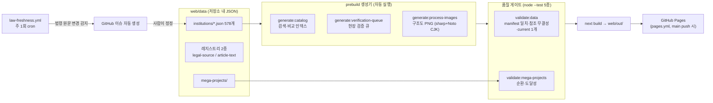
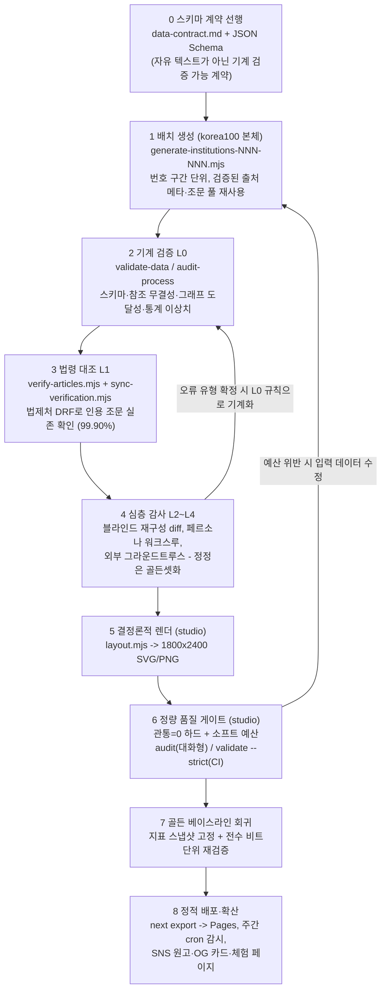

# 07. 레퍼런스 저장소 심층분석 — korea100·korea100studio 코드 해부와 klocal 데이터 계층

> 문서 목적: 팀장이 지목한 레퍼런스의 **코드·데이터·제작 방법론**을 해부한 심화 보고서. [02. 선행사례 및 유사 서비스 분석](./02_선행사례_및_유사서비스_분석.md)이 "사이트 표면"을 다뤘다면, 이 문서는 로컬에 전체 클론된 저장소 2개(korea100, korea100studio)의 내부를 다룬다.
>
> 기준일: 2026-08-18. 분석 대상:
> - `F:/policy_maps/external/korea100` — 제도 JSON 578개, main 커밋 481개, HEAD = 4dcac53 (2026-08-17)
> - `F:/policy_maps/external/korea100studio` — Agent Skill 기반 시각화·품질게이트 도구 (v0.1.2)
> - klocal — GitHub 저장소가 없어 라이브 사이트 역공학 대상이나, **이번 라운드 심층 조사는 실패**. 본 문서의 klocal 서술은 02 문서의 표면 실측만 근거로 하며 나머지는 전부 "(확인 필요)"로 표기한다.
>
> 표기 규칙: 저장소 파일·git에서 직접 확인한 사실은 [실측], 우리 설계 제안·해석은 (추정) 또는 (제안), 근거 없는 항목은 (확인 필요).

관련 문서: 01. 공모전 분석(팀 내부 문서 — 공개본에 포함하지 않는다) · [02. 선행사례 분석](./02_선행사례_및_유사서비스_분석.md) · [03. 법령·조례 체계와 데이터 소스](./03_법령조례_체계와_데이터소스.md) · [04. 선행연구 리뷰](./04_선행연구_리뷰.md) · [05. 시스템 설계](./05_시스템_설계.md) · 06. 실행계획 로드맵(팀 내부 문서 — 공개본에 포함하지 않는다)

---

## 0. 요약 (TL;DR)

1. **korea100은 "1인 + Claude 에이전트" 체제로 40일 만에 제도 578개를 만든 저장소다.** 481커밋 중 80%(383개)에 Claude co-author 트레일러, 376개 커밋에 Claude 세션 링크, `agent/` 접두 브랜치 25개가 남아 있다. 콘텐츠는 손으로 쓴 것이 아니라 **생성 스크립트(generate-institutions-*.mjs 15개+) → 기계 검증(L0~L4) → 정적 export**의 재현 가능한 파이프라인 산출물이다. [실측]
2. **MCP의 진실**: korea100 본체(main)에는 MCP가 없다. 미병합 브랜치(`feat/org-institution-crosswalk`)에 읽기 전용 행정절차 MCP 서버(2,958줄)가 존재하지만, R2 검증을 통과한 **3개 제도만** 공개하는 극도로 보수적인 설계다. 별개로 CI가 법제처 API 래퍼인 `korean-law-mcp@4.7.1`을 **소비자로서** 사용한다. 02 문서의 "두 사이트 모두 설치 가능한 MCP 없음" 결론과 정합. [실측]
3. **데이터 스키마의 핵심 자산은 3가지**: ① canvas 9칸(578개 전 파일에서 키가 정확히 동일) ② 상태 인식형 process 그래프(노드 7,555·엣지 8,334, 회귀 루프가 1급 시민) ③ verification 3단계 + 조문 원문 로컬 캐시(4,427조문). `LegalBasisKind` 열거형에 이미 `조례`, `조례·규칙`이 있고 법제처 DRF `ordin` target까지 문서화되어 있어 **조례 확장의 절반은 이미 설계돼 있다**. [실측]
4. **korea100studio는 "대량생산 파이프라인 전체"가 아니라 그 마지막 단계(렌더링+품질 감사)를 도메인 무관 Agent Skill로 추출한 패키지다.** 진짜 교훈은 "관통 0건"이라는 하드 게이트 1개 + 소프트 예산 + 골든 베이스라인 회귀라는 **정량 품질 계약**, 그리고 스펙→플랜→TDD 서브에이전트로 도구 자체를 하루 만에 만든 방법론이다. [실측]
5. **klocal 데이터 계층 역공학은 이번 라운드에 완결하지 못했다.** 02 문서 실측(manifest+조각 아키텍처, API 3종 존재, MCP 부재 확정)까지가 확보된 사실이고, 조각 파일 스키마·용량 추정·로컬 샘플은 (확인 필요) 상태다. `external/klocal_samples/`는 **현재 존재하지 않음을 실측 확인**했다(2026-08-18).

---

## 1. korea100 저장소 해부

### 1-1. 최상위 구조 [실측]

| 디렉터리 | 역할 | 우리에게 주는 시사점 |
|---|---|---|
| `.github/` | CI 2종: ① `pages.yml`(main push 시 GitHub Pages 배포, Node 22, Noto CJK 폰트, `NEXT_PUBLIC_BASE_PATH=/korea100`) ② `law-freshness.yml`(**매주 일요일 21:17 UTC cron**으로 법령 원문 변경 감시 → 변경 시 GitHub 이슈 자동 생성) + 제도 제안 이슈 템플릿 | 조례 개정 감시 자동화의 실물 선례 — [05 문서](./05_시스템_설계.md)의 자동 갱신 파이프라인 항목의 구현 참조 |
| `docs/` | 프로젝트의 두뇌(40여 파일): `data-contract.md`(스키마 단일 진실 원천), `verification-methodology.md`(오류 유형학 A~G + L0~L4), `development.md`(법제처 DRF target 지도), recipes 4종, 감사 리포트 20여 개, work-log(세션 인계 기록) | "문서가 곧 에이전트 컨텍스트" — 코드보다 문서가 먼저 |
| `web/` | Next.js 정적 웹앱 본체 + `web/data/`(데이터) + `web/scripts/`(생성·검증 스크립트) | §1-5, §2 |
| `sources/` | 프로젝트 기원 원천자료: 2026-07-09 텔레그램으로 수신한 FastAPI 프로토타입(법령 텍스트→스윔레인 추출)과 참고 메일. NOTES.md에 SHA256·검증 절차까지 기록 | 기원 자료도 저장소에서 버전 관리하는 감사 추적 문화 |
| `site/` | 첫날의 바닐라 HTML MVP(이후 web/으로 대체된 유물) | — |
| `design/canvas/` | 리디자인 시안 5종(.dc.html) + 제작 QA 스크린샷 30여 장, `data/` → `web/data` 심링크로 실데이터 기반 시안 | 디자인 시안도 실데이터로, 저장소에서 버전 관리 |
| `쓰레드 초안/` | Threads(메타) SNS 게시 원고 10편 — "글 1편 = 제도 1개 = PNG 구조도 1장" 매핑 | 확산 전략 산출물 — 01 문서(팀 내부 문서 — 공개본에 포함하지 않는다)의 발표·홍보 전략 참고 |
| `assets/` | README 히어로 SVG | — |

### 1-2. 설계 철학 — README.md / DESIGN.md / PROJECT_SOUL.md [실측]

- **핵심 명제**: "기업에 비즈니스 모델이 있듯, 국가에는 제도 모델이 있다." 제도를 법령·기관·문서·기한·병목으로 분해해 "한 장 요약 + 업무구조도"로 읽게 하는 **행정 리터러시 제품**.
- **3층 구조**: ① 한 장 요약(목적·권한·돈/문서 흐름·병목) ② 업무구조도(행위주체 레인·단계 게이트·근거 조문·회귀 경로) ③ **검증 대장**(법령만으로 확정 못 하는 정보를 감추지 않고 "확인 필요 사유"와 함께 공개).
- **신뢰 원칙 4개**: 원문 대조(국가법령정보센터) / 다층 검증 / **지어내지 않기**(미확인 조문은 `unverified`) / 정정 이력 공개(`warnings`에 날짜·근거). — 우리 조례 데이터에 그대로 이식할 신뢰 문법.
- **DESIGN.md**: "quiet public-policy command desk" 무드. 완전한 디자인 토큰 체계(캔버스 `#fcfcfb`, 액센트 그린 `#0f9f72`은 기능적 용도만, 앰버 `#c78116`은 병목·위험 전용), 컴포넌트 계약 명문화(비교표 최대 3개·10행, `?process=` URL 상태 공유, 요청 폼은 `mailto:` 초안만 — 서버 미저장), 접근성(포커스 트랩, `prefers-reduced-motion`)이 디자인 문서 수준에서 강제됨.
- **PROJECT_SOUL.md**(미병합 브랜치): "Agent source of truth. Dense context beats clever prompts." — 브랜드 어휘, 금지 표현("AI가 알아서 다 해줌"), 하드 제약(조문 추정 금지), append-only 의사결정 로그를 담은 **에이전트용 단일 컨텍스트 문서**. 우리도 팀 저장소에 동급 문서를 두는 것을 권장 (제안).
- 유의: README가 링크하는 mcp/, chrome-extension/은 main에 없고 미병합 브랜치에만 존재 — README가 브랜치 산출물을 선반영한 상태. [실측]

### 1-3. git 이력에서 재구성한 개발 타임라인 [실측]

규모: main 커밋 **481개**, 원격 브랜치 refs **59개**, 기간 **2026-07-09 ~ 2026-08-17 (약 40일)**, PR #89까지.

| 시기 | 커밋 | 주요 사건 |
|---|---|---|
| 07-09 (첫날) | 11 | FastAPI 프로토타입 수신 → MVP 커밋(제도 10개 + 환경영향평가 18노드) → 같은 날 86개 캔버스 일괄 추가 → **하루 만에 100개 + 전부 full 스윔레인 승격** |
| 07-10~11 | 44 | 법령 위임 위계·출처 검증, Pages 배포, 모바일 타임라인, PNG 내보내기 |
| **07-12** | **171** | 검증 캠페인의 날 — 방법론 설계·전량 적용(오류 238건 + L2 정정 130건), 정부조직 개편 부처명 170건 일괄 수정, 인사제도 13종 추가 |
| **07-13** | **199** | L2 감사 캠페인(제도 124~300), 301~331 확장(ISMS-P 심층감사 포함) |
| 07-14~16 | 20 | R&D 행정 332~360, **361~500 스크립트 일괄 생성**, 전 카탈로그 감사, 페르소나 워크스루 1~505 |
| 07-16~19 | 소규모 | MIT 라이선스, 501~509 확장, 조문 원문 뷰어 |
| 07-25~26 | 소규모 | 접근성 일괄 개선, law-freshness 하드닝, README 리디자인+영문판 |
| 08-08 | 소규모 | 문서 결재·세무 제도, iOS 앱 export |
| 08-09 (브랜치) | — | 행정절차 **MCP 서버**, Chrome MV3 확장, Threads/X 발행 도구, PROJECT_SOUL.md, A3 포스터·릴 영상 (main 미병합) |
| 08-16~17 | 15 | **메가프로젝트 오버레이**(광주 반도체 클러스터), Three.js "1,281 permit halo" 스크롤 체험, 제도 528~578 도달 |

읽어야 할 패턴 3가지:

1. **하루 100개, 이틀 370커밋** — 사람이 타이핑한 속도가 아니다. 생성 스크립트 + 병렬 에이전트 운영의 속도다.
2. **생성보다 검증에 더 큰 날을 썼다** — 07-12(171커밋)와 07-13(199커밋)의 주제는 신규 생산이 아니라 **검증 캠페인**이다. "빨리 만들고, 그보다 더 세게 검증한다"가 이 저장소의 리듬.
3. **콘텐츠 완성 후 확산·체험 레이어로 이동** — 후반부 커밋은 SNS 초안, OG 카드, Three.js 체험, 포스터 등 발표·확산 산출물. 경진대회 일정(06 문서(팀 내부 문서 — 공개본에 포함하지 않는다))과 동형의 흐름.

제작 방식 증거 [실측]:

- 481커밋 중 **383개(80%)에 Claude co-author** (`Claude Fable 5` 378건, `Claude Opus 4.8` 4건), **376개 커밋에 `Claude-Session:` 링크**(claude.ai/code 세션 URL) — 커밋→AI 세션 추적 가능.
- 원격 브랜치 59개 중 **`agent/` 접두 25개**(agent/structural-audit-round2 등) — 에이전트 단위 작업 브랜치 관행.
- 첫 커밋에 개인 AI 에이전트(OpenClaw)의 상태 디렉터리 `.omc/state/`가 포함됐다가 이후 .gitignore 처리. "audit remediations (added by external AI)" 커밋도 존재.
- 검증 방법론 문서에 **병렬 에이전트 git 규율**까지 기록: "에이전트별 git add는 자기 파일만, index.lock 충돌은 2초 대기 재시도, 최종 보고는 유실될 수 있으니 커밋·데이터 실측으로 검수."

### 1-4. MCP 흔적의 진실 [실측]

02 문서에서 "korea100 사이트에 MCP 없음(경로 404)"을 확정했는데, 저장소 해부로 전모가 드러났다. **MCP는 두 층위로 존재하며 둘 다 main 서비스가 아니다.**

| 층위 | 실체 | 위치 |
|---|---|---|
| **제공자 측** (자체 MCP 서버) | 커밋 `b7eca94` "feat(mcp): 행정절차 MCP 서버 추가" (2026-08-09). 2,958줄: server.mjs 278줄 + service.mjs 894줄 + 테스트 18개 | **미병합 브랜치 `feat/org-institution-crosswalk`에만 존재. main·라이브 사이트에 없음** |
| **소비자 측** (외부 MCP 사용) | CI가 `korean-law-mcp@4.7.1`(법제처 API 래퍼)을 전역 설치해 `korean-law` CLI로 법령 검색. secret `LAW_OC` 필수. "MCP 장애 시 curl 직접 조회 가능(OC=test)" 폴백 명시 | `.github/workflows/law-freshness.yml` |

브랜치 MCP 서버의 설계 철학이 특히 중요하다:

- 법령 검색기가 아니라 **"지금 단계가 끝난 뒤 누가 무엇을 확인하고 어떤 문서를 누구에게 넘기는가"를 반환하는 읽기 전용 행정절차 MCP**.
- 578개 전체가 아니라 **R2 검증을 통과한 3개 제도만 공개**(과태료 사전통지·이의제기, 국가연구개발비 정산). 서버 기동 시 등급·조문 대조·사람 확인을 재검사해 하나라도 어긋나면 **기동 거부**. 원문 대조 30일 초과 시 다음 경로 선택 차단.
- 도구 6종(search_procedures, get_procedure_map, get_step_requirements, get_next_actions, resolve_work_event, create_action_packet). 분기 조건 임의 선택 금지(`decision_required: true` 반환).

**우리 해석**: 578개를 만들고도 3개만 MCP에 태운 것은 "AI에게 물려줄 데이터는 사람 검증 등급이 다르다"는 선언이다. [05 문서](./05_시스템_설계.md)의 자체 MCP 설계에 이 **검증 등급 게이트**(검증 통과 데이터만 MCP 노출) 개념을 이식할 것을 권장 (제안). 또한 "MCP를 실제로 공개 제공하는 것"이 여전히 우리의 차별화 공백임이 재확인됐다 — korea100조차 브랜치에 머물러 있다.

### 1-5. 빌드·배포 방식 [실측]

스택: Next.js 16.2.10 + React 19.2.4 + Tailwind 4 + TypeScript. 외부 의존성은 fast-xml-parser, sharp **2개뿐**. `output: "export"` 완전 정적, GitHub Pages 배포.



- DB 없음, 서버 없음. **JSON in Git → 생성기 → 정적 export**가 전부다. [05 문서](./05_시스템_설계.md)에서 결정한 "manifest + 정적 JSON 조각 + 정적 호스팅" 구조의 타당성을 578개 규모 실물이 입증.
- 검증·최신성 스크립트: `web/scripts/lib/law-service.mjs`(법제처 DRF lawService.do 직접 fetch + 조문 재귀 평탄화 파서), `verify-articles.mjs`(인용 조문 실존 배치 대조), `sync-verification.mjs`(법령명→공식 식별자 매핑, `--check`가 CI 최신성 점검), `audit-process.mjs`(L0 기계 감사 — 그래프 도달성·고아 노드·통계 이상치 z>2).
- **조례 직결 사실**: 법제처 DRF target 지도(docs/development.md)에 **`ordin`(자치법규 — 조례·규칙)**이 포함돼 있고, 조례 위임 사항은 "예시 지자체 1곳 원문 검증 + '지자체별 상이' 명시" 정책, 구조도 PNG의 **조례 위임 노드 별도 마킹**(PR #46)까지 이미 존재한다. law-service.mjs의 구조는 `ordin` 전수 검증에 재사용 가능 — [03 문서](./03_법령조례_체계와_데이터소스.md)의 API 전략과 직접 연결.
- 라이선스: MIT (Copyright 2026 Hoseong Seo). 단 README는 "**소프트웨어**는 MIT"로 한정 — 데이터·콘텐츠 재사용 범위는 저자 확인 필요 (확인 필요).

---

## 2. korea100 데이터 스키마 완전 문서화

스키마의 단일 진실 원천은 `docs/data-contract.md`("데이터 계약 v2")로 명시돼 있고, `validate:data` 스크립트가 이를 기계 강제한다. 이하 전수 통계는 578개 파일 전체를 node 스크립트로 파싱한 값이다. [실측]

### 2-1. 데이터 배치

```
web/data/
├── institutions/                # 578개 JSON, 11.45MB (제도 1건 = 1파일, slug = 파일명)
├── mega-projects/
│   ├── artifacts.json           # 표준 산출물 사전 48종
│   └── projects/gwangju-semiconductor-cluster.json
├── article-text-registry.json   # 9.6MB — 조문 원문 캐시 4,427건 + 노드별 인용 매핑 10,286건
└── legal-source-registry.json   # 276KB — 법령 공식 출처 사전 531건
```

정식 인덱스는 `docs/institutions-100-manifest.json`(578항목: priority/slug/name/type/category). 런타임 인덱스는 없고 로더가 빌드 시 디렉터리 전체를 읽는다. 검색·비교용 파생 인덱스 2종은 생성기가 만들며 Git 제외.

### 2-2. institution JSON 필드 명세 [실측]

**최상위 (578개 전 파일 공통, 존재율 100%)**

| 필드 | 타입 | 내용 |
|---|---|---|
| `slug` / `name` / `oneLiner` | string | 영문 케밥케이스 ID(URL·파일명 동일) / 한글명 / 한 줄 요약 |
| `type` | string | 자유서술 유형 태그 — 전수 **437종** (비통제 어휘) |
| `category` | string | 분야 분류 — 전수 **63종** (통제어휘 아님, 유기적 증식) |
| `priority` | number | 1~578 공개 순서 (manifest와 동기) |
| `whyFirst` | string | 편집 논리(왜 먼저 만들었나) |
| `asOfDate` | string | 법령 확인 기준일 YYYY-MM-DD |
| `status` | enum | `full`(캔버스+프로세스) / `canvas`(캔버스만) — 실측 전부 full |
| `canvas` | object | 9칸 캔버스 (아래) |
| `process` | object | 스윔레인 프로세스 그래프 (아래) |
| `verification` | object | 법령 검증 레코드 (아래) |
| `related` | string[] | 관련 제도 — slug가 아닌 **이름 문자열** 참조 (평균 2.92개, 약점) |
| `fieldVerification` | string[] | "현장 검증 필요" 항목 → 공개 검증 큐의 원천 |

**canvas — 9칸 제도 모델 캔버스** (578개 전 파일에서 9개 키 정확히 동일)

| 칸 | 키 | 질문 | 규격 |
|---|---|---|---|
| 1 | `purpose` | 무엇을 해결하나 | string |
| 2 | `stakeholders` | 누구에게 영향을 주나 | string |
| 3 | `legalBasis` | 법적 근거는 | `Array<{law, articles?, kind}>` — kind 열거형에 **`조례`, `조례·규칙` 이미 포함** |
| 4 | `authorities` | 누가 권한을 갖나 | `Array<{name, role}>` |
| 5 | `procedure` | 절차는 어떻게 흐르나 | string[] 6~10개, 게이트 ID("(G3)") 병기 관례 |
| 6 | `moneyFlow` | 돈은 어떻게 흐르나 | string |
| 7 | `docsFlow` | 문서·데이터는 어떻게 흐르나 | string ("A → B → C" 체인 관례) |
| 8 | `bottlenecks` | 어디서 막히나 | string[] |
| 9 | `reformPoints` | 어떻게 바꿀 수 있나 | string[] |

**process — 상태 인식형 스윔레인 그래프**

- `lanes`(행위주체, 평균 4.7개·최빈 4개) × `stages`("G0 대상판정" 형식 게이트, 평균 6.0개)의 2차원 격자 위에 노드를 배치.
- **ProcessNode** (전수 7,555개): `id/name/lane/stage` 필수, `type`(task 5,104 / gateway 1,791 / notice 476 / system 184), `status`(done 1,679 / **current 정확히 578 = 파일당 1개** / waiting 3,990 / risk 1,149 / loop 159 — 실제 진행률이 아닌 **편집 표지**로 정적 데이터에 상태 스토리텔링을 입힘), `input_documents`/`output_documents`(산출물→투입물 체인이 문서 흐름을 형성), `deadline`(값 보유 2,073 — "협의요청 후 45일(영 제50조)" 식 법정기한+조문 병기), `blocker`(1,175), `confidence`(평균 0.877, 0.8 미만이면 UI가 "현장 검증 필요" 뱃지), `legal_basis`(**노드 단위 조문 인용** 9,528건, `unverified:true` 48건).
- **ProcessEdge** (전수 8,334개): `type` = `sequence` 6,484 / `loop` 1,068 / `message` 782. **회귀(반려-재제출) 루프가 1급 시민** — 행정절차의 실제 모양을 그래프로 보존.
- `warnings` (575/578 존재): 정정 이력. 문자열 1,156 + 객체 75 혼합(객체 키가 한글 "내용"인 비일관 지점 — 반면교사).

**verification — 법령 검증 레코드**

- `status` 3단계: `source-linked`(원문 식별자 연결) → `article-verified`(인용 조문번호가 현행 원문에 실존함을 자동 확인) → `needs-review`(범위 지정 필요).
- `sources[]`: lawId + **MST**(law.go.kr 마스터번호, 특정 시행본 식별) + 공포일·시행일 + 한글 슬러그 영구링크(`law.go.kr/법령/환경영향평가법`). 행정규칙·조약은 대체 식별자.
- `unresolved[]`의 reasonCode에 **`local-scope`**(지자체 범위 지정 필요) 존재 — 조례가 이미 미해결 사유 체계에 들어와 있음.
- scope 문장에 매번 "**조문번호의 존재 여부만 검증하며 해석·적용 타당성은 검증 범위 밖**"을 명시 — 법적 책임 한정 장치.

### 2-3. 전수 통계 [실측]

| 항목 | 값 |
|---|---|
| 파일 수 / 용량 | 578개 / 11.45MB (전부 status="full") |
| 검증 상태 | article-verified **494 (85.5%)** / source-linked 63 / needs-review 21 |
| 공식 법령 연결 | 1,148건 (제도당 1.99건). kind: 법률 781 / 대통령령 203 / 부령 75 / 고시·지침 53 / 행정규칙 22 / 기타 |
| 조문 인용 | articleReferences **14,347** (제도당 24.8), 검증 성공 14,332 (**99.90%**), missing **0**, uncheckable 15 |
| 프로세스 그래프 | 노드 7,555 (평균 13.1, 5~36) / 엣지 8,334 (평균 14.4, 4~50) |
| 현장 검증 큐 | fieldVerification 2,219건 (공개 검증 대장의 원천) |
| category | 63종 — 상위: 국토·환경·안전 82, 인허가·규제·산업 35, 복지와 사회보험 35, 다부처·복합사업 30, 연구개발·행정 29 … 1건짜리 카테고리 다수 |
| type | 437종 (사실상 제도별 자유 태그) |
| 조례 관련 | 조례 근거 포함 파일 27개, kind=조례 인용 19건 |

교훈: **category 63종·type 437종은 통제어휘 부재의 흔적**이다. 우리는 ELIS 분야코드 등 통제어휘로 시작부터 고정해야 한다([03 문서](./03_법령조례_체계와_데이터소스.md) 분류 체계 참조). 반대로 `related`가 slug 아닌 이름 문자열 참조인 것도 참조 무결성 검사가 불가능한 약점 — 우리는 ID 참조로 설계.

### 2-4. 레지스트리 2종 — 조문 원문 로컬 캐시 패턴 [실측]

- **legal-source-registry.json**: 제도들이 공유하는 법령 출처 531건(연결 507, 미해결 24)의 중복 제거 사전. 법령별 lawId·MST·공포일·시행일·공식 URL.
- **article-text-registry.json** (9.6MB): `"statute:<mst>::제N조"` 키로 **조문 원문 전문 4,427건 캐시** + 제도 505개의 노드별 인용→조문키 매핑 10,286건. **UI가 노드 클릭 시 law.go.kr 왕복 없이 조문 원문을 즉시 표시** — 단, 커버리지가 505개에서 멈춰 있음(이후 확장분 73개 미포함, 재생성 미실행 추정).
- 이식 가치: 조례 카드에서도 법제처 `ordin` 본문 API로 동일한 "자동 검증 + 정적 번들 캐시" 파이프라인 구축 가능 (제안). 단, 커버리지가 갱신에서 탈락하는 korea100의 실수까지 배우지 말 것 — 레지스트리 재생성을 CI 게이트에 포함해야 한다.

### 2-5. mega-projects — 산출물 매개 의존 그래프 [실측]

institutions를 **불변 템플릿 라이브러리**로 두고, 프로젝트 오버레이가 참조·합성하는 구조 ("The overlay does not mutate or duplicate the institution source files").

- **artifacts.json**: 표준 산출물 사전 48종 (`industrial_complex.designated` 식 네임스페이스 id, category 11종 — permit 11 / infrastructure 9 / plan 7 …).
- **광주 반도체 클러스터 인스턴스**: stages 8(G0 정책~G7 건축·가동), actors 10(정규화된 `{id, code, label, mandate}`), **nodes 49 = 마일스톤 컨테이너**, sources 76, rules 4.
  - **엣지 배열이 없다** — 의존은 `requires:[{artifact, relation, strength, kind}]` → `produces:[artifactId]`의 **산출물 매개 이분그래프**. relation 4종(finish_to_start 등 + `satisfied_by` 인허가 의제), strength hard/soft.
  - `confidence` 증거 등급제: official 2 / statutory 31 / modeled 16. `rules`는 미확정 쟁점을 true/false/**unknown** 3상태로 명시 — "검증기가 유리한 경로를 몰래 선택하지 않는다".
  - **institutions 연결 = `templateRefs`**: 실측 194개 참조, 유니크 제도 103개(README 서술은 91개 — 집계 기준 차이 추정, 원인 미확인). `mappingStatus` exact 95 / candidate 99.
- **조례 전용 아이디어** (제안): 이 모델은 "**표준조례안(모델조례) ↔ 지자체별 변형**" 관계에 그대로 전용 가능하다. 표준안을 템플릿으로, 각 지자체 조례를 노드로, `mappingStatus:"candidate"`를 "표준안 준용 여부 미확인" 표기로. 여러 조례가 얽히는 지역 정책 패키지(빈집 정비 = 조례+보조금+위원회)는 산출물 매개 requires/produces로 표현 — [05 문서](./05_시스템_설계.md) 그래프 스키마 확장 후보.

### 2-6. 조례 카드 전용 매핑 초안 (제안 — 05 문서 스키마 작업의 입력)

| 구분 | 항목 | 내용 |
|---|---|---|
| 그대로 | `slug/name/oneLiner/priority/asOfDate/status`, canvas 9칸, `legalBasis.kind`(조례 이미 존재), process 전체, verification 3단계 | 절차형 조례(지원금·위원회·허가)는 process까지, 선언형 조례는 `status:"canvas"` — korea100이 이미 2단계 지원 |
| 신규 | `region` | korea100에는 **공간 필드가 전혀 없다**(전국 제도라서). 시군구 행정구역코드·geometry 조인 키가 우리 지도의 핵심 축 |
| 신규 | `ordinanceMeta` | 자치법규ID, 공포번호·공포일·시행일, 제정/개정/폐지 이력. sourceType에 "ordinance" 추가 |
| 개조 | `upperLaw` | 위임 근거 법률·시행령 조항 매핑 — legalBasis를 "상위법(위임근거)"과 "당해 조례 조문" 2층으로 분리. **조례↔상위법 엣지가 그래프의 세로축** |
| 신규 | `siblingOrdinances` | 동일 표준조례안 계열의 타 지자체 조례 목록 — **횡적 비교(전국 확산도)가 가로축** |
| 개조 | `category` | ELIS 분야코드 등 통제어휘로 고정 (63종/437종 증식 방지) |
| 삭제 | `whyFirst`, `personaAudit`, node `progress`(레거시) | 편집 메타는 우리 규모(수천~수만 건)에서 유지 불가 |

---

## 3. korea100studio 해부

### 3-1. 정체 정정 — 무엇이 아닌가 [실측]

korea100studio는 **"578개를 생산한 파이프라인 전체"가 아니다.** 제도 JSON을 찍어낸 배치 스크립트는 korea100 본체(`web/scripts/generate-institutions-*.mjs` 15개+)에 있다. korea100studio는 그 파이프라인의 최종 단계 — **스윔레인 보드 렌더링 + 정량 품질 감사**를 도메인 무관 **Agent Skill**로 추출·일반화한 독립 npm 패키지다(README 자기 서술: "standalone Agent Skill extracted and generalized from korea100's process renderer").

핵심 수치: v0.1.2, 2026-07-20~21 **이틀 33커밋**으로 완성, 의존성 **ajv 1개**, Node≥20, 테스트 34개 전부 통과 [실측 실행 확인], CLI 서브커맨드 5종(render/audit/validate/motion/check).

결정적 사실 하나(CHANGELOG v0.1.0): **"gov 프로필이 korea100의 구성 지표를 509개 보드 전체에서 비트 단위로 재현함을 검증"** — 추출 당시 원본과 산출물이 동일함을 전수 검증했다.

### 3-2. 구성 요소 [실측]

| 구성 | 실체 | 핵심 |
|---|---|---|
| `SKILL.md` | Claude Agent Skill 정의(YAML frontmatter + 107줄). 워크플로 3단계: ① Elicit(무엇이든→lanes/stages/nodes/edges 4요소 추출) ② board-v1 JSON 작성 ③ **Render–audit–iterate 루프** | "한 번 렌더하고 끝내지 말라. **nodePiercings가 0이 될 때까지 입력(보드 구조)을 고쳐라**" — 렌더 튜닝이 아니라 데이터 수정을 지시 |
| `agents/openai.yaml` | 서브에이전트 정의가 **아니라** Codex용 스킬 피커 메타데이터 10줄 | 행동 정의는 SKILL.md 단일 소스 |
| `schemas/board-v1.schema.json` | JSON Schema draft 2020-12. institution 스키마가 아닌 도메인 중립 보드 계약. `refs[]`에 법조문 인용 슬롯 | **2계층 검증**: ① ajv 스키마 ② 참조 무결성(없는 lane/stage/node 인용, id 중복)을 사람이 읽을 문장으로 반환 |
| `scripts/` | CLI(board.mjs 261줄) + lib 7모듈 ~2,000줄. layout.mjs 1,045줄(1800×2400 세로판, **거터 라우팅** — 이 수정 하나로 korea100 전체 노드관통 552→287), composition.mjs(품질 점수), profiles.mjs(gov/default 룩앤필 데이터화), motion.mjs(SMIL 자체완결 애니메이션 SVG — 외부 JS 0) | 순수 함수 레이아웃 → **시각 산출물도 코드처럼 재현 가능** |
| `templates/` `references/` | 최소 골격 템플릿(`_comment`로 규칙 인라인) + authoring.md(자연어→스키마 매핑표·워크드 예제) + composition-quality.md(지표 의미·수리 근거·위반 시 수리법) | 에이전트가 파일 하나만 열어도 규칙을 알게 하는 문서 설계 |
| `fixtures/` `tests/` | gov-sample(행정심판 4레인×6단계) + **quality-baseline.json 골든 스냅샷**. baseline.test.mjs가 라이브 계산과 일치 강제 | 기하 리팩터링이 점수를 몰래 바꾸면 테스트 즉사. 실행 실측: audit 점수 19.56 = 기록값 정확 일치 |
| `docs/superpowers/` | 설계 스펙(비목표 YAGNI 명시) + 구현 플랜 919줄(Task 1~14, 태스크마다 "실패 테스트→구현→통과→커밋" TDD 5단계) | 33커밋이 플랜 태스크와 거의 1:1 — **도구 자체를 스펙→플랜→TDD 서브에이전트로 제작** |

품질 게이트의 수식 [실측]: `score = piercings×20 + crossings×3 + max(0,bendsMax−3)×2 + max(0,stretchMax−1.6)×6 + adjustedLabels×1.5`. 예산: **piercings 0 (하드)**, crossings ≤6, bends ≤4, stretch ≤2.2, labels ≤4 (소프트). 위반 엣지를 `"E07↯P05"` 형식으로 특정해 **에이전트가 스스로 고칠 수 있게** 한다. 지표는 렌더러가 실제 그리는 지오메트리에서 계산 — 근사치가 아님.

### 3-3. "1인 + Claude" 대량생산 파이프라인 재구성 (본체 + studio 결합)



이 그림의 요체 두 가지:

1. **되먹임 고리가 두 개다.** 품질 게이트 위반은 렌더러가 아니라 **입력 데이터를 고치게** 하고(S6→S1), 사람 층위에서 발견한 오류는 **기계 규칙으로 내려보낸다**(S4→S2). 검증 체계가 스스로 자라는 구조.
2. **사람의 노하우가 전부 파일로 형식화됐다.** SKILL.md(절차) + references/(도메인 매핑 지식) + templates/(골격) + fixtures/(모범 답안) — 그래서 Claude가 "elicit → JSON → render → audit → 수렴" 루프를 자율 수행할 수 있다. 우리도 조례 카드 저작을 같은 4종 세트로 형식화하면 팀원 누구든(그리고 에이전트가) 동일 품질로 생산 가능 (제안).

미확인: studio가 korea100 본체 렌더러를 실제로 교체했는지(Phase 2)는 미실행으로 추정. 509→578 확장분과 studio의 동기화 여부도 미추적.

---

## 4. klocal 데이터 계층 역공학 결과 — 이번 라운드 미완, 확보분 정리

**정직한 상태 보고**: 이번 라운드의 klocal 심층 조사(라이브 사이트 역공학 상세)는 **산출물 확보에 실패**했다. 아래 표는 [02 문서](./02_선행사례_및_유사서비스_분석.md)에서 이미 실측 확정된 사실만 옮긴 것이고, 이 문서가 원래 다루려던 심층 항목은 전부 (확인 필요)로 남긴다. 지어내지 않는다.

### 4-1. 확보된 사실 (02 문서 실측 근거)

| 항목 | 확인된 내용 | 근거 |
|---|---|---|
| 정체 | "K-지방직 정책서랍"(klocal.solvonluchs.com) — 전국 지자체 주요업무계획·세출예산서 검색·비교 서비스. 제작자 미상 개인 비영리, GitHub 저장소 없음 | 02 §2-1 |
| 스택 | React + Vite SPA, nginx 단일 서버, **DB 없이 정적 JSON(manifest + 지자체별 조각) 클라이언트 사이드 검색** | 02 §2-1 |
| 데이터 규모 | 세출예산서 **235개 지자체 1,477,728행**(2026 단일 연도, 17개 시도 전체), 주요업무계획 문서 235건·사례(섹션) **50,918건**, NotebookLM 공유노트 12개 위임 | 02 §2-2 |
| manifest 실물 URL | `https://klocal.solvonluchs.com/data/jeonnam-budget/manifest.json` — `/data/{지역}-budget/manifest.json` 패턴 (전남 사례 1건만 확인, 패턴 일반화는 추정) | 02 출처 표 |
| API 3종 | `/api/search`, `/api/smart`, `/api/verify` **존재 확인** — 문서화 없음, 공공데이터 내비게이터 전용. `/api/smart`는 LLM 계획-검색-판정 파이프라인(plan의 search_terms/reasoning을 응답에 노출, 소요 1~3분 사전 안내) | 02 §2-3, §2-4 |
| MCP | **없음 확정** — JSON-RPC initialize POST → 405, JS 번들 294KB 내 "mcp" 문자열 0건, llms.txt 없음 | 02 §2-4 |
| UX 특징 | 검색식(따옴표·`&`·`or`) + 행정용어 동의어 사전, 235개 파일 백그라운드 프리로드 진행률 UI, "비교 담기"(localStorage), 업무계획↔예산서 크로스 매칭 | 02 §2-3 |
| 한계 | 지도 전무, URL 라우팅 부재(딥링크 불가), 클라이언트 전량 로드(확장 불가), HWP 파싱 아티팩트 잔존, 단일 연도·수동 갱신 | 02 §2-5 |

### 4-2. 미확보 항목 — 다음 라운드 조사 과제 (전부 확인 필요)

| 항목 | 상태 |
|---|---|
| manifest JSON의 필드 구조(파일 목록·행수·버전·해시 등 무엇을 담는가) | (확인 필요) — URL 1건만 알려짐, 본문 스키마 미확보 |
| 지자체별 조각 파일의 스키마(예산 행 필드 명세, 업무계획 사례 필드 명세, documentShape 값 목록) | (확인 필요) |
| API 3종의 요청·응답 명세(`/api/verify`는 기능 자체 미상) | (확인 필요) |
| 전체 데이터 용량 추정(조각 파일 크기 분포 합산) | (확인 필요) |
| 로컬 샘플 확보 | **미확보 [실측]** — 지시서에 `external/klocal_samples/` 확보로 기재되어 있으나, 2026-08-18 현재 `F:/policy_maps/external/`에는 korea100, korea100studio만 존재하고 해당 디렉터리가 없다 |

### 4-3. 후속 조사 지시안 (제안)

1. `/data/jeonnam-budget/manifest.json` 본문을 받아 필드 구조 문서화 → 타 지역 URL 패턴 일반화 검증 → 대표 시도 1~2곳의 조각 파일 샘플을 `external/klocal_samples/`에 실제로 저장.
2. 조각 1개의 크기 × 파일 수로 전체 용량 추정치 산출(브라우저 네트워크 탭 또는 HEAD 요청).
3. `/api/search` 요청 형식을 프론트 번들에서 역추적(02 라운드에서 번들 294KB 확보 이력 있음).
4. 담당·기한은 06 문서(팀 내부 문서 — 공개본에 포함하지 않는다) W1 액션 항목에 추가할 것.

---

## 5. 두 시스템의 공학적 교훈 — 가져올 것 / 변형할 것 / 버릴 것

### 5-1. 그대로 가져올 것

| # | 항목 | 출처 | 내용 → 우리 적용처 |
|---|---|---|---|
| 1 | **데이터 계약 문서 + 기계 강제** | korea100 | data-contract.md를 단일 진실 원천으로, validate 스크립트가 계약을 강제 → 조례 카드 스키마 문서 + `validate` CLI ([05](./05_시스템_설계.md) 데이터 모델 장) |
| 2 | **검증을 제품으로** | korea100 | 검증 대장 공개, `unverified` 플래그, `asOfDate`, warnings 정정 이력, "부재의 확인도 검증" → 조례 데이터 신뢰 문법으로 전면 이식 |
| 3 | **L0~L4 검증 깔때기 + 오류의 기계화** | korea100 | 싼 검사부터 전수→정밀(L0 기계 감사→L2 블라인드 재구성→L4 외부 그라운드트루스), 사람이 찾은 오류를 L0 규칙·골든셋으로 격하 |
| 4 | **정적 export + prebuild 생성기 + 주간 cron 감시** | korea100 | DB·서버 없이 JSON→생성기→GitHub Pages, law-freshness식 조례 개정 감시→이슈 자동 생성 ([05](./05_시스템_설계.md) 배포 구조와 일치) |
| 5 | **법제처 DRF 호출 코드 구조** | korea100 | law-service.mjs(조문 재귀 평탄화 파서)·verify-articles.mjs를 `ordin` target으로 전용 — 조례 전수 검증 ([03](./03_법령조례_체계와_데이터소스.md)) |
| 6 | **하드 게이트 1개 + 소프트 예산 + 위반 대상 특정** | studio | "관통=0" 같은 절대 기준 하나, 나머지는 예산, 위반을 id로 특정해 에이전트가 자가 수정. `audit`(대화형)/`validate --strict`(CI) 이중 운용 |
| 7 | **골든 베이스라인 회귀 + CI** | studio | 대표 산출물의 지표 스냅샷을 테스트로 고정 — 생성 로직 수정 시 드리프트 즉시 검출 |
| 8 | **SKILL.md 4종 세트(절차+지식+골격+모범답안)** | studio | 조례 카드 저작을 SKILL.md + references(조례→카드 매핑 가이드) + template + fixture로 형식화 → 에이전트 위임 |
| 9 | **에이전트 git 운영 규율** | korea100 | 커밋당 Claude-Session 링크, agent/* 브랜치, 에이전트별 add 범위 제한, 번호 구간 생성 스크립트 = 재실행 단위 = 생산 대장 (06(팀 내부 문서 — 공개본에 포함하지 않는다) 협업 규칙) |
| 10 | **manifest + 정적 JSON 조각 서빙** | klocal | 235개 지자체 148만 행을 무운영으로 서빙한 검증된 패턴 — [05](./05_시스템_설계.md)에서 이미 채택 결정 |

### 5-2. 변형할 것

| # | 항목 | 원형 | 변형 방향 |
|---|---|---|---|
| 1 | canvas 9칸 | korea100 제도 단위 | 조례 단위로 축소 적용 + `region`/`ordinanceMeta`/`upperLaw`/`siblingOrdinances` 신설 (§2-6) — **공간 필드가 전무한 korea100에 지도를 다는 것이 우리의 존재 이유** |
| 2 | process 그래프 | 모든 제도가 full | 절차형 조례만 full, 선언형 조례는 canvas만 — korea100의 status 2단계를 규모(수만 건)에 맞게 실제로 활용 |
| 3 | mega-projects 오버레이 | 대형 국책사업 인허가 의존성 | "표준조례안 ↔ 지자체 변형" 확산 지도로 전용. mappingStatus exact/candidate → 준용 여부 확인 상태로 |
| 4 | MCP 검증 등급 게이트 | 브랜치에 3개 제도만 공개 | 우리는 MCP를 **실제 공개**하되(차별화 핵심, [05](./05_시스템_설계.md) §MCP), 검증 통과 데이터만 노출하는 등급 게이트 사상은 계승 |
| 5 | related 참조 | 이름 문자열 (무결성 검사 불가) | slug/ID 참조로 교체 + 참조 무결성 검사기(studio 2계층 검증 패턴) |
| 6 | category/type | 자유 어휘 63종/437종으로 증식 | ELIS 분야코드 등 통제어휘 고정. "전수 렌더가 아니라 전수 검증" — 카드 생성은 조례군 단위, 스키마·참조 검증은 12.8만 건 원천 전수에 |
| 7 | 조례 예시 정책 | "예시 지자체 1곳 검증 + 지자체별 상이" | korea100은 조례를 예시로 도피했지만, 우리는 그 "상이함" 자체를 데이터(지역별 비교)로 만든다 — 관점의 반전 |
| 8 | /api/smart 패턴 | klocal LLM 파이프라인 (plan 노출·소요시간 안내) | 우리 AI 질의 API의 응답 계약으로 차용 + 실패 시 advice/alternatives ([05](./05_시스템_설계.md) 챗봇 설계) |
| 9 | SMIL 모션 SVG | studio 단계 점등 애니메이션 | 외부 JS 0의 자체완결 애니메이션 — 발표 데모·조례 확산 타임랩스에 저비용 적용 |
| 10 | 확산 산출물 공정 | 쓰레드 초안(글1=제도1=PNG1), OG 카드, Three.js 체험 | "지도 1장=조례군 1개=SNS 1편" 공정으로 번안 — 01(팀 내부 문서 — 공개본에 포함하지 않는다) 발표 전략과 연결 |

### 5-3. 버릴 것

| # | 항목 | 이유 |
|---|---|---|
| 1 | `whyFirst`·`personaAudit`·node `progress` | 1인 편집 체제의 메타데이터 — 수만 건 규모에서 유지 불가, 우리 카드엔 미탑재 |
| 2 | warnings의 문자열/객체 혼합(한글 키 "내용") | 스키마 비일관의 반면교사 — 정정 이력은 처음부터 `{date, note, refs}` 단일 객체형으로 |
| 3 | 이름 문자열 related | §5-2와 동일 — 원형 그대로는 채택 불가 |
| 4 | 클라이언트 전량 로드 검색 (klocal) | 148만 행을 브라우저 순차 검색 — 우리 규모(조례 12.8만 건+원문)에서는 사전 빌드 검색 인덱스 필수 |
| 5 | URL 라우팅 부재 (klocal) | 딥링크·공유·북마크 불가 — 조례별 정적 URL은 [05](./05_시스템_설계.md)에서 이미 필수로 결정 |
| 6 | NotebookLM 링크 위임 | 실용적 절충이지만 우리는 RAG+MCP가 차별화 축이므로 위임으로 대체 불가 (참고 사례로만) |
| 7 | 라이선스 모호성 | korea100의 "소프트웨어만 MIT" 한정·klocal의 라이선스 불투명 — 우리는 코드/데이터/콘텐츠 라이선스를 처음부터 분리 명시 (01(팀 내부 문서 — 공개본에 포함하지 않는다) 공개검증 대비) |
| 8 | 통계 불일치 방치 | README 509 vs 실데이터 578, article-text-registry 505 커버리지 정체, templateRefs 91 vs 103 — 수치 재생성을 CI에 넣어 문서·데이터 동기화를 기계화 |

---

## 6. 남은 확인 과제

| # | 과제 | 관련 절 |
|---|---|---|
| 1 | klocal 데이터 계층 역공학 재시도 — manifest 본문·조각 스키마·API 명세·용량 추정, `external/klocal_samples/` 실제 확보 | §4-2, §4-3 |
| 2 | korea100 데이터·콘텐츠 라이선스 범위(MIT '소프트웨어' 한정 문구) — 인용·차용 범위 저자 확인 | §1-5 |
| 3 | 미병합 브랜치의 MCP service.mjs(894줄)·Chrome 확장 내부 구현 심층 분석 — 우리 MCP 설계 착수 전 | §1-4 |
| 4 | docs/recipes/ 4종(L1 인용검증·L2 블라인드 재구성·admrul 검증·제도 제작) 전문 정독 — 검증 워크플로 이식 시 | §1-5 |
| 5 | korea100 라이브 사이트 현재 배포 상태·게시 수치와 로컬 HEAD(578개) 대조 | §1-3 |
| 6 | studio Phase 2(본체 렌더러 교체) 실행 여부, 509→578 확장분과 studio 동기화 여부 | §3-3 |
| 7 | 광주 프로젝트 templateRefs 집계 불일치(README 91 vs 실측 103)의 기준 확인 | §2-5 |

---

## 출처

**korea100 (F:/policy_maps/external/korea100)**
- README.md / README.en.md (설계 철학·신뢰 원칙), DESIGN.md (디자인 시스템), LICENSE (MIT)
- docs/data-contract.md (데이터 계약 v2 — 스키마 단일 진실 원천)
- docs/verification-methodology.md (오류 유형학 A~G, L0~L4 깔때기)
- docs/development.md (법제처 DRF target 지도 — `ordin` 포함), docs/operations.md
- docs/one-page-template.md (9칸 캔버스 원형), docs/institutions-100-manifest.json (578항목 인덱스)
- web/data/institutions/ (578개 JSON 전수 파싱), web/data/mega-projects/ (artifacts.json 48종, 광주 프로젝트)
- web/data/article-text-registry.json (조문 원문 캐시 4,427건), web/data/legal-source-registry.json (531건)
- web/scripts/lib/law-service.mjs, sync-verification.mjs, verify-articles.mjs, audit-process.mjs (검증 인프라)
- .github/workflows/pages.yml, law-freshness.yml (CI 2종), web/package.json (빌드 파이프라인)
- git 이력: main 481커밋·브랜치 59개 전수 분석 (커밋 b7eca94 = 브랜치 MCP 서버)
- 라이브: https://hosungseo.github.io/korea100/ · 저장소: https://github.com/hosungseo/korea100

**korea100studio (F:/policy_maps/external/korea100studio)**
- SKILL.md (Agent Skill 정의), README.md/README.ko.md, CHANGELOG.md (509개 비트단위 검증)
- schemas/board-v1.schema.json, agents/openai.yaml
- scripts/board.mjs + lib 7모듈 (layout/composition/profiles/motion/render-svg/rasterize/validate)
- references/ (authoring·composition-quality·profiles), templates/, fixtures/ (quality-baseline 골든 스냅샷), tests/ (34개)
- docs/superpowers/specs·plans (설계 스펙 + TDD 구현 플랜 919줄)
- npm: https://www.npmjs.com/package/korea100studio · 저장소: https://github.com/hosungseo/korea100studio

**klocal**
- 본 문서의 klocal 사실관계는 전부 [02. 선행사례 및 유사 서비스 분석](./02_선행사례_및_유사서비스_분석.md) §2의 실측(2026-08 라운드)에 근거. 이번 라운드 심층 역공학 산출물은 미확보 (§4-2).
- 라이브: https://klocal.solvonluchs.com/ · manifest 예시: https://klocal.solvonluchs.com/data/jeonnam-budget/manifest.json
