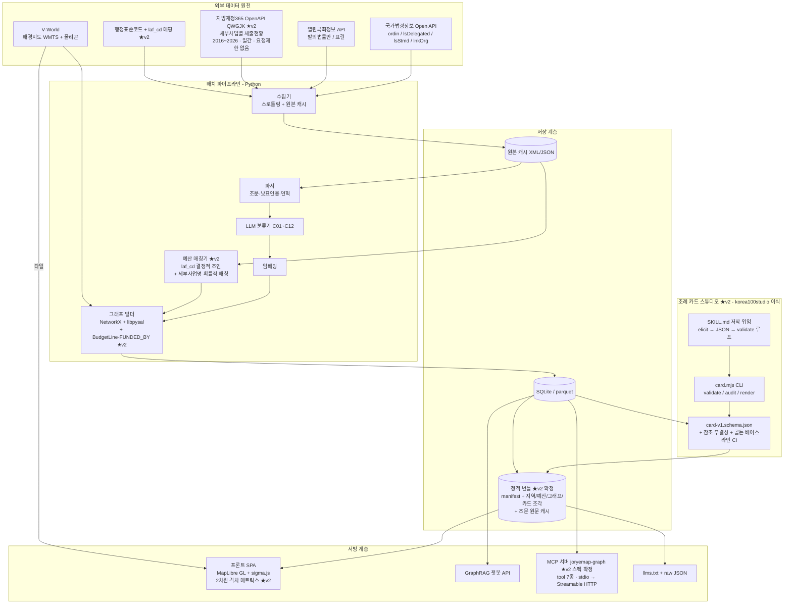

# 09. 설계 고도화 v2 — 심층 분석 반영 증보판

> [05. 시스템 설계서](./05_시스템_설계.md)의 **v2 증보판(델타 문서)**. 05 전체를 다시 쓰지 않고, 이번 라운드 심층 분석(korea100 스키마 전수 해부 · korea100studio 파이프라인 해부 · klocal 데이터 원천 조사 · MCP 스펙/사례 조사 · 라이선스 전수 점검)으로 **바뀌는 것만** 기록한다.
> 기준일: 2026-08-18. 이 문서에서 05를 참조할 때는 "v1"으로 표기한다. 조사자료로 확인 못한 항목은 "(확인 필요)".
>
> 관련 문서: 01. 공모전 분석(팀 내부 문서 — 공개본에 포함하지 않는다) · [02. 선행사례 분석](./02_선행사례_및_유사서비스_분석.md) · [03. 데이터소스](./03_법령조례_체계와_데이터소스.md) · [04. 선행연구 리뷰](./04_선행연구_리뷰.md) · [05. 시스템 설계 (v1)](./05_시스템_설계.md) · 06. 실행계획 로드맵(팀 내부 문서 — 공개본에 포함하지 않는다)

---

## 0. 이번 라운드에서 새로 확보된 사실 (v2의 전제)

| 확보 사실 | 의미 |
|---|---|
| korea100 저장소 전체 로컬 클론 완료 — 제도 JSON **578개(11.45MB)**, 전수 파싱 통계 확보. 커밋 481개 | 조례 카드 스키마를 "추정"이 아니라 **실측 스키마 전용(轉用)**으로 확정 가능 |
| korea100 검증 체계 실측: verification 3단계(source-linked/article-verified/needs-review), 조문 인용 14,347건 중 99.90% 자동 검증, 조문 원문 로컬 캐시(article-text-registry, 4,427조문) | 조례 카드의 검증 규율을 검증된 원형에서 직수입 |
| korea100studio 로컬 클론 완료 — Agent Skill + JSON Schema(ajv) + 참조 무결성 검사 + CLI 렌더/감사 + 골든 베이스라인 + CI. 원본 509개 보드 비트 단위 재현 검증 이력 | 조례 카드 **대량생산 파이프라인의 완제품 레퍼런스** 확보 |
| klocal은 깃허브 없음 → 라이브 사이트 역공학으로 데이터 계층 파악: 예산 manifest(`gov/file/rows/total/hash`) + 지자체별 JSON 조각 235개(1,477,728행), ID 체계 `ehojo-{자치단체코드}-{연도}-{순번}` | 서빙 아키텍처(manifest+조각)를 실측 구조 기준으로 확정. 단 klocal 데이터 자체는 미러링 금지([법적 점검](#8-리스크미확인-사항-갱신)) |
| **지방재정365(lofin365)에서 세부사업 단위 세출 데이터가 로그인 불필요·일간 갱신·API 요청제한 없음·출처표시/상업적/2차 가공 허용으로 개방** 중임을 실측 (OpenAPI `QWGJK`, 2016~2026, **지출액 필드 포함**) | v2 킬러 기능 "조례 실효성 분석"의 데이터 요건 충족 — klocal 미러링 없이 원천에서 상위 호환 확보 |
| MCP 현행 스펙 2026-07-28 확인. 한국 법령 MCP 6종 존재(전부 원문 검색 래퍼), **조례 그래프 분석형 MCP는 조사 범위 내 부재**. korea100 행정절차 MCP v0.2는 미머지 브랜치의 3개 제도 프로토타입 | v1의 "MCP 제공 차별화"가 유지·강화됨. tool 스펙을 초안 수준에서 스펙 수준으로 격상 |

---

## 1. v1 → v2 변경 요약

| # | 영역 | v1 (05 문서) | v2 (본 문서) | 왜 바뀌나 |
|---|---|---|---|---|
| 1 | 조례 상세 데이터 모델 | Ordinance 노드 속성 나열 수준 (v1 §2.1) | **조례 카드 card-v1 스키마 확정** — korea100 institution JSON(578개 실측)의 canvas 9칸·verification·process를 조례용으로 전용 | korea100 전수 해부로 원형 스키마가 실측 확정됨. "그래프 노드"와 별개로 사람이 읽는 카드 계층이 필요 |
| 2 | 검증 규율 | "asOfDate·verification 메타 부여" 원칙 선언 (v1 §2.3 설계노트 3) | verification **3단계 상태기계 + articleVerification 카운터 + unresolved reasonCode + 조문 원문 로컬 캐시** 구체 스펙 | korea100의 실제 레코드 구조를 필드 단위로 확보 — 원칙을 스펙으로 격상 |
| 3 | 격차 분석 | [조례 유무] 1차원 (v1 §4 모듈 ②) | **[조례 유무] × [예산 편성·집행] 2차원** — BudgetLine 노드 + FUNDED_BY 엣지 신설, "조례는 있는데 예산이 안 잡힌 지자체" 탐지 | lofin365 세부사업별 세출 데이터(지출액 포함)의 개방 조건·API 스펙이 실측 확인됨 |
| 4 | 노드/엣지 수 | 노드 8종 / 엣지 7종 | **노드 9종 / 엣지 8종** (+BudgetLine, +FUNDED_BY) | 위 3번 |
| 5 | 콘텐츠 생산 | LLM 분류 태깅까지만 설계 (v1 §3.3) | **korea100studio 방식 이식**: card-v1 JSON Schema + ajv 검증 + 참조 무결성 검사 + CLI audit/validate + 골든 베이스라인 + SKILL.md 저작 위임 | studio 해부로 "스키마 계약→배치 생성→기계 검증→품질 게이트" 파이프라인 전체가 재사용 가능함을 확인 |
| 6 | 서빙 구조 | "manifest+지역별 정적 JSON 조각(klocal 검증 패턴)" 방향만 결정 (v1 §3.7) | manifest 필드·분할 기준·프리로드 UX·비교 세션까지 **확정 스펙** | klocal 예산 manifest 구조 실측(`gov/file/rows/total/hash`) |
| 7 | MCP | 도구 5종 이름만 초안 (v1 §6.2) | **tool 7종 + resources 4종 + prompts 2종 입출력 스키마**, transport 로드맵(stdio→Streamable HTTP→OAuth 2.1), korea100 MCP v0.2의 안전 규율 승계 | MCP 2026-07-28 스펙·법령 MCP 6종·korea100 MCP 설계 문서 실독 |
| 8 | 데이터 출처 전략 | klocal을 "검증 패턴" 레퍼런스로 서술 | **klocal 데이터 미러링 금지 확정, 예산은 lofin365 원천 재수집, korea100은 스키마·방법론만 차용(데이터 전량 재배포 회피)** | 라이선스 전수 점검: DB제작자 권리(저작권법 §91~93)·잡코리아 판례, korea100 "소프트웨어 한정 MIT" 확인 |
| 9 | 주요업무계획 축 | (v1 범위 밖) | 시범 지역 1~2개 시도만 자체 수집, 전국은 로드맵 서술 | 중앙집중 원천 부재 실측(235개 홈페이지 분산, 정보공개포털은 결재문서 위주) |

v1의 나머지 결정(그래프 저장소 이중 구조, 분석 모듈 5종, 프론트 구성, MVP A안+카테고리 2종, 로드맵 S0~S5)은 **그대로 유지**된다.

---

## 2. 조례 카드 스키마 확정안 — `card-v1`

### 2.1 설계 원칙

1. **korea100 institution JSON을 원형으로 전용한다.** 578개 파일 전수에서 최상위 필드 존재율 100%, canvas 9칸 키 완전 동일이 실측됐다 — 검증된 계약이다. `canvas.legalBasis.kind` 열거형에 이미 `조례`, `조례·규칙`이 포함돼 있어 도메인 충돌도 없다.
2. **데이터가 아니라 스키마를 가져온다.** korea100의 라이선스는 "저장소의 소프트웨어는 MIT"로 한정 서술되고 데이터는 llms.txt의 목적 한정 고지뿐이다 — 스키마·검증 규율 차용은 아이디어/방법론이라 저작권 문제가 없고, 데이터 전량 미러링은 회피한다(§8).
3. **korea100의 실패도 가져온다.** category 63종·type 437종으로 증식한 비통제 어휘의 전철을 밟지 않는다 — 카테고리는 v1 §3.3의 C01~C12 통제어휘로 고정.
4. 그래프 노드(Ordinance)와 카드(card-v1)는 역할이 다르다: 노드는 전수(12.8만) 커버 최소 속성, 카드는 큐레이션 대상(MVP 2개 카테고리)의 심층 콘텐츠. 카드는 노드를 `slug`로 참조한다.

### 2.2 최상위 필드 명세

| 필드 | 출처 | 규격 | 조례 전용 시 변경점 |
|---|---|---|---|
| `slug` | korea100 동일 | `{sig_cd}-{조례슬러그}` (예: `26110-parking-lot-management`) | 지자체코드 접두로 복합키화 — korea100은 전국 제도라 공간 키가 없었음 |
| `name` / `oneLiner` | 동일 | 조례 정식 명칭 / 한 줄 요약 | — |
| `priority` | 동일 | 공개 순서 정수 | manifest와 동기 유지 규정(korea100 데이터 계약 승계) |
| `asOfDate` | 동일 | `YYYY-MM-DD` — **원문 확인 기준일** | §2.5 규율 참조 |
| `status` | 동일 | `"full"` \| `"canvas"` | **선언형 조례(기본이념·책무 선언)는 `canvas`로 프로세스 생략** — korea100이 이미 지원하는 2단계 구조를 그대로 활용. 절차형 조례(지원금 신청·위원회·허가신고)만 `full` |
| `region` | **신규** | `{sig_cd, sido_cd, org_code, name, level}` | korea100에 공간 필드가 전혀 없음(실측) — 우리 지도의 핵심 축이므로 필수 신설. V-World `sig_cd`·법령정보 `org` 코드와 조인 |
| `ordinanceMeta` | **신규** | `{ordin_id, mst, 공포번호, 공포일자, 시행일자, rrClsCd, history[]}` | 제정→일부개정→전부개정→폐지 연혁(rrClsCd 300201~300204). korea100 verification.sources의 `lawId/mst` 대응물 |
| `category` | **개조** | C01~C12 코드 (v1 §3.3) | korea100 자유서술 category(63종 증식) 대신 통제어휘. `type`(437종) 필드는 **도입하지 않음** |
| `canvas` | 동일 골격 | 9칸 (§2.3) | — |
| `budgetLinks` | **신규(v2 킬러)** | `Array<BudgetLink>` (§3.3) | 조례↔세출 세부사업 매칭 레코드 |
| `siblingOrdinances` | **신규** | `Array<{slug, region, 제정일}>` | 동일 조례군(표준조례안 계열)의 타 지자체 조례 — korea100 `related`(이름 문자열 참조)의 공간 확장판이며, **slug 참조로 개선**(korea100의 이름 참조는 무결성 검사 불가능한 약점) |
| `related` | 동일(개선) | slug 배열 | 동일 지역 내 연관 조례·규칙 |
| `fieldVerification` | 동일 | string[] | "현장 검증 필요" 항목 → 공개 검증 큐 생성(korea100 field-verification-queue 패턴) |
| `verification` | 동일(확장) | §2.5 | `sourceType`에 `"ordinance"` 추가, `ordinanceId/ordinanceSerial` 식별자 신설 |
| `process` | 동일 | lanes/stages/nodes/edges/warnings | `full` 카드만. korea100studio board-v1로 렌더(§4) |
| (삭제) | — | `whyFirst`, `personaAudit`, node `progress` | 편집 논리·레거시 필드 — 조사자료 매핑 초안대로 미도입 |

### 2.3 canvas 9칸 — 조례 버전

korea100의 9칸 골격(9개 키 578개 파일 전수 동일)을 그대로 쓰되, 각 칸의 질문을 조례 도메인으로 재해석한다. 지시서의 "정의/근거법령/적용대상/…" 9요소는 아래처럼 실제 스키마 키에 사상된다 (제정연혁→`ordinanceMeta.history`, 예산연계→`budgetLinks`, 유사조례→`siblingOrdinances`, 검증상태→`verification`은 canvas 밖 최상위 필드가 정위치).

| 칸 | 키 (korea100 원형 유지) | 조례 버전 질문 | 규격 |
|---|---|---|---|
| 1 | `purpose` | 이 조례는 무엇을 해결하나 (정의·목적 — 통상 제1조) | string |
| 2 | `stakeholders` | 누구에게 적용되나 (수혜자·신청자·규제대상·비용부담자) | string |
| 3 | `legalBasis` | 법적 근거는 무엇인가 — **2층 구조**: ① 상위법 위임근거(법률·시행령 조항, `kind: 법률/대통령령/부령`) ② 당해 조례의 핵심 조문(`kind: 조례`) | `Array<{law, articles, kind}>` — kind 열거형에 `조례`·`조례·규칙`이 이미 존재(실측). 그래프의 `DELEGATED_FROM` 엣지와 동일 원천 |
| 4 | `authorities` | 누가 집행하나 (소관부서·위원회·단체장) | `Array<{name, role}>` |
| 5 | `procedure` | 절차는 어떻게 흐르나 (신청→심의→지급 등 6~10단계, 게이트 ID 병기 관례 승계) | string[] |
| 6 | `moneyFlow` | 돈은 어떻게 흐르나 — **자체재원·시도비·국비 보조·기금** 서술 + `budgetLinks` 실측치와 상호 참조 | string |
| 7 | `docsFlow` | 문서·데이터는 어떻게 흐르나 (신청서→심의자료→ELIS/시스템, "A → B → C" 체인 관례) | string |
| 8 | `bottlenecks` | 어디서 막히나 (사각지대·집행 병목·**예산 미편성**) | string[] |
| 9 | `reformPoints` | 어떻게 바꿀 수 있나 (개정 포인트·타 지자체 사례) | string[] |

### 2.4 process — 절차형 조례의 스윔레인 그래프

korea100 실측 규격을 그대로 승계한다: 노드 `{id, name, lane, stage, type(task/gateway/notice/system), status(편집 표지), actor, action, receiver?, condition?, input_documents[], output_documents[], deadline?, blocker?, confidence(0~1), legal_basis[]}` + 엣지 `{id, source, target, type(sequence/loop/message), label}`. 특히 두 가지를 규율로 못박는다:

- **회귀 루프(loop 엣지)는 1급 시민** — 보조금 반려·보완 재제출 사이클을 명시적으로 그래프화(korea100 EIA의 L01/L02 패턴).
- **노드 confidence < 0.8이면 UI에 "현장 검증 필요" 뱃지** — korea100 데이터 계약의 임계값 규칙 승계.

### 2.5 verification 레코드와 asOfDate 규율

korea100 실측 구조를 조례용으로 확장한 확정안:

```jsonc
"verification": {
  "status": "source-linked | article-verified | needs-review",
  "verifiedAt": "YYYY-MM-DD",
  "method": "국가법령정보센터 Open API (target=ordin) 출처·조문 대조",
  "scope": "법적 근거 N건 중 공식 원문 N건 연결. 조문 M건 중 M건 존재 확인. 조문번호의 존재 여부만 검증하며 해석·적용 타당성은 검증 범위 밖.",
  "sources": [{
    "law": "부산광역시 ○○ 조례",
    "kind": "조례",
    "sourceType": "ordinance",            // korea100의 statute/admin-rule/treaty에 추가
    "ordinanceId": "...",                  // 자치법규ID — lawId 대응
    "ordinanceSerial": "...",              // MST 대응 일련번호
    "promulgatedOn": "...", "effectiveOn": "...",
    "officialUrl": "https://law.go.kr/자치법규/..."   // 한글 슬러그 영구링크 — law.go.kr이 자치법규도 서비스
  }],
  "unresolved": [{ "law": "...", "kind": "...", "reasonCode": "local-scope | title-needs-confirmation | ...", "reason": "...", "nextStep": "..." }],
  "articleVerification": {
    "checkedAt": "...", "citationEntries": 0, "explicitCitationEntries": 0,
    "articleReferences": 0, "verifiedReferences": 0, "missingReferences": 0, "uncheckableReferences": 0
  }
}
```

운영 규율 (korea100 실측 수치가 곧 목표 벤치마크):

| 규율 | 내용 | korea100 실측 근거 |
|---|---|---|
| 3단계 상태기계 | source-linked(원문 식별자 연결) → article-verified(인용 조문번호가 현행 원문에 실존함을 자동 확인) → needs-review(범위 미확정) | 578개 중 article-verified 494(85.5%) — 우리 목표치로 채택 |
| 책임 한정 문장 | "조문번호의 존재 여부만 검증, 해석·적용 타당성은 범위 밖"을 scope에 **매번** 명시 | korea100 전 파일 관례 |
| unverified 플래그 | 자동 검증 실패 인용은 `unverified: true`로 남기고 숨기지 않음 | korea100 노드 legal_basis 9,528건 중 48건 |
| asOfDate 만료 | asOfDate가 오래되면 카드에 stale 고지(MCP에서는 `stale:true` 응답 — §6.4) | korea100 MCP의 30일 신선도 게이트 완화판 |
| 조문 원문 로컬 캐시 | `ordinance-text-registry.json`: `"ordinance:{serial}::제N조"` 키로 조문 원문 캐시 → 카드 UI가 law.go.kr 왕복 없이 원문 즉시 표시 | article-text-registry 패턴(4,427조문·10,286매핑). 단 korea100도 커버리지가 505/578에서 멈춘 전례 → **재생성을 CI에 편입**해 드리프트 방지 |

조례는 법률보다 원문 접근성이 나쁘므로 이 검증 계층이 korea100에서보다 **더** 중요하다. 공모전 정확성(15점) 방어의 핵심 장치이기도 하다(01(팀 내부 문서 — 공개본에 포함하지 않는다)).

### 2.6 표준조례안 오버레이 — mega-projects 모델 전용

korea100 mega-projects의 구조(institutions를 불변 템플릿으로 두고 오버레이가 `templateRefs`로 참조, `mappingStatus: exact/candidate`)를 조례 도메인으로 전용한다:

- **표준조례안(모델조례)** = 템플릿 카드. **각 지자체 조례** = 오버레이 인스턴스가 `templateRefs: {template: slug, mappingStatus}`로 참조.
- `mappingStatus: "candidate"` = "표준안 준용 여부 미확인" — 확인 안 된 것을 확인 안 됐다고 적는 korea100 규율의 재활용.
- 여러 조례가 얽히는 지역 정책 패키지(예: 빈집 정비 = 정비 조례 + 보조금 조례 + 위원회 조례)는 mega-projects의 **산출물 매개 이분그래프**(엣지 직접 연결 대신 표준 artifact를 매개로 requires/produces 선언)로 표현 — MVP 이후 확장 항목.

---

## 3. 신규 킬러 기능 — 조례 실효성 분석 (조례 × 예산 2차원)

### 3.1 무엇이 달라지나

v1의 격차 분석(모듈 ②)은 **[조례 유무]** 1차원이었다: "유사 지자체 10곳 중 7곳에 있는데 우리에게 없는 조례". v2는 여기에 **[예산 편성·집행]** 축을 추가해 2차원 매트릭스로 만든다:

| | 세출 세부사업 매칭됨 (예산 있음) | 매칭 세부사업 없음 (예산 0/미편성) |
|---|---|---|
| **조례 있음** | A. 작동하는 조례 | **B. 선언뿐인 조례** ★v2 킬러 — "조례는 만들었는데 돈이 한 푼도 안 잡힌 지자체" |
| **조례 없음** | C. 조례 없이 집행되는 사업 (위임근거·자치법규 정비 점검 대상) | D. 완전 격차 (v1 격차 분석) |

나아가 지방재정365 데이터에는 **지출액(ep_amt)·집행잔액**이 있으므로(실측 — klocal의 예산액-only 데이터에 없는 필드), "편성은 했는데 집행이 0인 조례"까지 한 단계 더 들어갈 수 있다. 이것이 klocal 대비 우리만의 차별화 포인트다.

### 3.2 데이터 요건 — 전부 실측 확인됨 (조사자료[primary])

| 요건 | 확인 내용 |
|---|---|
| 원천 | 지방재정365 "세부사업별 세출현황" — 통계 화면(`LF3120202.do`, XLSX/CSV/TXT 다운로드) + 재정데이터셋(`LF5100000.do`, Sheet/OpenAPI/Time Series) |
| API | OpenAPI `https://www.lofin365.go.kr/lf/hub/QWGJK` — **요청제한 없음**(인증키 필요), 검색인자 `fyr`(필수)·`laf_cd`·`dbiz_nm`(유사검색)·`exe_ymd`(필수), 출력 25필드 |
| 핵심 필드 | `dbiz_cd/dbiz_nm`(세부사업), `bdg_cash_amt`(예산현액), `bdg_ntep/capep/sggep/etc_amt`(재원 4분), `ep_amt`(지출액), `cpl_amt`(편성액), `fld_cd/part_cd`(분야·부문), `laf_cd`(자치단체코드), `dept_cd`(부서코드 — API에만 존재) |
| 커버리지·갱신 | 2016~2026 보유, **일간 갱신**, 전 지자체(243) |
| 이용조건 | "출처표시, 상업적·비상업적 이용가능, 변형 등 2차적 저작물 작성 가능" — 공모전 "공개 데이터만" 규정과 정합, 참고문헌 인용 가능 |
| 한계 | 정책사업명·예산과목명(편성목/통계목)·산출근거(부기)는 공개 채널에 없음. **klocal의 "부기 매칭"도 실측 결과 세부사업/예산과목 행 수준 명칭 매칭**이었으므로, 세부사업명 수준 매칭이 동일 출발선. 산출근거 수준은 지자체 예산서 책자(HWP/PDF) 파싱으로만 가능 — 확장 로드맵 |

### 3.3 그래프 스키마 증보 — BudgetLine 노드 + FUNDED_BY 엣지

**노드 9종째 `BudgetLine`** (v1 §2.1 표에 추가):

| 속성 | 내용 |
|---|---|
| budget_id | `{laf_cd}-{fyr}-{dbiz_cd}` (dbiz_cd 미확보 행은 명칭 해시 대체) |
| fyr, laf_cd, acnt_dv_nm | 회계연도, 자치단체코드, 회계구분 |
| dbiz_cd, dbiz_nm, dept_cd | 세부사업 코드·명, 부서코드(→부서명 매핑 테이블은 확인 필요) |
| fld_cd/fld_nm, part_cd/part_nm | 분야(14종)·부문 |
| bdg_cash_amt, bdg_ntep, capep, sggep, etc_amt | 예산현액과 재원 내역 |
| ep_amt, cpl_amt, exe_ymd | **지출액**, 편성액, 집행일자 |
| asOfDate | 수집 기준일 (일간 갱신 원천이므로 필수) |

**엣지 8종째 `FUNDED_BY`**: `Ordinance → BudgetLine`

| 속성 | 내용 |
|---|---|
| match_method | `exact_name`(조례명 제도어와 세부사업명 완전 일치) / `keyword`(부분일치) / `synonym`(행정용어 동의어 사전 경유) / `embedding`(임베딩 유사도) |
| confidence | 0~1 — korea100 노드 confidence 규율 승계. 임계 미만은 UI에서 점선·"검증 필요" 표시 |
| verified | 표본 수작업 검수 통과 여부 (`unverified` 기본) |
| category_gate | 분야·부문 코드 ↔ 조례 카테고리 사전 필터 통과 여부 (오탐 축소 장치) |
| matched_at, source_fyr | 매칭 실행일, 대상 회계연도 |

**매칭 파이프라인** (조사자료[primary] §4의 조인 설계 채택):

1. **지역 축(결정적)**: `laf_cd` ↔ 법령정보 `org` ↔ V-World `sig_cd` — **243행 매핑 테이블 1개**로 확정 조인. v1 §3.1의 코드 매핑 CSV에 laf_cd 열 추가. `padm_laf_cd`로 행정구역 개편(전남광주 통합 등) 추적.
2. **사업 축(확률적)**: 조례명에서 제도명 추출("○○ 설치 및 운영 조례" → "○○") → 세부사업명 부분일치 + 동의어 사전 + 임베딩 유사도. API의 `dbiz_nm` 유사검색으로 조례 키워드 직접 원천 조회도 병용.
3. **보강 신호**: 분야·부문 14분류 ↔ C01~C12 매핑을 사전 필터로.
4. **검증**: 시범 지자체 1곳에서 정답셋 50~100쌍 수작업 구축 → 정밀도/재현율 측정치를 공모전 문서에 명기(미수행 — S0~S1 과제, §8).

### 3.4 표현 규율 — 단정하지 않는다

매칭은 확률적이므로 다음 규율을 UI·MCP·문서 전체에 강제한다:

- "예산 0원"이 아니라 **"매칭되는 세부사업을 찾지 못함"**으로 표현. FUNDED_BY 부재 ≠ 예산 부재의 증명.
- 정상적 반례를 항상 병기: **국비 보조사업은 조례 없이 수행 가능**, 규제·절차형 조례는 예산 불요, 세부사업명은 축약·관습 표기 다수.
- 조례 카드 `canvas.moneyFlow`·`bottlenecks`에 매칭 결과를 서술로 반영하되, `budgetLinks`의 confidence·verified를 함께 노출.
- 참고 문구: 지방재정365 "사회보장적 수혜금" 데이터셋 설명의 **"자치단체가 법령(조례포함)의 근거에 따라 자체 추진하는 현금성 복지"**(실측) — 조례-예산 연결 서사의 공식 근거 문장으로 발표·문서에 인용.

### 3.5 데모 서사 (v1 §8.1 데모 시나리오 증보)

> OO시 선택 → 유사 지자체 10곳 → "7곳에 있는 반려동물 조례가 우리엔 없다"(v1) → **"그런데 조례가 있는 7곳 중 2곳은 관련 세부사업 예산이 잡혀 있지 않다 — 조례 제정이 끝이 아니다"**(v2) → 예산이 실제 집행되는 지자체의 세부사업명·재원 구성·지출액 제시 → 입안 실무자에게 "조례+예산 패키지" 벤치마킹 대상 추천.

격차 분석이 "만들 조례 찾기"에서 **"작동하는 조례 찾기"**로 진화한다 — 심사 기준의 독창성·혁신성 어필 포인트가 하나 더 생긴다.

---

## 4. 콘텐츠 생산 파이프라인 — korea100studio 방식 이식

### 4.1 원형 요약 (실측)

korea100studio는 578개 제도를 만든 파이프라인의 최종 단계(렌더링+품질 감사)를 도메인 무관 Agent Skill로 추출한 독립 패키지다. 핵심 장치: ① board-v1 JSON Schema(ajv) + 참조 무결성 검사 2계층, ② CLI 5커맨드(render/audit/validate/motion/check), ③ 정량 품질 게이트(하드 지표 nodePiercings=0 + 소프트 예산 4종, 위반 엣지를 id로 특정), ④ 골든 베이스라인 회귀 테스트(리팩터링 드리프트 즉사), ⑤ SKILL.md로 에이전트에게 "elicit → JSON → render → audit 수렴" 루프 위임, ⑥ 룩앤필의 프로필 데이터화. 원본 509개 보드를 비트 단위 재현 검증한 이력이 있고, 로컬 실측에서 34개 테스트 전부 통과·audit 점수가 기록값과 정확 일치했다.

### 4.2 이식 설계 — `joryestudio` (가칭) 도구 체인

| 구성요소 | korea100studio 원형 | 조례 카드 버전 |
|---|---|---|
| 스키마 계약 | `board-v1.schema.json` | **`card-v1.schema.json`** — §2의 카드 전체를 JSON Schema draft 2020-12로 고정. `additionalProperties: true`(전방 호환) 승계 |
| 2계층 검증 | ajv + 참조 무결성(lane/stage/노드 id) | ajv + **조례 도메인 참조 무결성**: ① region.sig_cd가 지역 매핑 테이블에 실존 ② siblingOrdinances/related slug 실존 ③ budgetLinks의 laf_cd·fyr 유효 ④ category 코드가 C01~C12 ⑤ 카드 slug 중복 없음 ⑥ process의 lane/stage/엣지 참조(원형 그대로). 12.8만건 규모에선 이 참조 검사가 원형의 lane/stage 검사보다 중요 |
| CLI | `board.mjs` 5커맨드 | `card.mjs`: `validate <card.json> [--strict]`(스키마+참조+예산 게이트, CI용 exit 1) / `audit [--json]`(품질 점수) / `render`(카드 페이지 + process는 board-v1 변환 후 studio 렌더러 재사용 — **MIT이므로 코드 재사용 적법**) / `registry`(조문 원문 캐시 재생성) |
| 하드 게이트 | nodePiercings = 0 | **"실존하지 않는 조례·지역·조문 인용 = 0건"** — 검증 실패 카드는 배포 번들에서 제외 |
| 소프트 예산 | crossings ≤6 등 4종 | 카드당 인용 조문 수 하한/상한, oneLiner·canvas 길이 범위, budgetLinks confidence 분포, (렌더 시) 스윔레인 관통 0 — 위반은 경고 + 목록화 |
| 골든 베이스라인 | quality-baseline.json + baseline.test.mjs | 대표 카드 N장의 지표 스냅샷을 fixture로 잠금 → 생성 로직 수정 시 회귀 검출. GitHub Actions Node 매트릭스 CI 그대로 |
| 저작 위임 | SKILL.md + references/ + templates/ + fixtures/ | **`joryestudio` SKILL.md**: (a) 원자료(조례 원문 API 응답·lofin365 행)→card-v1 매핑 절차, (b) CLI 사용법, (c) "한 번 만들고 끝내지 말고 validate·audit이 통과할 때까지 반복" 루프. `references/authoring.md` 등가물 = "조례→카드 매핑 가이드 + 워크드 예제"(품질의 핵심 — korea100 일관성의 원천으로 판단) |
| 배치 생성 | `generate-institutions-361-500.mjs` 구간 단위 | 카드 생성 스크립트를 **지자체·카테고리 구간 단위로 분할, 커밋 단위와 일치** — 실패 시 재실행 범위가 명확, git 히스토리가 생산 대장 |
| 프로필 | profiles.mjs (gov/default) | 17개 시도별 색·라벨 + 면책 문구("법률 자문이 아님") 데이터화 — 엔진 하나로 전 시도 룩 |
| 모션 | SMIL 자체완결 SVG | 확산 타임라인·카드 공개 애니메이션에 재사용(외부 JS 0 — 경진대회 데모용) |

### 4.3 생산 원칙

- **"전수 렌더"가 아니라 "전수 검증"**: 카드(심층 콘텐츠)는 MVP 범위(2개 카테고리)만 생산하되, 스키마·참조·검증은 조례 전수 노드 데이터에 건다 — korea100도 그림은 578장, 검증은 전수·비트단위였다.
- LLM 생성 + 기계 검증 + 소량 수작업 감사의 3단 구조(korea100 운영 방식 실측)를 그대로: 생성 스크립트 / verify(조문 대조) / audit(표본 심층 감사) 분리.
- 도구 자체의 개발도 studio 방식(스펙 문서 → 체크박스 플랜 → 태스크별 TDD)을 채택 — 06 로드맵(팀 내부 문서 — 공개본에 포함하지 않는다)의 작업 분해에 반영.

---

## 5. 서빙 아키텍처 확정

### 5.1 v1 결정의 구체화

v1 §3.7은 "NetworkX 분석 + manifest/정적 JSON 조각 서빙 이중 구조"까지 결정했다. v2는 klocal 실측(예산 manifest 구조)으로 조각 계층을 확정한다. **데이터는 klocal에서 가져오지 않는다** — 구조만 차용한다(§8 라이선스).

### 5.2 manifest + 조각 스펙

```jsonc
// data/manifest.json — 번들 전체의 목차이자 무결성 대장
{
  "version": "...", "generatedAt": "...", "asOfDate": "...",
  "regions": [                       // klocal 실측 필드(gov/file/rows/total/hash) 차용·확장
    { "sig_cd": "26110", "name": "부산광역시 중구", "file": "regions/26110.json",
      "rows": 0, "bytes": 0, "hash": "sha256:..." }
  ],
  "shards": {
    "graph":      [ { "file": "graph/edges-similar-C03.json", "hash": "..." } ],
    "cards":      [ { "file": "cards/26110-....json", "hash": "..." } ],
    "budget":     [ { "file": "budget/26110-2026.json", "hash": "..." } ],
    "analysis":   [ { "file": "analysis/gap-26110.json", "hash": "..." } ],
    "registry":   [ { "file": "registry/ordinance-text-part1.json", "hash": "..." } ]
  }
}
```

**파일 분할 기준**:

| 조각 | 분할 축 | 근거 |
|---|---|---|
| 지역 조각 `regions/{sig_cd}.json` | 지자체 1개 = 1파일 (조례 목록·카테고리 집계·격차 결과 요약) | klocal이 235개 지자체 파일로 147만 행을 서빙한 실측 패턴 — 사용자는 한 번에 1~수 개 지역만 봄 |
| 예산 조각 `budget/{sig_cd}-{fyr}.json` | 지자체 × 회계연도 | lofin365 원천이 fyr 필수 인자 — 수집 단위와 서빙 단위 일치 |
| 그래프 조각 | 엣지 타입 × 카테고리 | SIMILAR_TO는 카테고리 내 생성(v1 §3.5)이므로 자연 분할. ADJACENT_TO·Region 노드는 전국 1파일(소형) |
| 카드 조각 | 카드 1장 = 1파일 (slug가 파일명) | korea100 institutions 배치 실측(578파일) — URL 딥링크와 1:1 |
| 조문 캐시 | 크기 기준 파트 분할 | korea100 article-text-registry가 9.6MB 단일 파일인 반면, 우리는 파트 분할로 초기 로딩 억제 |

**프리로드 UX**: 첫 진입 시 manifest + 전국 소형 레이어(Region 노드·ADJACENT_TO·카테고리 집계 choropleth)만 로드 → 지역 선택 시 해당 지역·예산·카드 조각을 지연 로드 + **manifest의 rows/bytes 합계로 진행률 표시**(klocal의 로딩 진행률 UX를 v1 §5.2에서 차용하기로 한 결정의 구현 근거 — manifest에 크기 정보가 있어야 진행률이 가능하다). hash는 CDN 캐시 무효화 겸 무결성 검증에 사용.

**비교 세션**: 비교 담기는 localStorage에 `{sig_cd[], ordin_slug[]}`만 저장(v1 결정 유지) — 조각 캐시는 브라우저 HTTP 캐시에 위임하고 상태와 데이터를 분리. 비교 뷰 진입 시 대상 지역 조각들을 병렬 프리로드. (klocal 비교 세션의 내부 구현은 이번 조사에서 미확인 — 확인 필요. 위는 자체 설계.)

### 5.3 v1 무서버 이중 구조와의 통합

```
분석 파이프라인(Python·NetworkX·배치) ──내보내기──▶ 정적 번들(manifest+조각) ──▶ 프론트 SPA
                                   └──▶ SQLite ──▶ GraphRAG API·MCP 서버 (소형 서버 2종만 상주)
```

정적 번들은 GitHub Pages 등 무서버 호스팅(v1 결정 유지). MCP·챗봇만 소형 서버. 카드 조각과 llms.txt·raw JSON 공개(korea100 패턴)는 같은 번들에서 나간다 — 사람용(웹)·에이전트용(MCP)·크롤러용(llms.txt) 3채널이 단일 진실 원천을 공유.

---

## 6. MCP 서버 스펙 — `joryemap-graph` (가칭)

### 6.1 스펙·transport 결정 (조사자료[mcp] 실측 기반)

| 결정 | 내용 | 근거 |
|---|---|---|
| 준거 스펙 | MCP **2026-07-28**(현행) — 요청 단위 버전 선언, `server/discover` 대응은 SDK에 위임 | 스펙 페이지 실확인 |
| 1단계 (공모 데모) | **stdio + FastMCP(Python)** — 정적 JSON/SQLite 래핑, 인증 없음(스펙이 stdio에는 OAuth 스펙을 따르지 말고 환경변수를 쓰라고 명시) | v1 §6.2 결정 유지·정합 확인 |
| 2단계 (공개) | **Streamable HTTP** 원격 엔드포인트 (구식 HTTP+SSE는 표준 바인딩에서 제거됨) | transports 페이지 실확인 |
| 3단계 (유보) | OAuth 2.1(리소스 서버 + RFC 9728) — 쓰기·개인화 도입 시에만 | authorization 페이지: 인증은 OPTIONAL |
| 3요소 | Tools 7종 + Resources 4종 + Prompts 2종 완비 | 아래 |

### 6.2 Tool 7종

| # | tool | 입력 (요약) | 출력 (요약) | 그래프 원천 |
|---|---|---|---|---|
| T1 | `search_ordinance` | query(≤100), region_code?, category?(C01~C12), status?(현행/폐지/전체), include_rules?, limit(1~50) | match_count, results[{ordin_id, mst, title, region, categories[{code,confidence}], 공포·시행일, 제개정구분, snippet, official_url}], as_of_date | Ordinance + HAS_ORDINANCE + IN_CATEGORY (FTS+임베딩 하이브리드) |
| T2 | `get_ordinance` | ordin_id 또는 mst(택1), include[](text/history/statutes/similar/bills/**budget**) | 조례 속성 + articles + history 타임라인 + delegated_from[{statute, 조항호목, 위임문구, source, 검증상태, official_url}] + similar + bills(발의·표결) + **budget_links**(§3.3) + provenance | Ordinance→DELEGATED_FROM→Statute→Bill 경로 + FUNDED_BY. **원문 전문은 law.go.kr 링크로 위임** — 기존 법령 MCP와 역할 분담 |
| T3 | `similar_regions` | region_code, top_n(1~30), category_weights?, method(embedding/portfolio) | base_region, neighbors[{region, similarity, top_shared_categories, is_adjacent, same_province}], model_name, computed_at | 지역 벡터 + ADJACENT_TO (분석 모듈 ①) |
| T4 | `gap_analysis` ★ | region_code, category?, min_adoption(기본 7), top_n(기본 10), **include_funding?(bool — v2 신설)** | peer_set, gaps[{cluster, adoption_count, adopters, example_ordinance, legal_basis{has_delegation, 지자법28조_주의플래그}, **funding{funded_count, unfunded_adopters[], avg_budget, note}**}], as_of_date | SIMILAR_TO 클러스터 × HAS_ORDINANCE 결여 × **FUNDED_BY**(모듈 ② 2차원판 — §3) |
| T5 | `diffusion_timeline` | topic 또는 cluster_id, region_scope?, granularity(year/month) | first_adopter, timeline[], adoption_curve[], non_adopters, spatial_stats?{moran_i, p_value} | 조례군 제정일 + Moran's I (모듈 ④⑤) |
| T6 | `region_profile` | region_code, compare_with?(≤3) | region 메타, ordinance_stats(카테고리별 보유율), cluster_membership{spatial, policy, mismatch_flag}, gap_summary, **budget_summary{matched_ordinances, unfunded_ordinances}**, adjacent_regions | HAS_ORDINANCE 집계 + Louvain 이중 파티션(모듈 ③) + FUNDED_BY 집계 |
| T7 | `statute_coverage` | law_id 또는 법령명, 조항? | 해당 법령 위임 조례의 보유/미보유 지자체 지도 데이터 + source별 건수(lsStmd vs lnkOrg 불일치 실측치 포함) | DELEGATED_FROM 역방향 집계 |

굵은 항목이 v2 증보분(조례 실효성 축). T7은 기존 `korean-law-mcp`의 `ordinance_radar`(단일 조례→상위법 **수직** 대조)와 정확히 **상보적**인 수평 커버리지 뷰 — 발표의 생태계 조합 데모(우리 gap_analysis → 타사 get_law_text → 조례 초안)에 최적.

### 6.3 Resources · Prompts

- Resources: `joryemap://regions`(지역·코드 매핑), `joryemap://categories`(C01~C12 정의문), `joryemap://clusters/{id}`, `joryemap://status`(수집 기준일·검증 현황 — korea100 `korea100://status` 차용)
- Prompts: `gap_briefing(region)`(격차+예산 → 입안 검토 보고서 초안), `benchmark_report(topic, region)`(벤치마킹 보고서)

### 6.4 안전·품질 규율 — korea100 행정절차 MCP v0.2 승계

korea100 MCP(미머지 브랜치 실독)에서 확인된 규율 중 채택분:

| 규율 | korea100 원형 | 우리 적용 |
|---|---|---|
| 검증 게이트 | R2 검증 통과 3개 제도만 노출, 시작 시 불변식 검사 실패 시 서버 기동 거부 | **verification이 needs-review인 카드는 T2 상세에서 상태 명시, 검증 실패 데이터는 번들에서 제외**(§4.2 하드 게이트와 동일 선) |
| 신선도 | 법령 대조 30일 초과 시 기능 축소 | 완화판: asOfDate 초과 시 응답에 `stale:true` 고지 의무화(기능 차단은 안 함) |
| 읽기 전용 | 전 tool `readOnlyHint:true / destructiveHint:false / idempotentHint:true` annotations | 그대로 |
| 원문 불재해석 | 원문은 law.go.kr 직접 링크 | 그대로 — "의사결정 지원이며 법적 판단이 아님" 고지 상수를 모든 응답에 포함 |
| 응답 형식 | content.text + structuredContent 병행 | 그대로 + 오류 코드화(`region_not_found` 등) + 전 응답에 `as_of_date`·`verification` 동봉 |

### 6.5 기존 한국 법령 MCP와의 차별화 (실측 6종 대비)

기존 6종(chrisryugj, finalchild, seo-jinseok, LexLink, korea-public-data, mcp-kr-legislation)은 전부 법제처 API의 **원문 검색 래퍼**다. 조례를 그래프로 분석하는 tool(유사 지자체·격차·확산·공간통계·**예산 연계**)을 제공하는 MCP는 조사 범위 내 부재(레지스트리 직접 탐색은 미수행 — 확인 필요). 우리 포지션: **원문 검색 계층과 경쟁하지 않는 분석 계층** — 조합 가능성 자체가 어필 포인트.

---

## 7. 갱신된 전체 아키텍처

v1 §7.1에서 굵은 테두리 없이 추가·변경된 부분: lofin365 원천, 예산 수집·매칭, card-v1 스튜디오 파이프라인, 카드·예산 조각, MCP 확장.



---

## 8. 리스크·미확인 사항 갱신

### 8.1 신규·갱신 리스크

| 리스크 | 심각도 | 대응 |
|---|---|---|
| 조례명↔세부사업명 매칭 정밀도 미검증 (실험 미수행) | 상 | S0~S1에서 시범 지자체 1곳 정답셋 50~100쌍 수작업 구축 → 정밀도/재현율 측정·문서 명기. 그때까지 FUNDED_BY는 전량 `unverified` + confidence 표시(§3.4 표현 규율로 단정 회피) |
| lofin365 인증키 발급 절차·소요 미실측 (sample key는 pSize 5 고정만 확인) | 중 | S0 즉시 회원가입·키 신청. 실패 대비: 통계 화면 CSV/XLSX 다운로드 + 공공데이터포털 연도별 파일(로그인 불필요 확인됨)로 폴백 |
| 세출 데이터 전량 수집 시 용량·"대량 다운로드 제한" 임계 미실측 | 중 | 연도×시도 분할 수집 전략으로 시작, 실측 후 조정. MVP는 2개 카테고리 관련 분야 코드로 사전 필터 |
| dept_cd(부서코드)→부서명 매핑 테이블 소재 미확인 | 하 | 카드 canvas.authorities는 조례 본문의 담당부서 필드로 대체 가능 — 예산 쪽 부서명은 확장 항목 |
| korea100 데이터 라이선스 회색지대 (코드 MIT / 데이터는 목적 한정 llms.txt) | 중 | **스키마·검증 규율·코드만 차용, 데이터 전량 미러링·재배포 회피**(이 문서의 §2·§4가 그 원칙으로 작성됨). 참고문헌 전수 기재 + 저자 서면 확인 메일 1통(저비용 고확실성) |
| klocal 미러링 리스크 (라이선스 무표시 + DB제작자 권리 §91~93 + 잡코리아 판례) | 상→**해소** | **예산 축은 lofin365 원천 재수집으로 전환 확정** — 원천이 상위 호환(다년·지출액·일간 갱신·이용조건 명시)이라 미러링 실익 자체가 없음. klocal은 UX·스키마 레퍼런스 + 참고문헌 인용만 |
| 주요업무계획 축의 고비용 (중앙집중 원천 부재 실측) | 중 | 시범 1~2개 시도만 자체 수집(HWP 파싱은 표 구조 보존이 관건 — hwplib/hwp-hwpx-parser 후보), 전국 확장은 로드맵 서술로 한정 |
| 조문 원문 캐시 커버리지 드리프트 (korea100도 505/578에서 멈춘 전례) | 하 | registry 재생성을 CI(prebuild)에 편입해 카드 수와 캐시 커버리지 일치를 기계 강제 |
| V-World 약관 전문 미열람 (타일·폴리곤 정적 재배포 가능 여부 미확정) | 중 | v1 결정 유지: 실시간 API + 출처표시. S0에서 키 발급 후 약관 전문(제4조·제12조) 캡처·보관 |
| MCP 레지스트리(smithery.ai·mcp.so) 직접 탐색 미수행 — "분석형 MCP 부재" 판단의 범위 한계 | 하 | 발표 전 재확인. 존재가 확인돼도 예산 연계 축은 여전히 미제공 영역일 가능성이 높음(추정) |

### 8.2 부록 B(v1 미확정 목록) 증감

- **해소**: klocal 데이터 계층 구조(역공학으로 파악) / korea100 스키마 상세(전수 실측) / MCP transport·인증 방향(스펙 실확인) / 예산 데이터 수급성(lofin365 실측).
- **신규 추가**: ① lofin365 인증키 발급 실측(S0) ② laf_cd ↔ org ↔ sig_cd 243행 매핑 테이블 작성 ③ 조례↔세부사업 매칭 정답셋 실험 ④ korea100 저자 서면 확인 메일 발송 여부 팀 결정 ⑤ 주요업무계획 시범 시도 선정 ⑥ klocal 업무계획 조각의 실제 경로·스키마(/data/jeonnam-plan 404 — 확인 필요, 단 미러링 안 하므로 우선순위 낮음).
- **유지**: 열린국회 표결 API 실측, 자치법규 본문 API 항·호 세분, ELIS ordinfd 정합, LLM 모델·비용 산정, 공모분야 선택(GeoAI 우선 검토).

---

## 부록. v2 반영 시 서식2(공모전 제출문) 어필 문장 후보

| 심사 항목 | v2 신규 어필 |
|---|---|
| 독창성(15) | "조례 유무 1차원을 넘어 **조례×예산 2차원 격차 매트릭스** — 조례는 있는데 예산이 잡히지 않은 지자체를 전국 단위로 탐지하는 최초 시도" |
| 혁신성(15) | "578개 제도를 검증해 낸 스키마·품질 게이트 방법론(korea100 계열)을 조례 도메인에 이식 + 조례 그래프 분석 MCP를 **제공하는** 쪽의 포지션" |
| 정확성(15) | "3단계 검증 상태기계 + 조문 자동 대조(원형에서 99.90% 검증률 실측) + 확률적 매칭의 confidence·unverified 전면 표기" |
| 데이터 다양성(15) | "법령·조례·의안·표결·행정경계·행정코드에 **지방재정 세출(세부사업 단위)** 추가 — 7계열 융복합" |
| 데이터 수급성(20) | "지방재정365 세부사업별 세출현황: 로그인 불필요·일간 갱신·API 요청제한 없음·출처표시/상업적/2차 가공 허용 — 전 페이지·API 명세 실측 완료" |
| 완성도(20) | "manifest+조각 정적 서빙, 카드 스키마 계약과 CI 품질 게이트, MCP tool 7종 입출력 스펙까지 구현 수준 설계 완료" |
