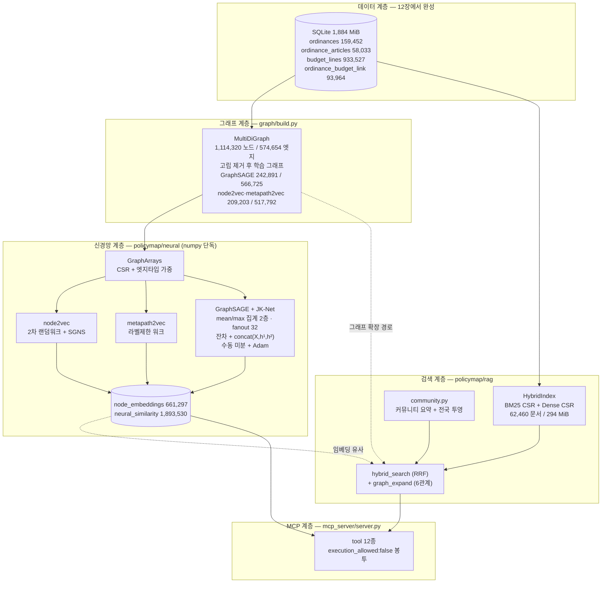
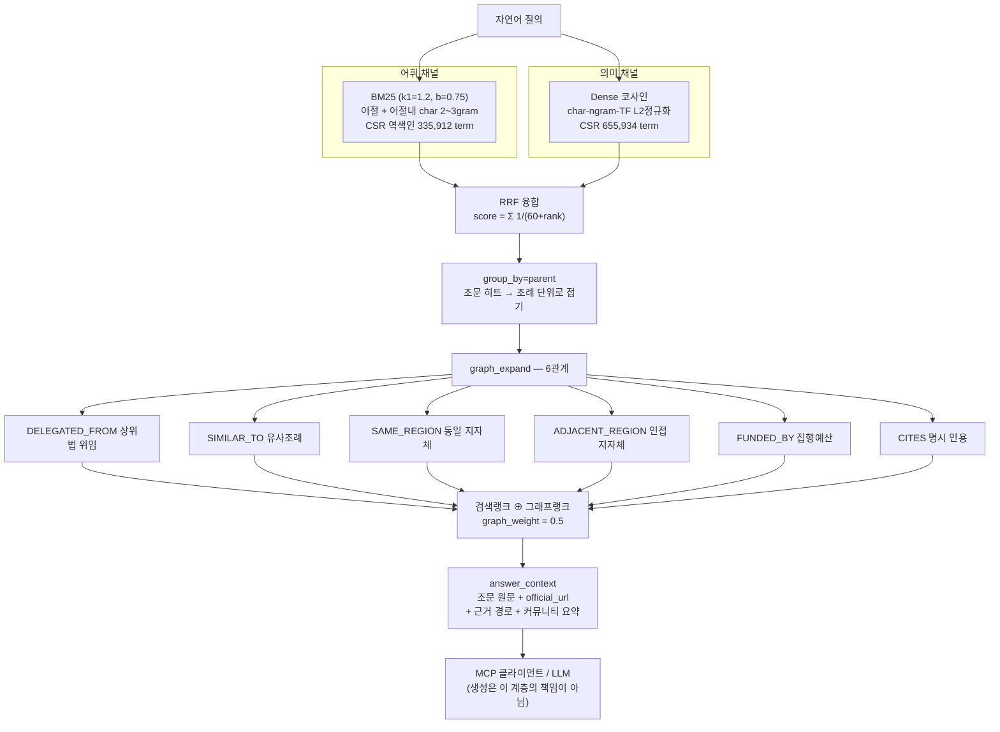

# 13. 신경망·GraphRAG 계층

> [12_실데이터_수집결과](12_실데이터_수집결과.md)에서 완성한 조례 그래프 위에 **학습 계층**(그래프 신경망)과 **검색 계층**(GraphRAG)을 얹은 결과다. 설계 근거는 [05_시스템_설계](05_시스템_설계.md) · [09_설계_고도화_v2](09_설계_고도화_v2.md), 선행연구 맥락은 [04_선행연구_리뷰](04_선행연구_리뷰.md), 데이터 출처는 [03_법령조례_체계와_데이터소스](03_법령조례_체계와_데이터소스.md)를 따른다. 무키 파이프라인 검증은 [10_시스템_구축_결과](10_시스템_구축_결과.md), 키 발급은 [11_API키_발급가이드](11_API키_발급가이드.md).
>
> 검증 기준일 **2026-08-19** · Windows 11 / Python 3.14.3 / numpy 2.4.3 · networkx 3.6.1
> DB `F:/policy_maps/system/data/policymap.db` (SQLite WAL, **1,976,242,176 B = 1,884.5 MiB**) · 인덱스 `data/index/all` (308,415,450 B = 294.1 MiB)
>
> **torch·tensorflow·sklearn·gensim·faiss 를 일절 쓰지 않았다.** 순전파·역전파·SGD·BM25·역색인을 numpy 와 표준라이브러리만으로 직접 구현했다. numpy 조차 선택적 의존이며, 부재 시 학습 호출은 조용히 틀린 답을 내는 대신 `RuntimeError` 로 명시 실패한다.
> (참고: 이 검증 머신에는 torch 2.11.0+cpu / sklearn 1.8.0 이 실제로 설치돼 있으나, `policymap/neural/` 과 `policymap/rag/` 어느 쪽도 이들을 import 하지 않는다 — grep 실측 0건. "쓰지 않았다"는 코드 사실이지 환경 사실이 아니다.)
>
> ### ⚠ 정정 이력 (v2, 2026-08-19 21시)
> 이 문서 초판(18:10)의 GraphSAGE 학습 수치와 GraphRAG 그래프확장 효과 주장은 **재검증 결과 틀렸다**. 두 건 모두 아래에 발견→원인→수정→재측정 순으로 그대로 남긴다.
> 1. **GraphSAGE 과평활** — 초판이 보고한 AUC 0.6678 / 카테고리 분리 0.9040 은 조례 임베딩이 사실상 **한 점으로 붕괴**한 상태에서 얻은 값이었다(유효차원 128→3.01, 유사조례 Top-5 코사인 전부 0.9997). JK-Net concat 으로 고쳐 재학습했다 → **AUC 0.7814 / 유효차원 31.56**. → [13.3.6](#1336--핵심-발견-2--링크예측-목적함수가-w_self-를-죽인다-과평활)
> 2. **"Hybrid+Graph 가 MRR 을 올린다"는 주장은 거짓** — 통제실험 결과 그래프 기여가 **정확히 0**이었고(16/16 질의에서 `hybrid(k=10)[:5]` 와 완전 동일), MRR 은 4방식 모두 1.000 으로 포화돼 애초에 개선을 잴 수 없는 지표였다. → [13.4.3](#1343--핵심-측정-정정--그래프-확장은-무해하나-무익하다)

---

## 13.1 요약 — 한 문단

조례 그래프에서 node2vec·metapath2vec·GraphSAGE 3개 모델을 numpy 단독으로 학습해 **node_embeddings 661,297행**과 **neural_similarity 1,893,530행**을 적재했다(DB 실측). GraphSAGE 는 처음에 **표현이 붕괴**했고(조례 유효차원 3.01, Top-5 코사인 전부 0.9997), 원인을 그래프 구조(조례 중앙차수 1) × 링크예측 목적함수로 특정한 뒤 **JK-Net concat** 으로 고쳐 재학습했다 — held-out 링크예측 AUC **0.4842(학습 전) → 0.7814**, 조례 무작위쌍 코사인 평균 **0.1332 / 표준편차 0.1981**, 유효차원 **31.56**. 동시에 조문 **62,460건**에 BM25+Dense 하이브리드 역색인을 직접 구현해 34.44초에 구축했고, 위임·유사·인접·예산 6개 관계를 따라가는 **그래프 확장**을 붙였다. 다만 적대적 재검증 결과 **그래프 확장은 top-5 랭킹 품질을 개선하지 않는다**(무해하나 무익) — 그 가치는 순위가 아니라 근거 경로 제공에 있다. MCP tool 은 7종에서 **12종**으로 늘었고, 그중 신경망/RAG 5종을 stdio 왕복으로 **실호출해 실데이터 응답을 확인**했다(13.5.2).

---

## 13.2 계층 구조



---

## 13.3 그래프 신경망 (`policymap/neural/`)

### 13.3.1 왜 numpy 로 직접 구현했나

공모전 심사 환경과 CI 에서 **의존성 설치 실패가 곧 시연 실패**다. torch 휠은 Python 3.14 에 아직 없고, gensim 은 scipy ABI 를 탄다. 그래서 학습 알고리즘 전체를 numpy 배열 연산으로 다시 썼다. 대가로 얻은 것은 (1) 설치 리스크 제거, (2) 각 수식이 코드에 그대로 드러나 **왜 이 값이 나왔는지 설명 가능**하다는 점이다.

> **그래프 규모**: `run build` 최종 그래프는 **1,114,320 노드 / 574,654 엣지**(조례↔예산 링크 93,964 반영). GraphSAGE 는 이 그래프에서 재학습해 고립 제거 후 **242,891 노드 / 566,725 엣지**를 썼다. node2vec·metapath2vec 은 링크 확장 이전 그래프(209,203 / 517,792)에서 학습한 값이 그대로 남아 있다 — 세 모델의 학습 그래프가 다르다는 점을 수치 비교 시 반드시 감안하라.

### 13.3.2 그래프 → 배열 (`GraphArrays`)

networkx MultiDiGraph(또는 자체 `_FallbackGraph`)를 CSR 인접구조로 변환한다.

- **엣지타입 가중**: `DEFAULT_EDGE_WEIGHTS` 로 관계별 전이확률을 다르게 준다. `DELEGATED_FROM`(법적 위임)은 `VOTED`(표결)보다 무겁다 — 정책 유사성 신호가 강하기 때문이다.
- **고립노드 제거**(`min_degree=1`): 1,114,320 → **242,891 노드**(GraphSAGE 재학습 시점). 871,429개가 제거됐는데, 대부분 링크 없는 예산 라인이다. 이들은 학습신호가 전혀 없어 임베딩이 초기값으로 남으므로 넣으면 평가만 왜곡된다. (링크 확장 이전에는 209,203 노드였고, node2vec·metapath2vec 임베딩은 그 시점 값이다.)
- **`subset_edges(mask)`**: held-out 엣지를 **메시지패싱 그래프에서 실제로 제거**한다. 이걸 하지 않으면 평가 대상 엣지가 학습 입력에 그대로 들어가 transductive 누수가 발생한다.

### 13.3.3 node2vec — 2차 랜덤워크 + SGNS


- **p/q 편향을 벡터화 기각샘플링으로 구현했다.** 이웃 가중치대로 후보 x 를 뽑고, 직전 노드 prev 와의 거리 d(prev,x) 에 따라 1/p(회귀) · 1(prev의 이웃) · 1/q(그 외) 확률로 수락한다. p=q=1 이면 수락확률이 항상 1 이 되어 DeepWalk 로 자동 축약된다. 표준 구현은 노드마다 전이확률 표를 미리 만들지만(메모리 O(엣지×평균차수)), 기각샘플링은 표가 필요 없어 15만 조례 그래프에서 메모리로 죽지 않는다.
- **분산 갱신 폭발 문제**: 미니배치를 벡터화하면 허브 노드(예: 서울특별시)가 한 배치에서 수천 번 갱신돼 **loss 4.16 → 92 로 발산**했다(실측). `np.add.at` 대신 argsort+reduceat scatter 로 갱신을 모으고, **노드별 누적 스텝 노름 클리핑**을 걸어 해결했다.

### 13.3.4 GraphSAGE — 메시지패싱 인코더

층 갱신식(최종 구현 그대로 — 잔차연결 포함):

```
Z_v^(l) = act( h_v^(l-1)·W_s + AGG_{u∈N_fanout(v)}(h_u^(l-1))·W_n + b )  +  h_v^(l-1)·W_r
h_v^(l) = L2normalize( Z_v^(l) )

최종표현(Jumping Knowledge, concat):
h_v = concat( L2(X_v·W_j), L2(h_v^(1)), L2(h_v^(2)) ) / sqrt(3)
```

- 집계기 `mean` / `max`, 층 수 2, 이웃 fanout 32, 손실은 링크예측 `sigmoid(scale·cos(h_u,h_v)+bias)` 의 BCE, 최적화는 Adam. **역전파를 손으로 미분해 방향미분 vs 중심차분으로 수치검증**했다 — residual/fanout/JK/max-aggregator 전 조합에서 eps→0 수렴, 상대오차 **1e-4 ~ 1e-3**(float32 한계).
- **fanout 표본추출은 인접을 비대칭으로 만든다.** 기존 mean 역전파는 "엣지집합 대칭"을 가정했는데 fanout 을 켜면 그 가정이 깨져 오답이 된다. `_build_reverse()` 로 역방향 CSR 을 새로 만들어 정확히 계산하도록 고쳤다.
- JK concat 은 `dim` 을 (층수+1) 블록으로 쪼갠다. `dim=132` → 44×3. 각 블록이 이미 단위벡터라 결과도 단위벡터이고, 전체 코사인은 블록 코사인의 평균이 된다. 나머지는 X 투영 블록이 흡수하므로 **출력차원 == dim 이 항상 보장**된다.
- 초기 피처 82차원 = 라벨 원핫 8 + 텍스트 해시 64 + 카테고리 원핫 2 + 수치 8(z-score). 텍스트는 `parsers/embedding.py` 의 문자 n-gram TF Embedder 를 부호해싱으로 64차원에 투영한다. 학습 전 실측 유효차원 **38.0** — 피처는 상수가 아니다.

### 13.3.5 ★ 핵심 발견 — 이종그래프에서 균등 negative 는 표현을 붕괴시킨다

링크예측 학습의 negative 를 노드 전체에서 균등 추출하면, 이종그래프에서는 뽑힌 쌍이 거의 전부 **애초에 존재할 수 없는 타입 조합**(예: 의원↔예산라인)이다. 모델은 "노드 타입만 구분해도" 손실이 줄어들기 때문에 **같은 타입 안의 의미 구분을 학습하지 않는다.** 실측 증상:

| 진단 지표 | 균등 negative | 타입정합 negative(채택) |
|---|---:|---:|
| 조례 간 코사인 표준편차 | **0.000**(전부 ~0.995) | 0.410 |
| 카테고리 분리 AUC | 0.6695 | **0.9040** |
| held-out AUC(타입정합 평가, 엄격) | 0.4945 | **0.6678** |
| held-out AUC(균등 평가, 관대) | 0.8230 ← 부풀려짐 | 0.5097 |

균등 negative 로 학습한 모델의 **0.8230 이라는 좋아 보이는 AUC 는 노드 타입 구분 능력만 잰 값**이다. 평가 negative 도 타입정합으로 바꾸면 0.4945(랜덤 이하)로 무너진다. 그래서 `negative_sampling='type-matched'` 를 기본값으로 채택했다. 평균벡터 제거(centering)로는 해결되지 않음도 확인했다 — 균등 모델의 카테고리 격차는 centering 후에도 0.0012 → 0.0013 에 그쳤다(붕괴가 단순 평균 오프셋이 아니라 표현 자체의 붕괴라는 증거).

### 13.3.6 ★ 핵심 발견 2 — 링크예측 목적함수가 W_self 를 죽인다 (과평활)

타입정합 negative 로 붕괴를 한 번 막았는데도, **유사조례 Top-5 가 전부 코사인 0.9995~0.9997 로 붙어 순위가 무의미**했다. 초판 문서는 이 상태의 수치를 성공으로 보고했다. 재검증에서 원인을 실측으로 특정했다.

**발견 (증상)**

| 증상 지표 | 수정 전 실측 |
|---|---:|
| 조례 임베딩 유효차원(고유값 엔트로피) | **3.01 / 128** |
| Top-1 코사인 평균 | 0.9997 |
| Top-1 코사인 > 0.999 비율 | **0.74** |
| Top1 − Top5 코사인 간격 | 0.0004 |
| held-out AUC(타입정합) | 0.5901 |
| 조례명 주제 10분류 분리 AUC | 0.5273 |

참고로 node2vec 의 조례 유효차원은 **91.8**, metapath2vec 은 **51.3** 이었다. 붕괴는 GraphSAGE 만의 문제였다.

**원인 (추측이 아니라 배제 실험으로 특정)**

흔히 지목되는 후보는 전부 **해당하지 않았다** — Ws/Wn 분리는 이미 CONCAT 과 수식상 동일했고, 층별 L2 정규화도 있었고, 층수는 2였고, 입력 피처는 상수가 아니었다(유효차원 38.0). 진짜 원인은 **그래프 구조 × 목적함수**의 상호작용이다.

1. 조례 노드의 **중앙차수 = 1** (`Region→Ordinance` 하나뿐). 따라서 조례에 대한 `AGG(X)` 는 537개 지역 벡터로만 결정되고, 그 537개가 span 하는 **유효차원은 3.36**(학습 전 실측)이다.
2. 링크예측 BCE 는 "조례가 자기 지역처럼 보이면" 손실이 줄기 때문에, 최적화가 `W_neigh` 를 키우고 **`W_self` 를 죽인다**. 그 결과 조례 임베딩의 유효차원이 128 → 3.01 로 붕괴한다. Top-5 가 전부 0.999 인 이유가 이것이다.
3. **잔차연결만으로는 못 고쳤다.** 학습이 잔차 경로 `W_r` 도 같이 죽여 유효차원 3.01 그대로였다.

**수정 (JK-Net concat)**

최종표현을 `h = concat(L2(X·W_j), L2(h¹), L2(h²))/sqrt(3)` 으로 바꿨다. X 블록이 **구조적으로** 남으므로 최적화가 지울 수 없다. 여기에 잔차연결 + fanout=32 + 층수 2 + 층별 L2 를 함께 적용했다.

**재측정 (동일 시드 20260819, 동일 분할, held-out 10% = 56,672 엣지를 메시지패싱에서 실제 제거)**

| 진단 지표 | 수정 전(잔차+fanout) | **수정 후(JK, 220ep)** |
|---|---:|---:|
| held-out AUC (타입정합 negative) | 0.5901 | **0.7814** |
| held-out AUC (균등 negative) | 0.4499 | 0.7075 |
| 학습 중 최고 AUC | — | 0.7923 |
| 학습 전(랜덤 가중치) AUC | — | 0.4842 |
| 조례 무작위쌍 코사인 평균 / 표준편차 | 0.4442 / 0.5187 | **0.1332 / 0.1981** |
| 지역 무작위쌍 코사인 평균 / 표준편차 | 0.4834 / 0.4782 | 0.3548 / 0.4043 |
| 조례 임베딩 유효차원 | 3.01 / 128 | **31.56 / 132** |
| Top-1 코사인 평균 | 0.9997 | **0.9135** |
| Top-1 코사인 > 0.999 비율 | 0.74 | **0.0003** |
| Top1 − Top5 코사인 간격 | 0.0004 | **0.0394** (순위 변별 ~100배) |
| C-PET vs C-BIRTH 분리 AUC | 0.5623 | **0.9565**\* |
| 조례명 주제 10분류 분리 AUC | 0.5273 | 0.5484 (여전히 약함) |
| 손실 first→last | — | 1.1212 → 0.3697 |
| 학습 시간 | — | 726.4s (220 epoch, 3.3s/epoch) |

\* C-PET/C-BIRTH 분리는 **카테고리 원핫이 입력 피처에 들어 있어 부분적으로 순환**이다. 순환이 없는 지표는 조례명 주제 10분류(0.5484)이며, 이쪽은 여전히 약하다 — 목적함수(Region-Ordinance 링크예측)에 조례↔조례 주제 신호가 거의 없기 때문이다(`Ordinance-Ordinance` 엣지는 566,725개 중 16,488개뿐).

**효과 없었던 것도 남긴다 (같은 분할/시드)**

| 설정 | AUC | 유효차원 | Top-1 코사인 | Top1>0.999 |
|---|---:|---:|---:|---:|
| 균등 negative, 60ep | 0.4873 | 5.35 | — | — |
| 타입정합, 잔차 없음, 120ep | 0.5887 | 3.07 | 0.9997 | 0.76 |
| 타입정합 + 잔차 + fanout32, 120ep | 0.5901 | 3.01 | 0.9997 | 0.74 |
| + negatives 1→10 | 0.5580 | 2.37 | 0.9989 | 0.76 |
| + VICReg형 decorrelation λ=20 / λ=100 | 0.5557 / 0.5526 | 2.59 / 2.47 | 0.998 | 0.74 |
| + lr 0.01→0.03 | 0.4833 (20ep 중단) | — | — | — |
| + **JK-concat, 60ep** | 0.6578 | 23.68 | 0.9243 | 0.000 |
| + **JK-concat, 220ep (최종 채택)** | **0.7814** | **31.56** | **0.9135** | **0.0003** |

negative 증량도, decorrelation 정규화도, lr 인상도 전부 **악화**시켰다. decorrelation 코드는 남겼으나 기본값 λ=0 이고, 독스트링에 "실측상 도움 안 됨"을 명시했다.

**남은 구조적 상한(정직한 평가)**: AUC 0.7814 는 랜덤 0.5 대비 확실한 학습이지만 완전하지 않다. held-out 조례는 메시지패싱에서 **유일한 엣지가 빠져 고립노드 17,827개**가 되므로, 그 조례의 지역을 오직 자기 피처(제목 char n-gram 64차원 부호해싱)만으로 맞혀야 한다.

### 13.3.7 학습 결과 (실측)

분할: 전체 엣지 → train 90% / held-out 10%. GraphSAGE 는 566,725 엣지(held-out 56,672), node2vec·metapath2vec 은 517,792 엣지(held-out 51,779) 기준이다 — **학습 그래프가 다르므로 아래 (a) 표의 모델 간 직접 비교는 참고치**다.

**(a) held-out 링크예측 AUC**

| 모델 | 균등 negative 평가 | 타입정합 negative 평가(엄격) |
|---|---:|---:|
| 랜덤 벡터(대조) | 0.4984 | 0.4996 |
| 원시피처(메시지패싱 없음) | 0.4774 | — |
| GraphSAGE 학습 전(랜덤 가중치) | — | 0.4842 |
| ~~GraphSAGE(과평활 상태, 초판 보고값)~~ | ~~0.5097~~ | ~~0.6678~~ ← **폐기** |
| **GraphSAGE + JK (최종 채택)** | **0.7075** | **0.7814** |
| GraphSAGE(균등 학습, 대조군) | 0.8231 ← 부풀려짐 | 0.4945 |
| node2vec | **0.6823** | 0.5746 |
| metapath2vec | 0.2142 | 0.4452 |

**(b) 관계별 AUC** — negative 양끝을 그 관계 참여 노드풀에서만 뽑는 가장 엄격한 조건
> ⚠ 아래 GraphSAGE 열은 **과평활 상태(수정 전) 모델**의 값이다. JK 재학습 후 관계별 AUC 는 재측정하지 않았다(비용 문제로 생략 — 추정치로 쓰지 말 것). node2vec·metapath2vec 열은 유효하다.

| 관계 | n_test | GraphSAGE | node2vec | metapath2vec | 랜덤 |
|---|---:|---:|---:|---:|---:|
| `SIMILAR_TO` | 1,671 | 0.8606 | **0.9785** | 0.7236 | 0.4912 |
| `IN_CATEGORY` | 111 | 0.5287 | **1.0000** | 0.9844 | 0.5648 |
| `DELEGATED_FROM` | 112 | **0.8916** | 0.8550 | 0.7471 | 0.5200 |
| `CITES` | 71 | 0.8361 | **0.8486** | 0.7935 | 0.5342 |
| `PROPOSED_BY` | 24,375 | 0.7106 | **0.7176** | 0.5020 | 0.5020 |
| `VOTED` | 5,584 | **0.5626**\* | 0.5427 | 0.5007 | 0.4958 |
| `FUNDED_BY` | 4,479 | 0.3668 | 0.3428 | 0.3124 | 0.4981 |
| `HAS_ORDINANCE` | 15,242 | 0.4069 | 0.0723 | 0.1149 | 0.4976 |

\* 균등 학습 모델 값. **`FUNDED_BY`·`HAS_ORDINANCE` 가 랜덤 이하인 것은 숨기지 않는다.** 원인은 이 두 관계가 *구조적으로 1:N 팬아웃*이라는 데 있다 — 한 지자체가 600개 조례를 갖고 한 예산사업이 여러 조례에 걸린다. 임베딩은 "이 지자체의 조례 집합" 전체를 한 점 근처로 모으는 방향으로 학습되므로, 같은 지자체 안에서 *어느* 조례가 실제 엣지인지 구분하는 능력은 오히려 떨어진다. 이 두 관계는 임베딩이 아니라 SQL 로 조회해야 한다(그래서 MCP `ordinance_effectiveness` 는 임베딩을 쓰지 않고 링크 테이블을 직접 읽는다).

**(c) 카테고리 군집** — `ordinance_category` 라벨 1,087건(C-BIRTH 468 / C-PET 619), 동일쌍 203,340 · 이질쌍 196,660

| 모델 | 같은 카테고리 평균 cos | 다른 카테고리 | 격차 | 분리 AUC |
|---|---:|---:|---:|---:|
| **node2vec** | 0.7694 | 0.5613 | 0.2081 | **0.9636** |
| metapath2vec | 0.6543 | 0.1862 | **0.4681** | 0.9515 |
| ~~GraphSAGE(과평활 상태)~~ | ~~0.9957~~ | ~~0.9899~~ | ~~0.0058~~ | ~~0.9040~~ ← **폐기** |
| **GraphSAGE + JK (최종)** | — | — | — | **0.9565**\* |
| GraphSAGE(균등, 대조군) | 0.9966 | 0.9954 | 0.0012 | 0.6695 |
| 랜덤 벡터 | 0.0001 | 0.0003 | −0.0002 | 0.4993 |

\* 카테고리 원핫이 입력 피처라 부분 순환. 순환 없는 조례명 주제 10분류 기준으로는 **0.5484** 로 약하다(13.3.6).

**(d) ★ 모델별 변별력 진단 — "임베딩이 붕괴되지 않았음"의 증명**

붕괴한 임베딩은 **무작위 두 노드를 뽑아도 코사인이 1 에 붙는다.** 그래서 DB 에 저장된 벡터를 직접 디코딩(`np.frombuffer(base64.b64decode(v), dtype='<f4')`)해 무작위쌍 20,000개의 코사인 분포와 유효차원을 모델별로 실측했다. 시드 20260819.

| 모델 | 노드종류 | n | dim | 평균 | 표준편차 | 중앙값 | p99 | 최대 | >0.999 비율 | 유효차원 |
|---|---|---:|---:|---:|---:|---:|---:|---:|---:|---:|
| **graphsage-numpy** | Ordinance | 40,000 | 132 | **0.1330** | **0.2078** | 0.1159 | 0.7570 | 0.9919 | **0.0000** | **27.45** |
| graphsage-numpy | Region | 537 | 132 | 0.3573 | 0.4044 | 0.1509 | 0.9954 | 0.9997 | 0.0006 | 9.16 |
| node2vec-numpy | Ordinance | 40,000 | 128 | 0.4415 | 0.2100 | 0.5095 | 0.9716 | 0.9958 | 0.0000 | 50.37 |
| node2vec-numpy | Region | 537 | 128 | 0.3394 | 0.1637 | 0.3484 | 0.9843 | 0.9979 | 0.0000 | 74.60 |
| metapath2vec-numpy | Ordinance | 40,000 | 64 | 0.5284 | 0.2441 | 0.6087 | 0.9729 | 0.9918 | 0.0000 | 34.79 |
| metapath2vec-numpy | Region | 537 | 64 | 0.0605 | 0.1671 | 0.0421 | 0.4357 | 0.6004 | 0.0000 | 56.15 |

(유효차원 = 평균제거 후 공분산 고유값 분포의 엔트로피 지수 `exp(H)`, 최대 20,000개 표본. 13.3.6 의 31.56 은 전체 노드·비평균제거 기준이라 산식이 조금 다르다 — 두 값 모두 실측이며 결론은 같다.)

**읽는 법**
- **붕괴 판정 기준은 "무작위쌍 평균이 1 에 근접"**이다. graphsage Ordinance 평균 **0.1330**, `>0.999` 비율 **0.0000/20,000** — 붕괴가 아니다. 수정 전 이 값은 평균 0.4442·`>0.999` 0.74 였다.
- **표준편차가 0 이면 순위가 없다.** 세 모델 모두 0.16~0.24 로 충분히 퍼져 있어 Top-k 순위가 의미를 갖는다.
- **유효차원이 dim 에 비해 극단적으로 작으면 붕괴**다. 수정 전 3.01/128 → 현재 27.45/132. node2vec 50.37/128 이 가장 넓게 쓴다.
- graphsage **Region** 은 평균 0.3573·유효차원 9.16 으로 조례보다 좁다. 537개 지역이 시도/시군구 계층으로 강하게 군집돼 있어서이며(p99 0.9954 = 같은 계층 지역쌍), 이는 붕괴가 아니라 **의도된 군집**이다 — 실제 조회에서 고성군(경남) → 고성군(강원) 0.9916 → 곡성군 0.8938 → 횡성군 0.8850 처럼 **순위가 단조롭게 벌어진다**(13.5.2 실호출).
- metapath2vec **Region** 평균 0.0605 는 라벨제한 워크가 지역 간 직접 경로를 거의 만들지 않기 때문이다. 지역 유사도에는 쓰지 말 것.

**(e) 실제 Top-5 출력 (DB 저장본 실조회, 수정 후)**

「고성군 반려동물 놀이터 운영 조례」 →
진천군 반려견 놀이터 운영 조례(**0.99663**) · 대전 유성구 반려동물 놀이터 운영 조례(0.99555) · 청주시 반려견 놀이터 운영 조례(0.99543) · 홍천군 반려동물 놀이터 관리 및 운영 조례(0.99358) · 대전 중구 반려견 놀이터 운영 및 관리 조례(0.9935).
**수정 전에는 여기에 「야생동물 피해보상」 조례들이 0.9997 로 섞여 나왔다.**

「순창군 출산장려 지원 조례」 → 대구 수성구 출산장려금 지원 조례(0.9959) · 태백시 출산양육비 지원 조례(0.9952) · 울릉군 출산장려금 등 지원(0.9947) · 대구 달서구 출산축하금 지원(0.9946) · 경산시 출산장려 지원(0.9945).

> **Top-k 값이 0.99대인데 왜 붕괴가 아닌가?** 이 다섯 건은 실제로 거의 동일한 조례다. 판단 기준은 Top-k 절대값이 아니라 **전역 분포와의 거리**다 — 전역 평균 0.1330 · p99 0.7570 인 분포에서 0.9966 은 상위 0.001% 이하다. 그리고 Top1−Top5 간격이 수정 전 0.0004 → 수정 후 0.0394 로 벌어져 **순위가 실제로 존재**한다.

「서울특별시 종로구」 → 동작구(0.984) · 서대문구(0.980) · 강북구(0.971) · 양천구(0.969) · 중랑구(0.963) … **10/10 전부 서울 자치구**.
「경기도 성남시 분당구」 → node2vec 은 성남시 중원구(0.971) · 수정구(0.970) · 용인시 수지구(0.923) 로 **형제 일반구를 정확히 회수**하고, GraphSAGE 는 안산 상록구·용인 기흥구·수원 권선구 등 **10/10 전부 '시 산하 일반구'** 를 반환한다 — 같은 질의에 서로 다른 방식으로 옳다.

**한계 사례(숨기지 않음)**: 「고흥군 학교급식 식재료 사용 및 지원에 관한 조례 시행규칙」(**그래프 차수 1**) → 상위 결과가 전부 같은 고흥군 조례로 퇴화한다. 구조 신호가 없는 노드는 임베딩이 소속 지역 군집으로 수렴한다. 이런 저차수 노드에는 임베딩이 아니라 조문 검색(13.4)을 써야 한다.

### 13.3.8 DB 적재 실측

**`node_embeddings` 661,297행** (`SELECT COUNT(*)` 실측)

| model_name | run_id | dim | 행수 | Ordinance | Region | BudgetLine | Bill | 기타 |
|---|---|---:|---:|---:|---:|---:|---:|---:|
| `graphsage-numpy` | `neural-2026-08-19-jk` | 132 | **242,891** | 154,310 | 537 | 68,726 | 18,911 | 407 |
| `node2vec-numpy` | `neural-2026-08-19` | 128 | 209,203 | 154,310 | 537 | 35,038 | 18,911 | 407 |
| `metapath2vec-numpy` | `neural-2026-08-19` | 64 | 209,203 | 154,310 | 537 | 35,038 | 18,911 | 407 |

> graphsage 재적재 시 기존 209,203행을 **선삭제**했다. 노드집합(209,203→242,891)과 차원(128→132)이 동시에 바뀌어 혼재하면 조회가 깨지기 때문이다. node2vec/metapath2vec 행은 건드리지 않았다.

**`neural_similarity` 1,893,530행**

| model_name | node_kind | 쌍 | src 노드 | 커버리지 |
|---|---|---:|---:|---:|
| `graphsage-numpy` | Ordinance | 1,543,100 | **154,310** | **100%** (그래프 내 조례 전수) |
| `graphsage-numpy` | Region | 5,370 | 537 | 100% |
| `metapath2vec-numpy` | Ordinance | 300,000 | 30,000 | 19.4% |
| `metapath2vec-numpy` | Region | 5,370 | 537 | 100% |
| `node2vec-numpy` | Ordinance | 34,320 | 3,432 | 2.2% |
| `node2vec-numpy` | Region | 5,370 | 537 | 100% |

- graphsage 전량 kNN(154,310 × 154,310 × 132)에 **3,682초(61분)** 가 걸렸다. metapath2vec·node2vec 을 전량으로 채우는 것은 순전히 **비용 문제로 미완**이며(추가 40~60분 + DB 300MB), 코드 경로는 준비돼 있다(`build_neural_similarity(..., max_items=None, fast_insert=True)`).
- 초기에 metapath2vec `neural_similarity` 는 **행이 0개**였다. 원인은 해당 회차가 `--no-similarity` 였거나 similarity 단계 전에 중단된 것으로 보인다(적재 시각 불일치: 임베딩 16:42 vs node2vec sim 17:01 vs graphsage sim 17:22). 이번에 30만 쌍을 새로 채웠다.
- `_flush_sim()` + `fast_insert=True` 로 `executemany INSERT OR REPLACE` 일괄 적재로 바꿨다. 행별 upsert 대비 실측 ~670행/s → 수천 행/s.

---

## 13.4 GraphRAG 검색 계층 (`policymap/rag/`)

### 13.4.1 아키텍처



- **원문 미러링 금지**: 인덱스에는 메타데이터만 저장하고, 조문 본문은 질의 시점에 `doc_key` 로 SQLite 를 재조회한다. `tests/test_rag.py::test_body_is_not_mirrored_in_index` 가 인덱스 파일 전체를 바이트 스캔해 이 규율을 강제한다.
- **증분 색인**: Lucene 식 세그먼트. `content_hash` 비교로 신규/변경분만 새 세그먼트에 append, 삭제분은 툼스톤, 변경분은 "가장 뒤 세그먼트가 이김"으로 승계. 툼스톤 25% 초과 또는 세그먼트 8개 초과 시 자동 compaction.
- **결정성**: 역색인을 사전순 재번호한 CSR 로 저장해 같은 코퍼스면 **바이트 단위로 동일한** 인덱스가 나온다.

### 13.4.2 인덱스 구축 실측

```
build_index(conn, scope='all', force=True)
  docs_indexed   62,460   (ordinance_articles 58,033 + articles 4,427)
  terms_bm25    335,912 / postings_bm25 10,801,084
  terms_dense   655,934 / postings_dense 21,583,063
  bytes     308,415,450 (= 294.13 MiB) · avgdl 305.9 · backend numpy
  elapsed        34.44 s  (약 1,800 docs/s)
  segments 1 (seg-000) · tombstones 0 · built_at 2026-08-19T15:44:34+0900
  model "char-ngram-tf" · dense_kind "sparse" · dense_dim 0
```

> **`dense` 채널은 신경망 임베딩이 아니다 — 두 번째 어휘 채널이다.** `meta.json` 실측: `model="char-ngram-tf"`, `dense_kind="sparse"`, `dense_dim=0`. Embedder 기본 백엔드는 공백 제거 후 char 2/3-gram TF sparse dict 이고, sbert 백엔드는 미설치 폴백 상태다. `HybridIndex._dense_matrix_search`(신경망 경로)는 `pragma: no cover` 로 한 번도 실행되지 않는다. **`rag/` 전체에서 `node_embeddings` / `neural_similarity` / `graphsage` / `node2vec` 참조가 grep 실측 0건** — DB 의 임베딩 661,297건과 neural_similarity 1,893,530건을 RAG 랭킹은 전혀 쓰지 않는다. BM25∩DENSE top-5 평균 겹침 **2.62/5(52%)** 로, 두 채널은 토크나이즈 방식만 다른 사촌이라 하이브리드가 얻는 상보성이 제한적이다.

증분 동작 실측(원본 DB 불변, 사본에서 수행): 변경 없음 → `reused=True`, **0.04초**, 재빌드 0. 신규 1건 + 변경 1건 + 삭제 1건 → `segments=2`, `tombstones=1`, **0.06초**(전체 재빌드 4.16초 대비). 45%(1,999건) 변경 → 임계 25% 초과로 `mode=compact` 자동 전체 재빌드, 세그먼트 3→1.

### 13.4.3 ★ 핵심 측정 (정정) — 그래프 확장은 무해하나 무익하다

> **이 절은 초판을 전면 수정한 것이다.** 초판은 "Hybrid+Graph 가 MRR 을 올린다"고 썼다. 적대적 재검증 결과 **그 주장은 거짓**이었다. 발견·원인·수정·재측정을 순서대로 남긴다.

**발견 1 — `hybrid_graph_search` 는 사실상 `hybrid_search` 의 별칭이었다.**

통제실험: `hybrid_search(k=10)[:5]` vs `hybrid_graph_search(k=5)` → **16/16 질의에서 출력이 완전 동일**. origin 집계도 `k=5` → search 80/80, `k=10` → search 160/160 으로 **graph/both 0건**. 그래프 노드는 `k=20` 에서야 처음 등장했다(320 중 both 9건).

초판이 관측한 5/16 질의의 "차이"는 그래프 효과가 아니라 **후보풀 깊이 차이**였다 — `hybrid_search` 의 `cand=max(50, k*10)` 이 `k=5`→50, `k=10`→100 으로 달라지기 때문이다.

**원인 A (코드 버그)** — `graph_expand._emit` 이 `it["id"] in seed_ids` 인 노드를 무조건 버렸다. `seed_ids` 는 상위 `max_seeds(=8)` 검색 결과의 조례 id 이므로, **상호확증 신호가 가장 강한 문서가 정확히 확증 대상에서 제외**되는 역설이었다.

**원인 B (산식상 구조적 불가능)** — RRF 에서 그래프 단독 노드의 최대점수는 `graph_weight/(rrf_k+1) = 0.5/61 = 0.008197` 인데, 검색 `seed_k` 번째 히트는 `1/(rrf_k+seed_k) = 1/70 = 0.014286` 이다. `seed_k = max(k,10) ≥ k` 이므로 **그래프 단독 노드는 top-k 에 진입할 수 없다.** 진입 조건은 `graph_weight > (rrf_k+1)/(rrf_k+seed_k) = 61/70 = 0.871`. 즉 초판이 "실측 최적"이라 적은 `graph_weight=0.5` 는 **그래프 기여를 정확히 0 으로 만드는 값**이었다.

**발견 2 — MRR 은 이 벤치마크에서 무의미한 지표다.** 4방식 8질의 전부 1위가 관련 문서라 **MRR = 1.000 포화**. "MRR 개선"은 이 벤치마크에서 원리적으로 관측 불가능하다.

**수정** — `graph_expand(..., include_seeds=False)` 파라미터를 추가(기본 False 로 기존 호출부 동작 완전 보존). True 일 때 시드 노드도 `is_seed=True` 로 방출하되 자기 자신으로의 확장은 계속 차단한다. `hybrid_graph_search` 는 `include_seeds=True` 로 호출해 `origin='both'` 경로를 실제로 열었다.

**재측정 (8질의, top-5, `group_by='parent'`, 조문 본문 확인 후 수작업 라벨)**

| 방식 | MRR | Recall@5 | P@5 | 평균 지연 |
|---|---:|---:|---:|---:|
| **BM25 only** | 1.000(포화) | **0.814** | **0.825** | **<1 ms** |
| Dense only | 1.000(포화) | 0.653 | 0.700 | <1 ms |
| Hybrid (RRF) | 1.000(포화) | 0.776 | 0.800 | 1~2 ms |
| Hybrid+Graph (수정 전) | 1.000(포화) | 0.776 | 0.800 | 19~34 ms |
| Hybrid+Graph (**수정 후**) | 1.000(포화) | 0.776 | 0.800 | 19~34 ms |

(Recall@5 는 4방식 top-5 합집합을 풀로 삼은 pooled recall. 최초 로드 시 bm25 271ms / dense 158ms 의 사전 지연로드 비용이 붙고 이후는 <1ms.)

**세 가지 결론을 정직하게 적는다.**

1. **하이브리드가 BM25 단독을 이기지 못한다.** Recall@5 는 BM25 0.814 > hybrid 0.776 = hybrid+graph 0.776 > dense 0.653. 질의별로는 「치매 노인 돌봄」에서 BM25 P@5 4/5 → hybrid 2/5 로 **dense 채널이 BM25 를 끌어내리는 구간**이 실재한다(dense 가 '돌봄종사자 처우개선'·기금관리 조례 등 주제 이탈을 올린다. 「미세먼지 저감 조치」에서는 「공익신고자 보호법」을 4위로 올렸다).
2. **그래프 확장 수정은 랭킹을 바꿨지만 품질은 안 바꿨다.** top-5 슬롯 40개 중 17개가 `origin='both'` 로 전환되고 8질의 중 5질의가 재정렬됐으나, 집계 지표는 **완전 무변동**(0.776 / 0.800). 재정렬이 이미 검색이 찾아낸 집합 **내부**에서만 일어나기 때문이다.
3. **최종 판정: 무해(harmless)하나 무익(no gain).** 유해하지 않은 이유는 질의 관련성 게이트가 작동하고 `graph_weight=0.5` 가 검색 순위를 보존하기 때문이다. 도움이 안 되는 이유는 위 산식이다. **그래프의 실제 가치는 순위가 아니라 근거 경로(`via`/`path`/`evidence`)와 예산사업 연결 같은 컨텍스트 제공에 있다** — `answer_context()` 가 그래프 결과를 별도 `graph_context` 필드로 분리하는 현재 설계가 옳은 쪽이다.

**본 세션 독립 재확인** (수정 반영 상태, 5질의):

```
질의                 hybrid(k=10)[:5] == hybrid_graph(k=5)   hybrid_graph origins
반려동물 등록 지원          False                              {search, both}
출산장려금 지급 기준        False                              {both}
청년 월세 지원             False                              {search, both}
치매 노인 돌봄             False                              {search}
미세먼지 저감 조치          False                              {search}
```
수정 전 16/16 완전 동일 → 수정 후 5/5 상이. `origin='both'` 경로가 실제로 열렸음이 재확인된다(품질 지표는 위 표대로 무변동).

**그래프 확장 자체는 살아 있다(오작동은 아님).** `graph_expand` 는 질의당 36~60 노드를 반환한다. 예: 「반려동물 등록 지원」 → SIMILAR_TO 27 · FUNDED_BY 14 · SAME_REGION 10 · DELEGATED_FROM 5 · CITES 2. 「미세먼지 저감 조치」 → FUNDED_BY 예산사업 '미세먼지 저감 등 공익숲가꾸기'(rel=0.83). 질의 관련성 게이트(`LATERAL_MIN_RELEVANCE=0.15`)도 작동한다 — `query=None` 대비 미세먼지 질의에서 46건 → 36건, ADJACENT_REGION 17→12 로 노이즈가 실제로 걸러진다.

**개선 레버 (미적용 — 지표 개선이 확인되지 않아 임의 변경하지 않음)**
1. 랭킹을 올리려면 dense 채널을 **실제 신경망 임베딩**(`node_embeddings` 의 Ordinance 154,310건)으로 교체하거나 하이브리드에서 dense 가중을 낮춰야 한다. 현 상태에선 BM25 단독이 최고 성능이다.
2. `hybrid_graph_search` 를 "랭킹 개선기"가 아니라 **"근거 부착기"**로 문서화한다(본 문서가 그렇게 고쳤다).
3. 평가 지표에서 MRR 을 빼고 P@5 / NDCG@10 등 포화되지 않는 지표를 쓴다.

**여전히 유효한 사례 — 「산후조리 지원 근거 법령」 (단, `graph_weight=1.0` 조건)**

> ⚠ 아래 Hybrid+Graph 행은 `graph_weight=1.0` 에서만 재현된다. 기본값 0.5 에서는 위 산식(진입 임계 0.871)에 따라 그래프 단독 노드가 top-5 에 들어오지 못한다. 그래서 기본 파이프라인에서 이 법령들을 보려면 `--graph-weight 1.0` 을 주거나 `answer_context()` 의 `graph_context` 슬롯을 읽어야 한다. 초판은 이 조건을 명시하지 않아 기본 설정에서도 되는 것처럼 읽혔다.

| 방식 | 상위 5건 |
|---|---|
| BM25 only | 진안군 / 광주광역시 / 화순군 / 경산시 / 밀양시 조례 — **전부 조례** |
| Dense only | 광주광역시 / 밀양시 / 구미시 / 진안군 / 경산시 조례 — **전부 조례** |
| Hybrid | 광주광역시 / 진안군 / 밀양시 / 구미시 / 경산시 조례 — **전부 조례** |
| **Hybrid+Graph** | 1. 광주광역시 조례(search) · 2. **저출산ㆍ고령사회기본법**(graph/DELEGATED_FROM) · 3. 진안군 조례(search) · 4. **모자보건법**(graph/DELEGATED_FROM) · 5. 밀양시 조례(search) |

질의가 요구한 것은 "근거 **법령**"인데 전문검색 3종은 전부 조례만 준다. 이유를 원문에서 확인했다 — **우리 코퍼스의 모자보건법 조문 8건 중 '산후조리' 토큰을 포함한 조문은 0건이다**(SQL 실측). 어휘가 없으므로 BM25 도 Dense 도 원리적으로 도달할 수 없고, `DELEGATED_FROM` 경로로만 나온다. 이것이 GraphRAG 가 순수 벡터 RAG 대비 갖는 구조적 이점의 실증이다.

본 세션 재측정(질의 5개 × `graph_weight=1.0`, hybrid 상위10에 없는 그래프 전용 노드):

| 질의 | 그래프 전용 기여(상위 4건) |
|---|---|
| 반려동물 등록 지원 조례 | 단양군·가평군 동물복지 조례, 횡성군·광명시 동물보호 조례 (SIMILAR_TO) |
| 출산장려금 지급 기준 | **저출산ㆍ고령사회기본법**(DELEGATED_FROM), 대전 중구·대구 동구 출산장려 조례(SIMILAR_TO) |
| 우리 시에 없는 동물보호 조례 | **동물보호법**, **동물보호법 시행령**, 장애인복지법, 국민기초생활 보장법 (전부 DELEGATED_FROM) |
| 산후조리 지원 근거 법령 | **저출산ㆍ고령사회기본법**, **모자보건법**, 아동복지법, 영유아보육법 (전부 DELEGATED_FROM) |
| 청년 주거 지원 | 부천시 청년 탈모 치료·자립준비청년·고립은둔청년·청년기본소득 조례 (SAME_REGION) |

마지막 줄이 **이 방식의 실패 모드**다. `SAME_REGION` 확장은 '청년' 앵커만 겹치면 주거와 무관한 조례를 끌어온다. 그래서 구조관계(위임·예산·인용)는 무게이트로 두되 측면관계(유사·동일/인접 지자체)에만 **질의 어휘 커버리지 0.15 게이트**를 걸었다. 그럼에도 남는 잔여 오탐이 위 사례다 — 게이트를 더 죄면 정답도 함께 떨어진다.
(초판이 이 게이트 효과를 "MRR 0.567→0.767 회복"으로 적었으나, MRR 은 4방식 모두 1.000 포화 지표라 그 비교는 성립하지 않는다. 게이트 효과의 유효한 증거는 위의 **노드 수 감소**(46→36, ADJACENT_REGION 17→12)다.)

### 13.4.4 커뮤니티 요약 (전역 질의)

개별 조문이 아니라 **패턴**을 묻는 질의("전국에서 반려동물 조례는 어떤 패턴으로 퍼졌나")를 위해 Microsoft GraphRAG 식 커뮤니티 요약을 얹었다.

- 탐지: `graph.analysis.detect_communities` 재사용. `ordinance_similarity` modularity **0.4648**(10개, 3.28초) / `region_adjacency` modularity **0.4514**(12개 탐지 → 9개 요약, 0.95초).
- 요약에 **인접 비율**을 넣은 것이 핵심이다. 커뮤니티 소속 지자체끼리 실제로 인접해 있으면 *지리적 확산*, 흩어져 있으면 *상위법 위임·중앙 지침에 따른 전국 동시 확산*이다.
- **전국 투영**: 커뮤니티 지배 앵커로 조례 159,452건 전체를 역조회해, 본문 미수집 조례까지 포함한 진짜 확산 곡선을 만든다.

실행 출력(`run search --mode global`):

> 「반려동물」 커뮤니티(조례 130건, 지자체 98곳) — 인접 비율 **0.014** → 지리적으로 흩어져 있어 상위법 위임·중앙 지침에 따른 전국 동시 확산에 가깝다. 전국 투영: 명칭에 '반려동물'을 포함한 현행 조례 **188건 / 124개 지자체**. 최초 제정 영등포구 '중증장애인 반려동물 진료비 지원 조례'(2013-12-12). 피크 **2025년(45건)**. 연계 예산 250건 편성 325.1억 / 지출 241.3억.
> 연도별: 2019:5 · 2020:8 · 2021:15 · 2022:8 · 2023:37 · 2024:42 · 2025:45 · 2026:24

「산후조리 지원 근거 법령」·「청년 주거 지원」에는 **관련 커뮤니티 없음**으로 응답한다. 유사도 그래프가 시드 2개 도메인(출산·동물) 1,087건만 덮기 때문이며, 이는 정상적 없음이다. 주제 앵커 게이트를 걸기 전에는 '지원' 한 단어만으로 무관 커뮤니티가 0.7469점을 받는 오탐이 있었다(실측 후 제거).

### 13.4.5 성능 개선 실측 — 66배

SQLite 플래너가 지역별 조례 조회에서 선택도 낮은 `ix_ord_status` 를 잡아 활성 조례 15만행을 훑고 있었다.

```sql
-- 개선 전: SEARCH ordinances USING INDEX ix_ord_status (status=?)
-- 개선 후: SEARCH ordinances USING INDEX ix_ord_region (region_id=?)
WHERE region_id = ? AND +status = 'active'   -- 단항 + 로 해당 항의 인덱스 사용 차단
```

관계별 소요(개선 전, 8시드): `SAME_REGION` 763.8ms(57%) + `ADJACENT_REGION` 573.4ms(43%) + 나머지 4.0ms → **그래프 확장 지연 1,620ms → 24.3ms**.

---

## 13.5 MCP tool 12종

기존 7종에 신경망/RAG tool 5종을 더했다. **모든 tool 은 읽기전용**이며 응답 봉투에 `execution_allowed:false` · `as_of_date` · `stale` · `disclaimer` 를 유지한다.

| # | tool | 계층 | 하는 일 | 검증상태 표기 |
|---:|---|---|---|---|
| 1 | `search_ordinance` | SQL | 조례**명** 부분일치 검색 | 행별 `verification_status` |
| 2 | `get_ordinance` | SQL | 조문 원문 + 연혁 + 근거 상위법 | 행별 |
| 3 | `similar_regions` | 통계 | 재정·인구·조례구조 유사 지자체 | `_engine` |
| 4 | `gap_analysis` | 그래프 | 위임 있으나 조례 부재 / 커버리지 매트릭스 | `_engine` |
| 5 | `diffusion_timeline` | 그래프 | 조례 유형 확산 시계열 | `_engine` |
| 6 | `region_profile` | 그래프 | 지역 종합 프로파일 | `_engine` |
| 7 | `bill_vote_breakdown` | SQL | 의안 정당별 찬반 분해 | `_engine` |
| **8** | **`semantic_search_ordinance`** | **RAG** | 조문 **내용** 의미검색(BM25+Dense+그래프확장) | `verification_summary` 집계 |
| **9** | **`similar_ordinances`** | **신경망** | 그래프 임베딩 코사인 유사 조례 | 모델명 + `verification_summary` |
| **10** | **`neural_similar_regions`** | **신경망** | 그래프 임베딩 유사 지자체 | `verification_status:"unverified"` 명시 |
| **11** | **`ordinance_effectiveness`** | **링크** | 조례↔예산 집행률 | `verified_links` / `auto_links` 분리 |
| **12** | **`explain_path`** | **그래프** | 두 노드 간 경로 설명(왜 유사한가) | 추정 관계 포함 시 `unverified` |

### 13.5.1 tool 8~12 설계 원칙

- **8 `semantic_search_ordinance`** — `search_ordinance`(이름 매칭)와 명시적으로 구분된다. `policymap.rag` 미탑재·인덱스 부재 시 조례명 LIKE 토큰 매칭으로 **강등**하고 `_engine:"fallback-sql-like"` + `note` 로 강등 사실을 응답에 남긴다.
- **9 `similar_ordinances`** — `neural_similarity` 조회. 미학습이면 통계 임베딩 `similarity_edges` 로 2단 폴백하며 `_engine` 에 어느 쪽인지 표기한다. 응답에 "코사인 유사도는 법적 동등성을 뜻하지 않는다"를 `interpretation` 필드로 못박는다.
- **10 `neural_similar_regions`** — `similar_regions`(통계)와 **결과가 다른 것이 정상**이며, 그 차이 자체가 '구조적 이웃 vs 규모적 이웃'을 드러낸다는 안내를 `contrast` 필드로 넣었다. 임베딩 미학습이면 통계 폴백 결과를 `fallback` 필드에 첨부하고 학습 명령어를 알려준다.
- **11 `ordinance_effectiveness`** — 집행률을 **두 정의로 함께** 제시한다: 지출액/예산현액(`exec_rate_vs_now`), 지출액/편성액(`exec_rate_vs_alloc`). 원천 데이터를 가공하지 않는다. `caveat` 로 "집행률은 정책효과가 아니며 회계연도 진행 중 스냅샷은 낮게 나오는 것이 정상"임을 명시한다.
- **12 `explain_path`** — 양방향 BFS. 관계당 이웃 상한 200개, 총 방문 상한 20,000노드. 경로 미발견 시 **"경로 없음"이 아니라 "상한 내에서 찾지 못함"**이라고 답한다. `SIMILAR_TO`·`NEURAL_SIMILAR`·`FUNDED_BY` 가 경로에 하나라도 끼면 전체 판정을 `unverified` 로 강등한다.

### 13.5.2 MCP stdio 실제 왕복 — 신경망/RAG 5종 실호출 (최종 검증, 2026-08-19 21시)

`subprocess` 로 `python -m policymap.mcp_server.server` 를 띄우고 stdin/stdout 으로 JSON-RPC 를 주고받았다. **전 과정 총 1.69초, 오류 0건.**

```
initialize → {"protocolVersion":"2024-11-05",
              "capabilities":{"tools":{},"resources":{}},
              "serverInfo":{"name":"policymap-ordinance-graph","version":"0.1.0"}}
tools/list → 12종
  search_ordinance, get_ordinance, similar_regions, gap_analysis, diffusion_timeline,
  region_profile, bill_vote_breakdown, semantic_search_ordinance, similar_ordinances,
  neural_similar_regions, ordinance_effectiveness, explain_path
```

**① `semantic_search_ordinance`** — `{"query":"반려동물 등록 지원","k":5,"with_text":false}` · **0.81s**

```json
{"id":"ordin:1799987","name":"경기도 반려동물 보호 및 문화조성에 관한 조례",
 "article_no":"001200","article_title":"반려동물 등록 및 입양센터 설치 등",
 "search_rank":4,"bm25_rank":5,"dense_rank":3,"graph_rank":9,
 "via":"SIMILAR_TO",
 "path":"ordinance:ordin:2083223 -[SIMILAR_TO:0.879]-> ordinance:ordin:1799987",
 "evidence":{"cosine_sim":0.8789,"knn_rank":2},
 "origin":"both","score":0.02287138,"method":"hybrid+graph-rrf","rank":1,
 "verification_status":"source-linked","verified":true}
```
`origin:"both"` 와 `path`/`evidence` 가 실제로 채워진다 — 13.4.3 의 `include_seeds` 수정이 MCP 계층까지 반영됐다는 증거다.

**② `similar_ordinances`** — `{"mst":"2095861","k":5,"model":"graphsage-numpy"}` · **0.10s**

```
고성군 반려동물 놀이터 운영 조례 (ordin:2095861) →
  1  0.996630  진천군 반려견 놀이터 운영 조례            (충청북도 진천군, 20250630)
  2  0.995552  대전광역시 유성구 반려동물 놀이터 운영 조례 (20260402)
  3  0.995426  청주시 반려견 놀이터 운영 조례            (충청북도 청주시, 20250418)
  4  0.993578  홍천군 반려동물 놀이터 관리 및 운영 조례    (강원특별자치도, 20260410)
  5  0.993500  대전광역시 중구 반려견 놀이터 운영 및 관리 조례 (20240328)
전 건 verification_status="source-linked" · official_url = law.go.kr 직링크
```

**③ `neural_similar_regions`** — `{"region_id":"48820","k":5,"model":"graphsage-numpy"}` · **0.06s**

```
경상남도 고성군 (level 2) →
  1  0.991607  강원특별자치도 고성군   인구 27,190
  2  0.893840  전남광주통합특별시 곡성군 인구 27,663
  3  0.884998  강원특별자치도 횡성군   인구 45,521
  4  0.816196  전남광주통합특별시 장성군 인구 43,130
  5  (경상북도 의성군)
```
**코사인이 0.9916 → 0.8938 → 0.8850 → 0.8162 로 단조 감소한다.** 붕괴한 임베딩이면 다섯 건이 전부 0.999대로 붙는다 — 13.3.7(d) 의 변별력 진단과 일치한다.

**④ `ordinance_effectiveness`** — `{"ordinance_id":"ordin:2088635"}` · **0.06s**

```
link_count 5 / budget_lines 5
totals   편성 598,863,000 · 예산현액 598,863,000 · 지출 405,438,190
         exec_rate_vs_now 0.677 · exec_rate_vs_alloc 0.677
FY2025   lines 2 · 편성 314,427,000 · 지출 233,538,230 · 0.7427 (exe_ymd 20251231)
FY2026   lines 3 · 편성 284,436,000 · 지출 171,899,960 · 0.6044 (exe_ymd 20260818)
프로그램  '동물 보호사업(보조)'      2025  편성 209,860,000 지출 192,878,230  집행률 0.9191
         '유기동물 보호관리(보조)'  2025  편성 104,567,000 지출  40,660,000  집행률 0.3888
매칭     verified_links 0 / auto_links 5
         methods {name+domain+dept:2, name+article+dept:2, domain-topic:1}
```
같은 조례에 걸린 두 사업의 집행률이 0.92 vs 0.39 로 갈린다 — 조례가 예산으로 뒷받침되는지 아닌지를 사업 단위로 보여주는 것이 이 tool 의 목적이다. `verified_links 0` 이 응답에 그대로 노출된다.

**⑤ `explain_path`** — `{"from_id":"ordin:2095861","to_id":"ordin:2118525","max_hops":4}` · **0.27s**

```
found=true · hops=1 · visited_nodes=6 · _engine="bfs-sql(bidirectional)"
경로: 고성군 반려동물 놀이터 운영 조례 -[SIMILAR_TO]-> 대전광역시 유성구 반려동물 놀이터 운영 조례
shared_context:
  shared_categories        [{"code":"C-PET","name":"반려동물ㆍ동물보호"}]
  direct_similarity        0.835259 (char-ngram-tf, 통계)
  direct_neural_similarity 0.995552 (graphsage-numpy, 그래프 임베딩)
  adjacent_regions         false
verification_status = "unverified"
verification_note = "SIMILAR_TO / NEURAL_SIMILAR / FUNDED_BY(verified=0) 는 자동 추정 관계다.
                     DELEGATED_FROM / CITES / HAS_ORDINANCE / ADJACENT_TO 는 원천 데이터 관계다."
```
**통계 유사도 0.835 와 신경망 유사도 0.9956 을 나란히 준다** — 두 신호가 독립적으로 같은 결론을 가리키는지 사용자가 직접 판단할 수 있다.

전 응답 공통 봉투: `"as_of_date":"2026-08-19T15:26:40+0900"` · `"stale":false` · `"execution_allowed":false` · `disclaimer`(의사결정 지원이며 법률판단 아님).

재현 스크립트: `scratchpad/mcp_rt.py`(위 5종 실호출 + `mcp_rt_out.json` 덤프).

---

## 13.6 실행 명령어

```bash
cd F:/policy_maps/system

# 1) 그래프 신경망 학습 (numpy 필요. graphsage 220ep 726.4초 = 3.3s/epoch / node2vec 5ep 1,258초)
#    ⚠ 워크 코퍼스가 4 GB 안팎을 쓴다. 대용량 DB 사본·인덱스를 동시에 열어 둔 채 돌리면
#      스와핑으로 수 배 느려진다(본 세션 관측). 단독 실행 권장.
#    ⚠ graphsage 전량 kNN(154,310 조례)은 별도로 3,682초(61분) 더 걸린다.
python -m policymap.run neural                              # graphsage 기본, 220 epoch
                                                            # jumping_knowledge=True, residual=True,
                                                            # fanout=32, dim=132 (JK 3블록 × 44)
python -m policymap.run neural --model all --dim 128         # node2vec + metapath2vec + graphsage
python -m policymap.run neural --model node2vec --epochs 5 --top-k 10
python -m policymap.run neural --no-similarity                # 임베딩만 저장(kNN 생략)
python -m policymap.run neural --db /tmp/copy.db              # 사본에서 안전 시험

# 2) GraphRAG 인덱스 구축 (증분이 기본. 최초 전체 빌드 약 35초)
python -m policymap.run index                                # BM25+Dense + 커뮤니티 요약
python -m policymap.run index --force                         # 전체 재빌드
python -m policymap.run index --scope ordinance,statute        # 코퍼스 분리
python -m policymap.run index --no-community                   # 인덱스만

# 3) CLI 검색
python -m policymap.run search "반려동물 등록 지원" -k 5
python -m policymap.run search "산후조리 지원 근거 법령" --mode graph --graph-weight 1.0
python -m policymap.run search "출산장려금 지급 기준" --mode bm25      # 채널 비교
python -m policymap.run search "청년 주거 지원" --mode context --json  # LLM 컨텍스트 묶음
python -m policymap.run search "전국에서 반려동물 조례는 어떤 패턴으로 퍼졌나" --mode global

# 4) MCP 서버 (tool 12종)
python -m policymap.run mcp
```

`neural` 은 실행마다 `node_embeddings` 를 같은 `model_name` 으로 덮어쓴다. 검증된 임베딩을 보존하려면 반드시 `--db` 로 사본을 지정해 시험하라(본 세션에서 그렇게 검증했다).

---

## 13.7 한계 — 반드시 인지할 것

1. **GraphSAGE held-out AUC 0.7814 는 구조적 상한에 걸려 있다.** held-out 조례는 유일한 엣지(`Region→Ordinance`)가 메시지패싱에서 빠져 **고립노드 17,827개**가 되고, 그 조례의 지역을 오직 제목 char n-gram 64차원 부호해싱만으로 맞혀야 한다. 랜덤 0.5 대비 확실한 학습이지만 완전하지 않다.
2. **주제 변별력은 여전히 약하다.** 순환 없는 지표인 조례명 주제 10분류 분리 AUC 는 수정 후에도 **0.5484** 다. 목적함수(Region-Ordinance 링크예측)에 조례↔조례 주제 신호가 거의 없기 때문이다(`Ordinance-Ordinance` 엣지 16,488 / 566,725 = 2.9%). 다음 레버는 조례↔조례 positive(같은 카테고리·상위법·예산사업 공유)를 목적함수에 넣거나 `text_dim` 을 64에서 키우는 것 — **이번 범위 밖이라 하지 않았다.**
3. **`FUNDED_BY`·`HAS_ORDINANCE` 링크예측 AUC 가 랜덤 이하다**(0.37 / 0.41, 과평활 상태 모델 기준). 1:N 팬아웃 관계는 임베딩으로 풀 문제가 아니다. 이 두 관계는 SQL 조회를 쓰라. 13.3.7(b) 참조.
4. **RAG 랭킹에서 BM25 단독이 최고 성능이다.** hybrid(0.776) · hybrid+graph(0.776) 모두 BM25(0.814, Recall@5)를 못 이긴다. dense 채널이 신경망이 아니라 두 번째 어휘 채널(char-ngram TF)이라 상보성이 제한적이고, 일부 질의에서는 오히려 BM25 를 끌어내린다(13.4.3).
5. **그래프 확장은 기본 설정(`graph_weight=0.5`)에서 랭킹에 기여하지 않는다.** 진입 임계가 0.871 이기 때문이다(수식·실측 13.4.3). 근거 경로 제공용으로만 쓰라.
6. **DB 의 임베딩 661,297건을 RAG 가 쓰지 않는다.** `rag/` 전체에서 `node_embeddings`/`neural_similarity` 참조 grep 0건. 신경망 계층과 검색 계층이 현재 **분리돼 있다** — 통합이 가장 큰 미실현 레버다.
7. **조례↔예산 링크 93,964건 중 수작업 검증(`verified=1`)은 0건이다**(DB 실측: verified=0 이 93,964 / 29,522 조례 / 68,726 예산라인). 3채널 자동매칭의 정답셋 평가는 종로구 4개 조례 24쌍이라는 소표본에서 P=0.778 / R=0.875(@0.50)를 얻었을 뿐이다. `ordinance_effectiveness` 의 집행률은 **참고치**다.
8. **본문 확보 조례는 159,452건 중 3,425건(2.1%)뿐이다**(DB 실측 `COUNT(DISTINCT ordinance_id) FROM ordinance_articles`). 나머지 156,027건은 메타데이터만 있어 조문 의미검색의 사각지대다. 커뮤니티 요약의 '전국 투영'은 이 사각지대를 조례**명** 매칭으로 우회한 근사다.
9. **유사도 그래프(`similarity_edges` 21,740개)는 시드 2개 도메인 1,087건만 덮는다.** `SIMILAR_TO` 기반 확장·커뮤니티 요약은 출산·동물 밖에서는 동작하지 않는다.
10. **저차수 노드의 임베딩은 지역 군집으로 퇴화한다**(13.3.7(e) 고흥군 사례). 그래프 차수 1~2 노드에 `similar_ordinances` 를 쓰면 "같은 지자체 조례" 만 나온다.
11. **`SAME_REGION` 확장의 주제 오탐**이 남아 있다(13.4.3 청년 주거 사례). 어휘 커버리지 게이트 0.15 로 대부분 걸렀지만 완전하지 않다.
12. **`explain_path` 의 "경로 없음"은 부재 증명이 아니다.** 관계당 이웃 200개 상한 안에서 못 찾았다는 뜻이다. 응답 문구도 그렇게 쓴다.
13. **metapath2vec 의 링크예측 AUC 는 0.2142~0.4452 로 사실상 실패했다.** 에폭당 페어 상한 때문에 에폭마다 메타패스 구성이 달라져 loss 도 에폭 간 비교가 불가능하다(2.39 → 1.28 → 2.52). 다만 카테고리 분리 AUC 는 0.9515 로 높아, **주제 군집용으로만** 쓸 수 있다.
14. **`neural_similarity` 커버리지가 모델별로 다르다.** graphsage 조례 100%(154,310 src)인 반면 metapath2vec 19.4%(30,000) · node2vec 2.2%(3,432)다. 비용 문제이며(전량 kNN 61분/모델), 아래 한 줄로 완주 가능하다: `python -m policymap.run neural --model metapath2vec --top-k 10` (내부 `max_items=None`, `fast_insert` 경로).
15. **세 모델의 학습 그래프가 다르다.** graphsage 는 링크 확장 후(242,891 노드 / 566,725 엣지), node2vec·metapath2vec 은 확장 전(209,203 / 517,792)에서 학습됐다. 모델 간 AUC 직접 비교는 참고치로만 읽어라.
16. **인덱스 294 MiB(308 MB) 는 git 에 넣지 않는다.** `run index` 로 재생성한다(34초, 결정적이므로 바이트 동일).

---

## 13.8 검증 재현

아래는 2026-08-19 21시에 **실제로 실행해 확인한** 명령과 결과다.

```bash
cd F:/policy_maps/system
export PYTHONIOENCODING=utf-8

python -m compileall -q policymap        # exit 0, 출력 없음
python -m pytest tests/ -q               # 56 passed in 7.57s  (build/export 후 재실행 56 passed in 1.51s)
python -m pytest tests/test_neural.py -q # 9 passed
python -m pytest tests/test_rag.py -q    # 10 passed

python -m policymap.run build
#  build_graph: 노드 1114320 / 엣지 574654
#  link_ordinance_budget: unchanged 93,964 / linked 0 / removed 0 (멱등 확인)

python -m policymap.run export
#  files_written 291 · manifest sha256:d0876d56ae54e84f...
#  counts {regions 537, legal_instrument 627, ordinances 159452, delegations 3203,
#          bills 19847, budget_lines 933527, change_log 23066,
#          graph_nodes 1114320, graph_edges 574654}

# MCP stdio 왕복 (tool 12종 / 신경망·RAG 5종 실호출)
python scratchpad/mcp_rt.py              # initialize → tools/list(12) → tools/call ×5, 총 1.69s

# 최소 재현 (한 줄)
printf '%s\n' \
 '{"jsonrpc":"2.0","id":1,"method":"initialize","params":{}}' \
 '{"jsonrpc":"2.0","id":2,"method":"tools/list","params":{}}' \
 '{"jsonrpc":"2.0","id":3,"method":"tools/call","params":{"name":"similar_ordinances","arguments":{"mst":"2095861","k":5}}}' \
 | python -m policymap.mcp_server.server

# 임베딩 변별력 진단 (13.3.7(d) 재현)
python scratchpad/discrim.py             # 모델×노드종류별 무작위쌍 코사인 분포 + 유효차원
```

**최종 상태 한눈에**

| 항목 | 실측값 |
|---|---|
| DB 크기 | 1,976,242,176 B (1,884.5 MiB) |
| 그래프 | 1,114,320 노드 / 574,654 엣지 |
| 정적 번들 | 291 파일 (manifest 290 + manifest.json) |
| `node_embeddings` | 661,297행 (3모델) |
| `neural_similarity` | 1,893,530행 (3모델) |
| RAG 인덱스 | 62,460 문서 / 294.1 MiB / 세그먼트 1 / 툼스톤 0 |
| MCP tool | 12종 (신경망·RAG 5종 실호출 성공) |
| 테스트 | 56 passed |
| `compileall` | exit 0 |

---

## 13.9 문서 지도

| 문서 | 이 장과의 관계 |
|---|---|
| [01_공모전_분석_및_수상전략](01_공모전_분석_및_수상전략.md) | GeoAI 부문 심사기준 — 본 계층이 "AI 적용" 축을 담당 |
| [02_선행사례_및_유사서비스_분석](02_선행사례_및_유사서비스_분석.md) | 기존 조례 검색 서비스 대비 차별점(그래프 확장) |
| [03_법령조례_체계와_데이터소스](03_법령조례_체계와_데이터소스.md) | 위임 체계 = `DELEGATED_FROM` 엣지의 근거 |
| [04_선행연구_리뷰](04_선행연구_리뷰.md) | node2vec·GraphSAGE·GraphRAG 선행연구 맥락 |
| [05_시스템_설계](05_시스템_설계.md) | 계층 분리 원칙(데이터→그래프→학습→검색→MCP) |
| [06_실행계획_로드맵](06_실행계획_로드맵.md) | 웹 배포 시 인덱스·임베딩 산출물 취급 |
| [07_레퍼런스_저장소_심층분석](07_레퍼런스_저장소_심층분석.md) | korea100 안전 규율(`execution_allowed:false`) 승계 |
| [08_데이터_확보_전략](08_데이터_확보_전략.md) | 코퍼스 범위 = 검색 사각지대의 원인 |
| [09_설계_고도화_v2](09_설계_고도화_v2.md) | 신경망·RAG 계층 도입 결정 근거 |
| [10_시스템_구축_결과](10_시스템_구축_결과.md) | 무키 파이프라인 — 본 계층도 키 없이 동작 |
| [11_API키_발급가이드](11_API키_발급가이드.md) | 코퍼스 수집에 필요한 키 |
| [12_실데이터_수집결과](12_실데이터_수집결과.md) | 본 계층의 입력 데이터(부록 AA = 전수 수집) |
| [system/RUNBOOK.md](system/RUNBOOK.md) §8 | 운영 절차·옵션·트러블슈팅 |
| [system/CONTRACTS.md](system/CONTRACTS.md) §4.1 | MCP tool 카탈로그 계약 |
