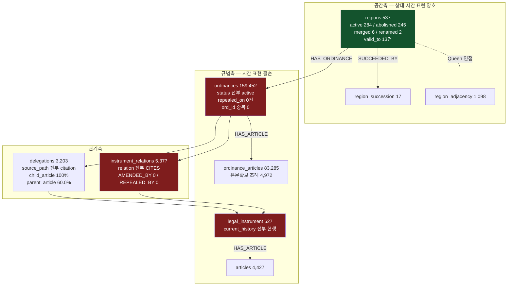
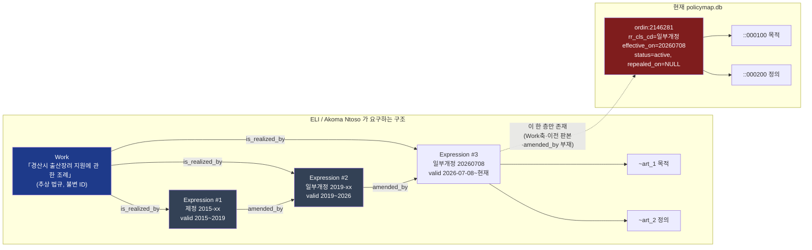
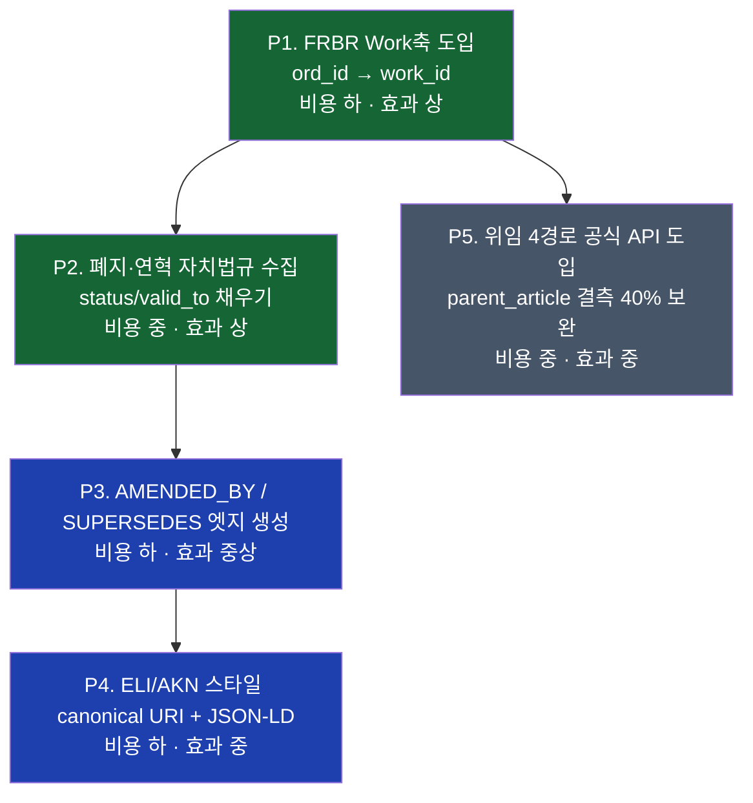

# 14. 법령 지식그래프 국제 표준·온톨로지 조사 및 우리 스키마 격차 진단

> 작성 2026-08-20 · 대상 시스템 `F:/policy_maps/system` (policymap, SQLite `data/policymap.db`)
> 관련 문서: [03 법령·조례 체계와 데이터소스](03_법령조례_체계와_데이터소스.md) · [04 선행연구 리뷰](04_선행연구_리뷰.md) · [05 시스템 설계](05_시스템_설계.md) · [09 설계 고도화 v2](09_설계_고도화_v2.md) · [10 시스템 구축 결과](10_시스템_구축_결과.md) · [12 실데이터 수집결과](12_실데이터_수집결과.md) · [13 신경망·RAG 계층](13_신경망_RAG_계층.md)

**이 문서의 원칙**: 아래 표준·논문은 모두 원문(사양서 HTML/PDF, arXiv, CEUR)을 실제로 열어 확인한 것만 기재했다. 우리 시스템 수치는 2026-08-20 `data/policymap.db` 직접 조회 결과다(본문 수집 배치 진행 중이므로 조문 수는 증가한다).

---

## 1. 왜 표준을 보는가 — 배점과의 연결

공모전 1차 심사는 **정확성 15 · 데이터다양성 15 · 완성도 20**이 걸려 있고, 2차는 **지속성 15 · 활용성 15**가 걸려 있다. 법령 지식그래프에서 이 항목들을 가르는 것은 모델이 아니라 **시간축과 식별자**다.

- "우리와 비슷한 지역이 이미 만든 조례 찾기"라는 타깃 시나리오에서, **이미 폐지된 조례를 추천하면 정확성 점수는 그 자리에서 무너진다.**
- 국제 표준(ELI·Akoma Ntoso·MetaLex)이 20년간 합의한 핵심은 단 하나로 요약된다: **법령은 "하나의 문서"가 아니라 "Work(추상 법규) — Expression(개정 시점별 판본)"의 2축 객체다.**
- 우리 DB는 현재 이 2축 중 Expression 한 층만 갖고 있다(§4에서 실측). 이것이 최대 격차다.

---

## 2. 표준 개요표

| 표준 | 관리주체·버전 | 무엇을 표준화하나 | 식별자 | 우리에게 주는 것 |
|---|---|---|---|---|
| **ELI** (European Legislation Identifier) | EU Publications Office / 온톨로지 v1.5 | 법령 **식별 URI 템플릿 + 메타데이터 온톨로지(OWL) + 직렬화(RDFa/JSON-LD) + 동기화** 4기둥 | 국가별로 조립하는 URI 템플릿 (`{jurisdiction}/{type}/{year}/{natural_id}` 등 컴포넌트 조합) | 조례 canonical URI 설계, 개정·폐지 관계 술어(`amends`/`repeals`), FRBR 골격 |
| **ECLI** (European Case Law Identifier) | EU 이사회 결론(2011) | **판례** 인용 식별자 + Dublin Core 기반 메타데이터 | `ECLI:{국가}:{법원}:{연도}:{일련번호}` (5요소, 콜론 구분) | 판례를 그래프에 넣을 때의 ID 규칙(현 단계 범위 밖, 향후 확장축) |
| **Akoma Ntoso / OASIS LegalDocML** | OASIS / v1.0 (Part1 XML Vocabulary, Part2 Specifications, + Naming Convention, + Media Type) | 입법·의회·사법 문서의 **XML 구조 어휘**(조·항·호·목, 부칙, 별표, 개정지시) | `/akn/{국가}/{문서종}/{일자}/{번호}/{언어}@{판본일}` + 컴포넌트 `!`, 포션 `~` | 조문 단위 IRI 설계의 사실상 유일한 국제 규범 |
| **LegalRuleML** | OASIS Standard, 2021-08-30 | 법령의 **규범 내용**(의무/허가/금지, 반증가능성, 시간관리, 조문↔규칙 isomorphism, 관할·권위, 해석 대안) | RuleML 확장 XML | 조례의 "의무/재량" 태깅, 상충 규범 우선순위 표현의 이론적 근거 |
| **CEN MetaLex** (CWA 15710:2010) | CEN Workshop Agreement | 관할 독립 XML **교환 포맷**(최소공통분모). 관할별 표준을 대체하지 않고 상호운용 뷰를 부여 | MetaLex 명명규약(ELI가 FRBR 술어를 여기서 차용) | ELI 온톨로지의 `is_realized_by`/`is_embodied_by` 술어 출처 |
| **FRBR** | IFLA 최종보고서 1998 (K.G. Saur) | 서지 레코드의 **Work / Expression / Manifestation / Item** 4계층 개체-관계 모델 | — | 위 표준 전부의 공통 기반 |
| **LKIF-Core** | ESTRELLA 프로젝트(EU FP6 IST-2004-027665), 2007 | 법 **개념** OWL-DL 온톨로지. 14개 모듈(top, place, mereology, time, process, action, role, expression, legal_action, legal_role, norm, rules, time_modification, core), 3계층(top/intentional/legal) | — | 규범(norm)·법적 역할(legal_role)·표현(expression) 개념 분리의 참조 모델 |
| **LRI-Core** | Leibniz Center for Law (Breuker 등) | 인지과학 기반 법 상위 온톨로지. LKIF-Core의 top 구조가 여기서 유래 | — | LKIF 논문 자체가 "전형적 법 개념 수가 실망스럽게 적다"고 평가 → 직접 채택 실익 낮음 |

### 2.1 ELI 4기둥 (원문 확인)

1. **식별(Pillar 1)** — URI 템플릿 컴포넌트를 국가가 조립. 웹 전역 식별자이자 기계가독.
2. **메타데이터 기술(Pillar 2)** — "ELI 온톨로지는 웹에서 법령 메타데이터를 교환하기 위한 공통 데이터 모델을 정의"하며 **FRBR 원칙을 따른다.**
3. **발행 포맷(Pillar 3)** — RDFa 또는 JSON-LD로 입법 웹사이트에 임베드.
4. **동기화(Pillar 4)** — 관보와 법령정보시스템 간 메타데이터 자동 교환.

도입은 **선택·자발·점진적**이며 국가별 구현 수준(기둥 단위)이 다르다. EUR-Lex ELI Register 기준 스페인·덴마크·핀란드·프랑스·아일랜드·이탈리아·룩셈부르크·노르웨이·포르투갈·오스트리아·벨기에·폴란드·영국 등이 적용 중이고, 프랑스·룩셈부르크는 Pillar 1, 아일랜드는 Pillar 1 + Pillar 2 부분 구현이다(등록부 최종 갱신 2026-03-24). **즉 "전부 다 하지 않아도 표준 준수"가 명시적으로 허용된다 — 우리가 Pillar 1+2만 취하는 것이 정당화된다.**

### 2.2 ELI 온톨로지 주요 클래스·프로퍼티 (v1.5 OWL 원문 확인)

| 구분 | 요소 |
|---|---|
| 클래스 | `Work`, `Expression`, `Manifestation`, `LegalResource`(법령=Work), `LegalExpression`(언어·판본별 실현), `Format`, `Agent`, `AdministrativeArea` |
| FRBR 관계 | `is_realized_by`/`realizes`, `is_embodied_by`/`embodies`, `is_exemplified_by`, `is_part_of`/`has_part`, `is_member_of`/`has_member` |
| 법적 관계 | `amends`/`amended_by`, `repeals`/`repealed_by`, `corrects`/`corrected_by`, `changes`/`changed_by`(상위 우산), `based_on`/`basis_for`(**수권 = 우리의 위임**), `transposes`, `consolidates`/`consolidated_by`, `cites`/`cited_by` |
| 시간·상태 | `version`, `version_date`, `date_document`, `first_date_entry_in_force`, `date_no_longer_in_force`, `in_force` |
| 기타 | `jurisdiction`, `passed_by`, `id_local`, `type_document` |

주목: **`based_on`/`basis_for`가 곧 우리 `delegations`의 표준 대응물**이고, **`consolidates`는 "일부개정 후 통합본"** 개념 — 우리 `rr_cls_cd='일부개정'` 10만 건의 정체가 정확히 이것이다.

### 2.3 Akoma Ntoso 명명규약 — FRBR 4계층 IRI (원문 확인)

| 계층 | 정의 | IRI 형태 | 예시 |
|---|---|---|---|
| **Work** | 추상적 법 개념 | `/akn/{ISO3166-1 2자}/{문서종}/{하위종}/{발령주체}/{YYYY-MM-DD}/{번호}` | `/akn/ke/act/2005-07-12/3` |
| **Expression** | 언어·개정 시점별 판본 | Work + `/{ISO639-2 3자}` + `@{판본일}` | `/akn/sl/act/2004-02-13/2/eng@2004-07-21` |
| **Manifestation** | 파일 포맷 | Expression + `.{확장자}` | `.../eng@2004-07-21.xml` |
| **Item** | 실제 저장 파일 | — | — |

부가 규칙(우리 설계에 직결):
- **현행판 = 판본일 생략** (`/eng`), **원본판 = 매달린 `@`** (`eng@`), **가상 판본 = `:`** (`eng:2007-01-01` = 2007-01-01 이전 유효 판본).
- **컴포넌트 `!`** — `/akn/eu/act/2003-11-13/87/!annex_1` (별표·부속서). 우리 `ordinance_appendix`가 여기 대응.
- **포션 `~`** — `.../~art_3`, 범위는 `~art_3->art_5`. **우리 `oa_id = 'ordin:2146281::000100'`가 바로 이 포션 계층인데 Work축과 결합돼 있지 않다.**
- 식별자는 **"판본 간 지속(persistent across versions)"** 이어야 한다 — 조문 번호가 재배열돼도 참조가 살아있어야 한다는 요구.

### 2.4 LegalRuleML 핵심 기능 (OASIS Standard 2021-08-30, 편집자 Palmirani·Governatori·Athan·Boley·Paschke·Wyner)

- **Deontic operators**: 의무·허가·금지·권리
- **Defeasibility**: 예외 있는 규칙, 규범 충돌을 **우월관계(superiority relation)**와 규칙 강도로 해소 → 우리 `instrument_relations.priority_rule`(lex_superior/posterior/specialis)의 표준 대응
- **Temporal management**: 효력발생(in force)·실효성(efficacy)·적용가능성(applicability)을 **분리**해 관리
- **Isomorphism**: 형식 규칙과 원문 조문의 세밀한(fine-grained) 연결 유지
- **Legal sources & references**: 규칙↔조문 N:M
- **Constitutive vs Prescriptive rules**: 개념 정의형 규칙 vs 행위 규율형 규칙 구분
- **Alternatives / Reification**: 동일 조문의 복수 해석, 규칙 자체를 객체화

> 실무적 함의: LegalRuleML 전면 채택은 조문당 수작업 형식화가 필요해 15만 건 규모에 비현실적이다. 다만 **"효력발생 ≠ 실효성 ≠ 적용가능성" 3분법**과 **isomorphism(규칙↔조문 링크 유지)** 두 원칙은 비용 없이 우리 스키마에 반영 가능하다.

---

## 3. 선행연구 (실제 확인한 것만)

| 저자 | 연도 | 제목 / 출처 | 확인한 핵심 |
|---|---|---|---|
| Hoekstra, R., Breuker, J., Di Bello, M., Boer, A. | 2007 | *The LKIF Core Ontology of Basic Legal Concepts*, CEUR-WS Vol-321 (LOAIT 2007), Leibniz Center for Law, Univ. of Amsterdam | ESTRELLA 프로젝트 산출. 약 250개 후보 용어 → 5개 척도 평가 → 50개 핵심어 선정. 클러스터 8개(expression, norm, process, action, role, place, time, mereology)에서 **14개 모듈**로 확장. 3계층(top/intentional/legal). Top은 LRI-Core에서 차용: Mental / Physical / Abstract Concept + Occurrence. 시간은 Allen 구간대수(Interval/Moment, `immediately_before`), 장소는 Donnelly(2005) 절대/상대 장소 |
| Bommarito, M. J., Katz, D. M. | 2009 | *Properties of the United States Code Citation Network* | 미국 연방법전 인용망의 통계적 성질. 법령 인용망 정량분석의 출발점 |
| Katz, D. M., Bommarito, M. J. | 2014 | *Measuring the Complexity of the Law: The United States Code*, **Artificial Intelligence and Law 22(4): 337–374** | 법의 복잡도를 구조·언어·상호의존으로 분해해 측정 |
| Koniaris, M., Anagnostopoulos, I., Vassiliou, Y. | 2015(arXiv 1501.05237) / 2018(*Journal of Complex Networks* 6(2):243) | *Network Analysis in the Legal Domain: A complex model for European Union legal sources* | **Legislation Network** 개념. EU 관보 60년치 코퍼스. 각 노드에 **date of effect / date of expiry** 부여, **엣지는 연결된 두 노드의 유효기간이 겹치는 구간에만 유효**. 시간에 따라 **엣지 증가율 > 노드 증가율(망이 조밀해짐)**. 회복탄력성(resilience) 테스트 수행 |
| Coupette, C., Beckedorf, J., Hartung, D., Bommarito, M., Katz, D. M. | 2021 | *Measuring Law Over Time: A Network Analytical Framework with an Application to Statutes and Regulations in the United States and Germany*, **Frontiers in Physics** (arXiv 2101.11284) | 법률문서를 **다차원 동적 문서망(multi-dimensional, dynamic document networks)** 으로 모델링. 미·독 1998–2019(21년) 법률·규칙 비교. 미 연방은 규칙(regulation) 비중 증가, 독일은 법률 지배 지속 |
| Winkels, R., Boer, A. 및 후속 연구 (Winkels et al. 2013, 2014) | 2013–2014 | 네덜란드 법령·판례 인용망 / *Towards a Legal Recommender System* / *Determining Authority of Dutch Case Law* (Winkels, Ruyter, Kroese) | 인용망 **중심성(betweenness/centrality)을 관련성·권위 지표**로 사용. 네덜란드 이민법 대상 추천시스템은 **선택된 조문 기준 매개중심성이 높은 판례**를 회수 — 조문 단위 그래프 추천의 선례 |

### 한국 적용 사례 (실제 확인)

- **법제처 LOD 플랫폼** (`lod.law.go.kr`) — 한국 법령의 Linked Open Data 서비스. URI 체계가 3분되어 있음: 인스턴스 `http://lod.law.go.kr/resource/{법령ID}`, 클래스 `http://lod.law.go.kr/Class/{Class명}`, 속성 `http://lod.law.go.kr/property/{속성명}`. **SPARQL 엔드포인트 `https://lod.law.go.kr/DRF/lod/sparql.do` 제공(REST + 웹 편집기)**. 예시 질의에 **자치법규가 독립 데이터 유형으로 포함**되고 자치단체별 조회를 지원.
  → **우리 시스템의 조례 노드를 이 LOD URI와 `owl:sameAs` 수준으로 연결할 여지가 있다. 데이터다양성·활용성 배점에 직결.**
- **국가법령정보 공동활용 Open API** (`open.law.go.kr`) — 3단비교(과거 조문/현행 조문/개정예정 조문 병렬 제공, 조문의 신설·변경·삭제 여부 + 법령연혁 포함), 법령체계도, 신구법 비교를 부가서비스로 개방. **위임법령 조회 API는 링크대상이 위임법령인지·인용법령인지·행정규칙인지를 나타내는 `위임구분`과 `위임법령일련번호`를 제공.**
  → **한국은 이미 "3단비교"라는 이름으로 FRBR Expression 축과 조문 delta를 API로 내주고 있다. 우리가 안 쓰고 있을 뿐이다.**
- **ELIS 자치법규정보시스템** (`elis.go.kr`) — 자치법규 및 입법예고 조회, 자치법규 현황, 자치법규 비교검색 제공. (조례 org/sborg 기관코드 체계는 이미 우리 `regions.law_org`/`law_sborg`에 반영됨 — [03 문서](03_법령조례_체계와_데이터소스.md) 참조)

---

## 4. 우리 스키마 진단 (2026-08-20 실측)

### 4.1 현재 그래프 구조



### 4.2 표준 대비 격차표

| # | 표준 요구 | 근거 표준 | 우리 현황 (실측) | 판정 |
|---|---|---|---|---|
| G1 | **Work / Expression 2축 분리** | FRBR, ELI `is_realized_by`, AKN Work/Expression IRI | `ordinances` 159,452행, `ord_id` 중복 **0건** → 법규 1개당 판본 1개. 그런데 `rr_cls_cd`는 **일부개정 100,109(62.8%) / 제정 49,971(31.3%) / 전부개정 7,735 / 타법개정 1,637** — 즉 **62.8%는 명백히 "N번째 판본"인데 앞선 판본이 DB에 없다** | ❌ **최대 격차** |
| G2 | **유효시간 구간 `valid_from`~`valid_to`** | ELI `first_date_entry_in_force`/`date_no_longer_in_force`, Koniaris et al. date of effect/expiry | `effective_on` 159,452건(100%) 있음. `repealed_on` **0건**, `status` **전부 active** → 구간의 끝이 없음. 폐지 조례 미수집 | ❌ |
| G3 | **개정·폐지 관계 엣지** | ELI `amends`/`repeals`/`consolidates`/`changes` | `instrument_relations` 5,377건 **전부 `CITES`**. `AMENDED_BY`/`REPEALED_BY`/`REPLACED_BY` **0건**(스키마 컬럼은 이미 존재) | ❌ |
| G4 | **시행예정(未시행) 판본 구분** | LegalRuleML "in force ≠ efficacy ≠ applicability", 법제처 3단비교 '개정예정 조문' | `effective_on > 20260820`인 조례 **460건**이 `status='active'`로 현행과 섞여 있음 | ❌ |
| G5 | **안정적 canonical 식별자** | ELI Pillar 1, AKN Naming Convention | `ordinance_id = 'ordin:{mst}'`. **mst=자치법규일련번호는 판본키**이므로 사실상 Expression ID를 Work ID 자리에 쓰고 있음. **Work 후보인 `ord_id`(자치법규ID)는 100% 보유 중이나 미사용** | ⚠️ 재료는 있음 |
| G6 | **조문 단위 포션 식별자** | AKN `~art_N`, LegalRuleML isomorphism | `oa_id = 'ordin:2146281::000100'` — 조 단위 포션 표현 **이미 있음**. 다만 Work축이 없어 판본 간 조문 추적 불가 | ⚠️ 절반 정합 |
| G7 | **수권(위임) 관계** | ELI `based_on`/`basis_for`, 법제처 위임법령 API `위임구분`+`위임법령일련번호` | `delegations` 3,203건. `child_article` **100%**, `parent_article` **1,923건(60.0%)**. **`source_path`가 전부 `'citation'`** — 낫표 인용 파싱 단일 경로. 스키마가 예정한 `lsDelegated`/`lsStmd`/`lnkLsOrdJo`/`lnkLsOrd` 4경로 미가동 | ⚠️ |
| G8 | **위계·효력우선 표현** | LegalRuleML defeasibility·superiority, LKIF `norm` 모듈 | `instrument_kind`에 `national_tier` 0~4 / `local_tier` L1·L2 / `tier_disputed` 플래그 **설계 완료**. `priority_rule`(lex_superior/posterior/specialis) 컬럼 존재하나 **데이터 0건** | ⚠️ 스키마만 |
| G9 | **관할(jurisdiction) 명시** | ELI `jurisdiction`, `AdministrativeArea` | `ordinances.region_id` → `regions`(법정동코드 스파인) + `has_legislation` 플래그로 자치입법권 없는 행정시·일반구 배제. **국제 표준보다 오히려 정밀**(V-World/ELIS/지방재정365 4중 크로스워크) | ✅ **우위** |
| G10 | **공간 승계(폐치·분합)** | ELI에 대응 개념 없음 | `regions` status 4종 + `region_succession` 17건 + `valid_to` 13건. **국제 표준이 다루지 않는 축을 우리가 갖고 있음** | ✅ **독창성 근거** |
| G11 | **출처·검증 상태(provenance)** | ELI Pillar 4 동기화, LegalRuleML legal sources | `verification` 테이블 3단계 운영 중이나 **`entity_type='ordinance'` 레코드 0건**(instrument 627·institution 578만). `ordinances.verification_status`는 source-linked **5,136(3.2%)**, needs-review 154,316 | ⚠️ |
| G12 | **RDF/JSON-LD 직렬화** | ELI Pillar 3, 법제처 LOD SPARQL 엔드포인트 존재 | 없음(SQLite + MCP tool 12종만) | ❌ 저비용 개선 여지 |
| G13 | **분류 체계 커버리지** | ELI `type_document`, 법제처 자치법규분야 | `ordinance_category` **1,087건 / 159,452 (0.7%)**. `categories` C01~C12 통제어휘는 설계 완료 | ❌ |
| G14 | **변경 피드(CDC)** | ELI Pillar 4 | `change_log` **23,066건** + `watermarks` 복합키 운영 중 | ✅ |

### 4.3 격차의 구조 — 한 장의 그림



실제 행으로 보면:

```
ordinance_id  = 'ordin:2146281'
mst           = '2146281'        ← 자치법규일련번호(판본키). 지금 이걸 Work ID로 쓰는 중
ord_id        = '2025671'        ← 자치법규ID. Work ID 후보. 100% 보유. 미사용
region_id     = '47290'
name          = '경산시 출산장려 지원에 관한 조례'
rr_cls_cd     = '일부개정'        ← "앞 판본이 있다"는 증거. 그 판본은 DB에 없음
enacted_on    = '20260708'
effective_on  = '20260708'
repealed_on   = NULL             ← 159,452건 전부 NULL
status        = 'active'          ← 159,452건 전부 active
```

**핵심 진단 한 줄**: 우리는 **`ord_id`라는 Work 키를 이미 100% 보유하고 있으면서 그것을 축으로 쓰지 않고 있다.** FRBR 2축 도입의 데이터 비용이 0에 가깝다는 뜻이다.

---

## 5. 적용 로드맵 (투자 대비 효과 순)



### P1 — FRBR Work축 도입 (즉시, 마이그레이션만)

```sql
-- 신규 테이블 (기존 ordinances 무손상)
CREATE TABLE IF NOT EXISTS ordinance_work (
  work_id         TEXT PRIMARY KEY,   -- = ord_id (자치법규ID)
  region_id       TEXT REFERENCES regions(region_id),
  name            TEXT NOT NULL,
  ord_kind        TEXT,
  eli_uri         TEXT,               -- '/akn/kr/ordinance/{sig_cd}/{ord_id}'
  first_enacted_on TEXT,              -- 최초 제정일
  current_expression TEXT REFERENCES ordinances(ordinance_id),
  expression_count INTEGER,
  status          TEXT DEFAULT 'active'  -- 'active'|'repealed'
);
ALTER TABLE ordinances ADD COLUMN work_id TEXT;   -- = ord_id
ALTER TABLE ordinances ADD COLUMN valid_from TEXT; -- = effective_on
ALTER TABLE ordinances ADD COLUMN valid_to   TEXT; -- 다음 판본 effective_on - 1일, 없으면 NULL
ALTER TABLE ordinances ADD COLUMN lifecycle  TEXT; -- 'in-force'|'pending'|'historical'|'repealed'
```

- `work_id = ord_id`로 **159,452행 즉시 채움**(중복 0이므로 현재는 1:1, 이후 P2에서 1:N이 됨).
- `lifecycle`: `effective_on > 오늘` → `'pending'` (**현재 460건이 여기로 분리됨**), 그 외 `'in-force'`.
- **효과**: 검색·추천 결과에 "이 조례는 2026-09-01 시행 예정입니다" / "현행 판본" 배지를 붙일 수 있게 됨 → **정확성 15점 직결, 데모 시연에서 즉시 보이는 차이.**

### P2 — 폐지·연혁 자치법규 수집

- 법제처 자치법규 API는 현행 외에 **연혁·폐지 자치법규**를 제공하며, 국가법령 쪽은 **3단비교(과거/현행/개정예정 조문 병렬 + 신설·변경·삭제 표시)** 까지 개방한다(§3 확인).
- 현재 `tools_bulk_bodies.py`가 본문 156,027건을 전수 수집 중이므로, **동일 재개형 패턴으로 폐지분 목록을 별도 스코프(`watermarks(source='ordin', scope='repealed:*')`)에 적재**하면 파이프라인 재사용이 가능하다.
- **효과**: G2·G3 동시 해소. "이미 폐지된 조례를 유사 사례로 추천"이라는 **치명적 오답 제거**. 동시에 Koniaris et al.(2015)식 시간 유효 엣지(양끝 노드 유효구간 교집합)를 계산할 수 있게 됨 → **시계열 지도 시각화라는 새 산출물이 열림**(공간정보 공모전 성격상 파급성 20점에 유리).

### P3 — 개정 관계 엣지 생성

`instrument_relations`는 이미 `AMENDED_BY`/`REPEALED_BY`/`REPLACED_BY`와 `amend_type`, `effective_on` 컬럼을 갖고 있다. P2 데이터가 들어오면 **동일 `work_id` 내 `effective_on` 정렬만으로 결정적 생성**이 가능하다(추론 아님, `inferred=0`). ELI 대응: `amends`/`repeals`/`consolidates`.

### P4 — canonical URI + JSON-LD

AKN 명명규약에 맞춘 조례 IRI 제안(국가코드 `kr`, 언어 `kor`):

```
Work        /akn/kr/ordinance/47290/2025671
Expression  /akn/kr/ordinance/47290/2025671/kor@2026-07-08
현행 판본    /akn/kr/ordinance/47290/2025671/kor
포션(조문)   /akn/kr/ordinance/47290/2025671/kor@2026-07-08/~art_1
별표        /akn/kr/ordinance/47290/2025671/!annex_1
```

- 여기에 ELI JSON-LD 한 블록(`eli:LegalResource` + `is_realized_by` + `first_date_entry_in_force` + `jurisdiction` + `based_on`)을 MCP tool 응답에 실으면 **Pillar 1 + Pillar 2 + Pillar 3 준수를 주장할 수 있다.** ELI는 부분 구현을 명시적으로 허용하므로(프랑스·룩셈부르크가 Pillar 1만) 과장이 아니다.
- 추가로 **법제처 LOD(`lod.law.go.kr/resource/{법령ID}`)와 `owl:sameAs` 연결** → 데이터다양성·활용성 배점 및 "국내 공식 LOD와 상호운용" 서사 확보.

### P5 — 위임 4경로 공식 API

현재 `delegations.source_path`가 전부 `'citation'`(낫표 파싱)이라 `parent_article` 결측 40%가 남아 있다. 법제처 **위임법령 조회 API**는 `위임구분`(위임법령/인용법령/행정규칙)과 `위임법령일련번호`를 직접 준다 — 파싱 대신 공식 링크를 받아 `source_path='lnkLsOrdJo'` 등으로 적재하면 결측 보완 + provenance 다변화가 동시에 된다. ELI `based_on`/`basis_for`로 직역 가능.

### 채택하지 않을 것 (명시적 판단)

| 후보 | 판단 |
|---|---|
| **LegalRuleML 전면 형식화** | 조문당 수작업 규칙 형식화 필요. 8만+ 조문 규모에 비현실적. **단, "in force / efficacy / applicability" 3분법과 isomorphism 원칙만 P1에 흡수** |
| **LKIF-Core / LRI-Core OWL 직접 임포트** | LKIF 논문 자체가 LRI-Core에 대해 "전형적 법 개념 수가 실망스럽게 적다"고 평가. 우리 12개 정책분야 통제어휘(C01~C12)가 실무 타깃(지자체 담당자)에 더 적합 |
| **ECLI** | 판례 축이 현재 범위 밖. 향후 확장 시의 ID 규칙으로만 기록 |
| **Akoma Ntoso XML 전면 변환** | 우리 원천(법제처 API JSON/HTML)에서 AKN XML 재생성은 비용 대비 실익 낮음. **명명규약(IRI)만 채택**하는 것이 표준의 취지에도 부합(MetaLex가 스스로 "관할별 표준을 대체하지 않는 최소공통분모"라 규정) |

---

## 6. 요약

- 우리 스키마는 **공간축(G9·G10)과 변경피드(G14)에서 국제 표준을 앞선다.** ELI에는 지자체 폐치·분합 승계 개념 자체가 없다 — 이것이 공모전 **독창성 15점**의 실질 근거다.
- 반면 **규범의 시간축(G1~G4)은 표준이 20년간 합의한 최소 요건조차 미충족**이다. 159,452건 전부 `active`, `repealed_on` 0건, 개정 엣지 0건, 시행예정 460건 미분리.
- 다행히 **복구 비용이 낮다.** Work 키(`ord_id`)를 100% 보유 중이고, `instrument_relations`·`ordinances`의 컬럼이 이미 설계돼 있으며, 법제처가 3단비교·연혁·위임 API를 공식 개방하고 있다. **P1은 SQL 마이그레이션 한 번, P3는 정렬 한 번이다.**
- 실행 순서: **P1(즉시) → P2(수집 배치 재사용) → P3(결정적 생성) → P4(URI/JSON-LD) → P5(위임 API)**.
